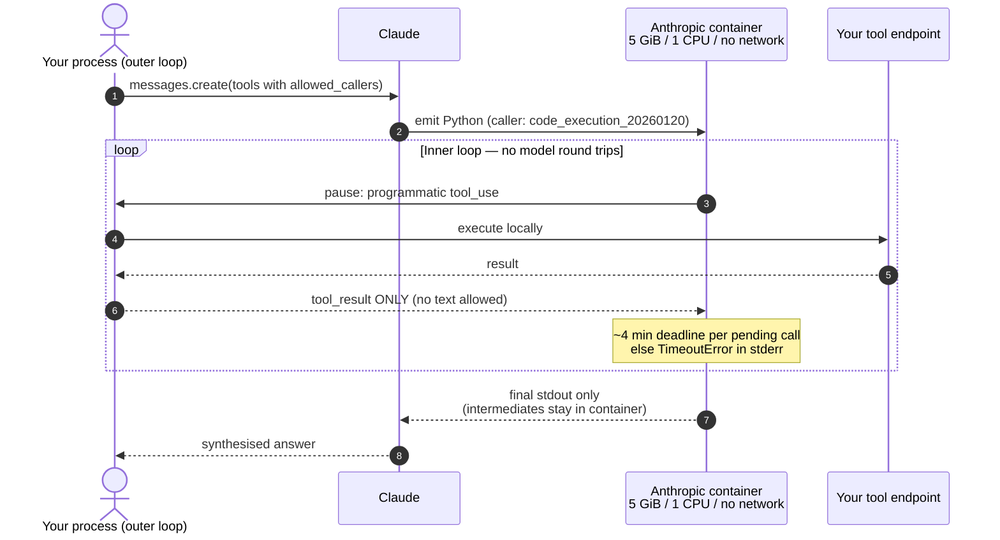
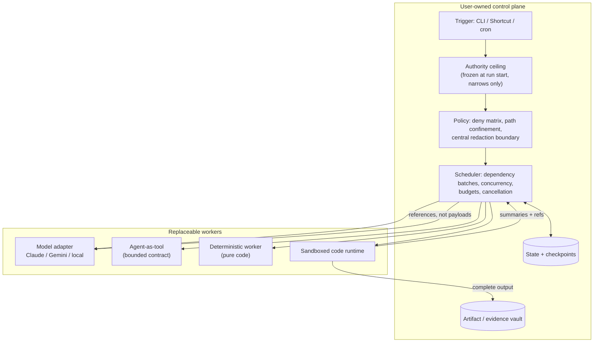
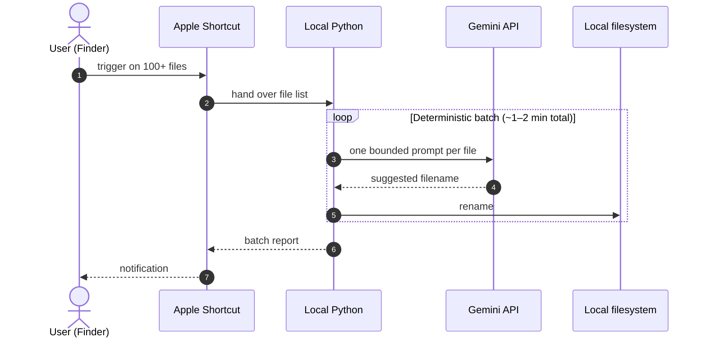

<!--
Provenance: this file in `docs/` is the **primary** preliminary study.
Original draft written 2026-07-29. **Revision R2 (2026-07-30)** re-verified every
material claim against primary sources and pinned framework versions/commits; see
§13 for the list of claims that changed. A separate, longer draft from a parallel
session was noted at `~/Downloads/ai-orchestration-preliminary-study-2026-07-29.{md,html}`
(marked "Superseding draft — provenance only"); it was not present in the R2 working
checkout and could not be reconciled. Both pairs are kept per user decision on
2026-07-29; do not delete either without checking with the user.

Deliberate decision (R2): this study was revised **in place** rather than forked to a
new dated pair. This repo has a documented history of parallel documents drifting
(`AGENT-DOCS-DIVERGENCE-2026-07-25.html`, the two colliding `P0` namespaces). One
canonical study with a revision log is the lower-risk shape.
-->

# Preliminary Research Report: User-Owned AI Orchestration, Programmatic Tool Calling, and Agent-as-Tool Architectures

**Original draft:** 2026-07-29 · **This revision (R2):** 2026-07-30
**Status:** Preliminary study — research and synthesis only. No runner, bridge, auth, or proxy code was modified.
**Working checkout:** `claude-local-bridge-playground`, branch `claude/user-owned-ai-orchestration-ypiplp`, at `1446307`.
**Scope boundary:** This is a defensible map and a second-phase agenda. It is **not** an implementation plan.

---

## 0. How To Read This Document

Every material claim carries a label. The labels are the point of the document: a
preliminary study is only useful if a later session can tell what was *verified* from
what was *reasoned*.

| Label | Means |
| --- | --- |
| `[documented fact]` | Stated explicitly in current official vendor/framework documentation. |
| `[source-code observation]` | Read directly out of a pinned released source tree. Version and commit given in §12. |
| `[measured result]` | A number produced by a benchmark run, reported by the party that ran it. |
| `[vendor claim]` | A performance/behaviour assertion by the vendor that this study did not independently reproduce. |
| `[research finding]` | From a peer-reviewed or preprint paper. |
| `[inference]` | This study's reasoning from the above. Not independently attested. |
| `[open question]` | Genuinely unresolved. Deliberately left unresolved rather than smoothed over. |

**Confidence** is stated separately from label, as High / Medium / Low, because a
`[documented fact]` about a fast-moving API can still be low-confidence over time.

**A note on what "verified" means here.** All framework claims were checked against
shallow clones of released source, not against blog posts or memory. Where the proxy
network policy blocked a host (`arxiv.org`, `docs.langchain.com`,
`microsoft.github.io`, `api.github.com`, `huggingface.co`), that is disclosed in §12
and an alternate primary route was used — repository source, or `raw.githubusercontent.com`.
No claim in this revision rests on a blocked source alone.

---

## 1. Executive Summary

*Written for a non-programmer. Jargon is defined on first use.*

### 1.1 The problem in plain terms

When an AI model uses tools today, the usual arrangement is a conversation. The model
says "read file 1," the software reads it and hands back the contents, the model says
"read file 2," and so on. Each exchange is a full round trip to the model, and each
one re-sends the whole conversation so far. For fifty files that is fifty round trips
and fifty ever-larger bills. This pattern is called **direct tool calling**.

The alternative that has taken hold is to let the model **write a small program**
instead. The program contains the loop — "for each of these fifty files, read it,
pull out the date, keep the ones from last month" — and the program runs once. The
model is consulted twice, not fifty times, and only the final short answer comes back
into the conversation. This is **programmatic tool orchestration**, and when the
model's program *is* the action, the research literature calls it **CodeAct**.

The savings are real and now vendor-measured: Anthropic reports that adding
programmatic tool calling on top of basic search tools improved results by an average
of **11% while using 24% fewer input tokens** on two web-research benchmarks
`[vendor claim]`.

### 1.2 The question that actually matters for this project

Efficiency is the easy part. The hard question is **who owns the machinery**.

A model writing a program still needs somewhere to run it, permission to touch files,
a budget, a way to be stopped, and somewhere to keep the evidence. Those things are
the **control plane**. Whoever owns the control plane owns the system — not whoever
supplies the model.

There are two answers on offer:

- **The vendor owns it.** Anthropic's programmatic tool calling runs the model's
  Python inside Anthropic's own container: 5 GiB of memory, 1 CPU, and — notably —
  **no internet access at all** `[documented fact]`. You get the efficiency
  immediately and you write almost no infrastructure. You also accept a fixed
  machine, a fixed isolation model, and a ~4-minute deadline to answer each tool call
  before the model's code sees a `TimeoutError` `[documented fact]`.
- **You own it.** Frameworks like LangGraph and smolagents, and this repository's own
  bridge runner, keep the loop, the credentials, the sandbox, the budget, and the
  audit trail on your side. The model becomes a replaceable worker you call, rather
  than the host you rent.

### 1.3 What this study concludes

1. **The user-owned side of this is more built than it looks.** Every layer the
   governing principle asks for — scheduling, state, policy, artifacts, budgets,
   execution — exists in shipping open-source software today. What does *not* exist
   is a settled standard that spans providers.
2. **"Has code execution" is not "supports programmatic tool orchestration."** This
   is the single most common category error in this space, and this study found a
   concrete instance of it: Google's ADK ships **six** code-execution backends but
   does **not** expose its own registered tools inside the generated code
   `[source-code observation]`. smolagents does, in one line of source. The
   difference decides whether the generated program can compose your capabilities or
   merely compute.
3. **This repository's runner already owns more of the control plane than the
   frameworks do.** Its `authority.js` enforces a per-run authority ceiling that
   only ever narrows, which is a stronger structural guarantee than any
   prompt-level or per-call permission check found in the surveyed frameworks
   `[source-code observation]`.
4. **The genuinely unsolved problem is not efficiency — it is pausing.** No surveyed
   system can stop a model-generated program in the middle, ask a human a question,
   and resume from that exact point. LangGraph is explicit that resuming re-runs the
   whole step from the top `[source-code observation]`. Every "human in the loop"
   story in this space is really "human between the steps."

### 1.4 The one-sentence version

> Programmatic tool orchestration is mature enough to adopt and too young to
> standardise; the durable investment is the control plane you keep, not the
> execution trick you borrow.

---

## 2. Working Ontology And Loop Ownership

### 2.1 Terminology

Held deliberately close to the handoff's ontology so downstream sessions inherit
stable words. Where this study sharpened a definition, that is marked.

| Term | Definition |
| --- | --- |
| **Direct tool calling** | The model requests a structured tool; the harness executes it, returns a result, and resamples the model. One tool call per model turn. |
| **Agent-authored scripting** | The model writes a program (Python, shell, JS) to automate work. Says nothing about whether that program can reach registered tools. |
| **Programmatic tool orchestration** | Executable logic — not repeated model turns — controls multiple tool calls and intermediate processing. **Runtime location is not part of the definition.** |
| **Self-hosted programmatic tool calling** | The user controls the generated-code runtime *and* the tool-call protocol. |
| **Provider-managed programmatic tool calling** | A vendor manages the generated program and some or all of the inner tool loop. |
| **Batch dispatcher** | Deterministic software that fans bounded jobs out to workers and aggregates results. No model in the control path. |
| **Worker** | A bounded deterministic or model-backed capability. |
| **Agent** | A worker with its own model loop, tools, state, or repeated decisions. |
| **Agent-as-tool** | An agent behind a bounded tool contract while the manager retains control. |
| **Orchestrator** | Chooses jobs, dependencies, sequencing, composition. |
| **Scheduler** | Enforces queues, concurrency, retries, timeouts, cancellation, limits. |
| **Control plane** | User-owned policy, state, authority, observability, lifecycle above workers. |

**Sharpened in R2 — the distinction that does the most work.** Three properties are
independent, and conflating them is the field's dominant confusion:

1. Can the model emit code that runs? (*code execution*)
2. Can that code call **registered tools**? (*programmatic tool orchestration*)
3. Can that code call **other agents**? (*nested delegation from code*)

A system can have (1) without (2) — ADK. A system can have (1), (2) and (3) — smolagents.
A system can have (2) without the user owning the runtime — Anthropic, OpenAI. These
are four genuinely different architectures, and the comparison matrix in §6 separates
them on exactly these axes.

### 2.2 Loop ownership: provider-managed inner loop

Note where the boundary falls. The developer still owns the *outer* loop — they are
still calling the Messages API in their own process. What is ceded is the **inner**
loop.



The subtlety worth carrying forward: **the user still executes the tool.** The vendor
manages the *loop*, not the side effects. Credentials and side-effect authority stay
local. That makes this less of a surrender than "vendor-managed" suggests — and it is
why §7 treats it as a pattern worth learning from rather than merely a lock-in risk.

### 2.3 Loop ownership: user-owned control plane



The load-bearing arrows are the last two: **complete evidence goes to the vault, and
only summaries and stable references go back toward the model.** That single split is
what keeps context small without losing provenance, and §8.4 explains why it is
harder than it looks.

### 2.4 The user's existing worker (architectural anchor)

The user already runs a system that gets this right, and it predates the frameworks
in this study.



Why this is the right anchor, and not merely a nice script:

- **The Python program is the orchestrator.** The model never decides what to do next.
- **Gemini is a bounded cognitive worker**, not an agent. It has no loop, no tools, no
  state, and no authority. It answers one narrow question per file.
- **All side-effect authority stays in the deterministic layer.** The model cannot
  rename anything; it can only suggest a string.
- **It is fast because there is no agent in it.** 100+ files in 1–2 minutes is a
  throughput a per-file agent loop would not approach.

This is a **batch dispatcher over a model-backed worker**, and it is the shape most of
§7's lessons converge on. It would sit behind a provider-neutral tool contract with
essentially no redesign. `[inference, High confidence]`

---

## 3. Verified Starting Point: The Bridge Runner

Re-verified read-only against the live checkout on 2026-07-30. The handoff's
observations held, with useful additions.

### 3.1 Confirmed

- The runner owns a custom Node.js Anthropic Messages loop: prompt → local bridge
  `/v1/messages` → `tool_use` → local execution → `tool_result` → repeat.
  `[source-code observation]`
- **No managed-execution surface exists.** A grep across `src/` and `bin/` for
  `code_execution`, `server_tool_use`, `allowed_callers`, `container_upload`, and
  `programmatic` returns **zero matches**. The runner implements none of Anthropic's
  managed programmatic tool calling, and no container continuation.
  `[source-code observation, High confidence]`
- Tools are organised into capability groups, `core` always on, everything else
  explicitly opted in `[source-code observation]`:

  | Group | Tools | Gate |
  | --- | --- | --- |
  | `core` | `list_files`, `read_file`, `search_text`, `glob`, `git_status`, `manage_tasks`, `ask_user_question` | always on |
  | `edits` | `edit_file`, `write_file`, `apply_patch` | `--capabilities` |
  | `recovery` | `undo`, `undo_edit` | `--capabilities` |
  | `agents` | `spawn_agent` | `--capabilities` |
  | `worktrees` | `enter_worktree`, `exit_worktree`, `list_worktrees` | `--capabilities` |
  | `skills` | `run_skill` | `--capabilities` |
  | `lsp` | `lsp_query` | `--enable-lsp` |
  | `shell` | `bash`, `manage_shell_jobs` | `--allow-shell` **only** |

  `shell` is deliberately excluded from `OPTIONAL_CAPABILITIES`, so `--capabilities`
  cannot reach it. The invariant "shell is hidden unless `--allow-shell`" is enforced
  structurally, not by convention. `[source-code observation]`
- `bash` is a broad local capability exposed through direct tool calling, and a model
  with `edits` + `shell` can write and run a Python script. That is **agent-authored
  local scripting** — not programmatic tool orchestration, because the script cannot
  call the runner's registered tools. `[inference, High confidence]`

### 3.2 Additions the handoff did not record

Three in-tree components are directly relevant to the governing principle and were
absent from the 07-29 draft.

- **`authority.js` — an immutable per-run authority ceiling.** Frozen once from
  CLI-derived flags at run start; everything downstream may only *narrow* authority,
  never widen it. No profile, hook, tool, or mid-run context mutation can add shell
  access, expose extra tools, escape plan mode, or drop `--no-network`. The one
  deliberate exception is a single-permission-check human consent path
  (`executeForce`) for a write the user just approved — and plan mode blocks even
  that for effectful tools. `[source-code observation, High confidence]`

  This is a **monotonicity guarantee**, and it is stronger than anything found in the
  surveyed frameworks, which gate per call rather than bounding the run. §7.6 develops
  this.

- **`coordinator.js` — a deterministic phased orchestrator.** Fixed phases
  (`research`, `synthesize`, `execute`, `verify`) above the agent kernel, with a
  Kahn-style topological sort grouping a phase plan into dependency-free batches that
  can run concurrently. Cycles and missing dependencies **throw** rather than silently
  serialising. `[source-code observation]`

  The runner therefore already has a user-owned orchestrator/scheduler with explicit
  dependency semantics — the same primitive LangGraph provides as a graph.

- **`spawn_agent` — a genuine agent-as-tool, conservatively bounded.**
  `[source-code observation]`
  - Child gets a **read-only** 7-tool set.
  - `spawnDepth > 0` is blocked: children cannot fork further. No recursive fan-out.
  - `MAX_SPAWNS_PER_RUN = 8`; child steps clamped 1–16, default 6.
  - Token budgets are **leased from the parent broker and reconciled on return**, not
    copied — so nested cost cannot exceed the parent's ceiling.

  Budget leasing is a notably mature answer to §8.3's nested-budget problem, and no
  surveyed framework does it as cleanly.

### 3.3 One honest limitation

`--no-network` is documented in the CLI help as a "best-effort HTTP/HTTPS proxy guard
for shell; **not** hard network isolation" `[documented fact]`. That is the correct
description, and it matters for §8.1: the runner bounds authority well and bounds
*network* weakly. Container-based executors in the surveyed frameworks are stronger on
exactly this axis, which is the clearest thing the runner could learn from them.

---

## 4. Maturity Rubric

Applied per capability, not per vendor, because vendors ship capabilities at very
different maturities.

| Level | Name | Test it must pass |
| --- | --- | --- |
| **0** | Research concept | Exists in a paper or prototype. No supported implementation. |
| **1** | Experimental implementation | Shipped but unstable interface, or explicitly not production-safe. |
| **2** | Usable feature with material caveats | Documented and usable; real constraints (security, portability, lock-in) that a user must design around. |
| **3** | Repeated production pattern | Hardened, operational guidance exists, multiple independent implementations agree on shape. |
| **4** | Interoperable / standardised infrastructure | A cross-vendor standard exists and is broadly implemented. |

**Hypothesis test.** The handoff supplied a starting maturity hypothesis. Verified
against sources, it was largely right, with two corrections:

| Layer | Handoff hypothesis | R2 verdict | Level |
| --- | --- | --- | --- |
| Structured model-to-tool calling | Mainstream | **Confirmed** | 3–4 |
| Agent exposed as bounded tool | Common in modern SDKs | **Confirmed** — 4 of 4 SDKs | 3 |
| Developer-authored parallel worker fan-out | Mature pattern | **Confirmed** | 3 |
| Provider-neutral model adapters | Common, parity incomplete | **Confirmed** | 2–3 |
| Generated code composing multiple tools | Demonstrated, harder to secure/persist/replay | **Confirmed and sharpened** — now shipped by *two* major vendors as a managed feature, which the hypothesis did not anticipate | 2 |
| Generated code invoking nested agents | Implemented, specialised | **Confirmed** — essentially smolagents alone | 1–2 |
| Durable cross-provider worker orchestration | Active, unsettled | **Confirmed** | 1–2 |
| Dependable autonomous agent organisations | Unsolved, overclaimed | **Confirmed** | 0–1 |

The one place the hypothesis under-called the field: managed programmatic tool
calling is no longer a single-vendor product. OpenAI ships
`ProgrammaticToolCallingTool` and Anthropic ships `code_execution_20260120`+, which
makes this a **converging two-vendor pattern**, not an Anthropic peculiarity — while
still being Level 2, because the two are mutually incompatible and neither is portable.

---

## 5. Source-Grounded Landscape Analysis

Versions and commits in §12. Every claim below was read from source or current docs.

### 5.1 Hugging Face `smolagents` — v1.27.0.dev0

*The closest exact match to code-as-action, and the only surveyed system where
generated code can call both tools and agents.*

- Two agent classes: `CodeAgent` (actions as Python) and `ToolCallingAgent` (actions
  as JSON) `[documented fact]`.
- **The decisive line.** `agents.py:492`:
  ```python
  self.python_executor.send_tools({**self.tools, **self.managed_agents})
  ```
  Tools **and** managed agents are injected into the executor namespace together, so
  generated Python calls both as ordinary callables. This is the verification the
  handoff explicitly demanded, and it is the strongest single piece of evidence in
  this study. `[source-code observation, High confidence]`
- **Correction to the 07-29 draft.** There is **no `ManagedAgent` wrapper class**.
  Only `ManagedAgentPromptTemplate` exists. Composition is `managed_agents=[...]`
  passed to the constructor, and each such agent must have a `name` and `description`
  (asserted at setup). `[source-code observation]`
- Five executors: `LocalPythonExecutor`, `E2BExecutor`, `DockerExecutor`,
  **`ModalExecutor`**, `BlaxelExecutor`; selected by
  `executor_type: Literal["local", "blaxel", "e2b", "modal", "docker"]`.
  `[source-code observation]` The 07-29 draft omitted Modal.
- **Security posture, stated by the project itself:** "The built-in
  `LocalPythonExecutor` is **not a security sandbox**. It applies some restrictions
  but can be bypassed and must not be used as a security boundary."
  `[documented fact, High confidence]`
- **Provenance correction on the headline number.** The README's "30% fewer steps"
  links to `huggingface.co/papers/2402.01030` — **the CodeAct paper itself**. It is
  smolagents *citing* CodeAct, not an independent smolagents benchmark. The separate
  "higher performance on difficult benchmarks" claim cites a different paper
  (`2411.01747`). `[documented fact, High confidence]`

  The 07-29 draft treated the 30% and the 20% as two independent confirmations. They
  are one research lineage cited twice. §9 trend 1 is downgraded accordingly.

### 5.2 LangGraph — v1.2.10

*The reference implementation of a durable, user-owned control plane. Not a code-gen
framework, and it does not pretend to be.*

- **Durability is a first-class, tunable property.** `Durability = Literal["sync",
  "async", "exit"]`: persist before the next step, persist concurrently with the next
  step, or persist only at exit `[source-code observation]`. That is an explicit
  correctness/throughput dial, and no other surveyed system exposes one.
- **The pause/resume truth, verbatim from the `interrupt` docstring:** "The graph
  resumes from the start of the node, **re-executing** all logic."
  `[source-code observation, High confidence]` Multiple `interrupt` calls in one node
  are matched to resume values **by order**.

  This confirms the 07-29 draft's claim and is the single most important operational
  fact in this study — it is the empirical basis for §8.2. Any side effect before an
  `interrupt` runs **again** on resume unless it is idempotent.
- Dynamic fan-out via `Send`, explicitly for map-reduce: invoke the same node many
  times in parallel with different states, then aggregate `[source-code observation]`.
- `Command` unifies control flow: `update` state, `resume` an interrupt, `goto` a
  node, and `graph=Command.PARENT` to address the parent graph
  `[source-code observation]`.
- Subgraph checkpointing is explicitly ternary: `True` enable, `False` disable even
  if the parent has one, `None` inherit `[source-code observation]`.
- Checkpointer backends ship as separate libs: base/in-memory, **SQLite**,
  **Postgres**, plus a *conformance* suite — evidence the checkpointer is treated as a
  pluggable contract, not an implementation detail `[source-code observation]`.
- Supersteps are real in the code, not just docs vocabulary: the delta channel
  snapshots on `snapshot_frequency` or when supersteps since last snapshot hit
  `DELTA_MAX_SUPERSTEPS_SINCE_SNAPSHOT` (default 5000) `[source-code observation]`.

### 5.3 OpenAI Agents SDK — v0.19.1

*The most refined agent-as-tool interface, and — new since the 07-29 draft — a second
vendor implementation of managed programmatic tool calling.*

- `as_tool()` is far richer than the draft recorded. Full signature includes
  `tool_name`, `tool_description`, `custom_output_extractor`, `is_enabled`,
  `on_stream`, `run_config`, `max_turns`, `hooks`, `previous_response_id`,
  `conversation_id`, `session`, `failure_error_function`, **`needs_approval`**,
  `parameters`, `input_builder`, `include_input_schema`. `[source-code observation]`

  Read as a control-plane checklist this is instructive: bounded turns (`max_turns`),
  output shaping (`custom_output_extractor`), dynamic visibility (`is_enabled`),
  approval gating (`needs_approval`), and its own session — all on the *tool contract*.
- The docstring states the agent-as-tool/handoff distinction precisely: with a
  handoff the new agent receives conversation history and **takes over**; as a tool it
  receives generated input and the original agent **continues** `[source-code observation]`.
- **`ProgrammaticToolCallingTool` — "A hosted Responses tool that lets generated
  JavaScript orchestrate other tools."** Only one is permitted per request.
  `[source-code observation, High confidence]`

  Note the language: **JavaScript**, where Anthropic uses Python. Two vendors, the
  same architecture, incompatible substrates. This is the clearest single reason
  §9 trend 6 remains unsettled, and the 07-29 draft missed the feature entirely.
- **`ToolSearchTool`** — a hosted tool letting the model search *deferred* tools by
  namespace `[source-code observation]`. Independent corroboration of trend 10.
- Approval is a real interrupt-style flow, not advisory: on trigger "the run pauses
  and pending items appear in `result.interruptions`", resolved via `state.approve()`
  / `state.reject()` `[documented fact]`.
- **Portability correction.** The SDK ships `litellm_model.py`, `litellm_provider.py`,
  `any_llm_model.py`, `any_llm_provider.py` under `extensions/models/`, with an
  optional `litellm>=1.83.0` dependency `[source-code observation]`. The 07-29 draft
  rated provider portability "Low (OpenAI focus)". That is **wrong** — hosted tools
  are OpenAI-only, but the model layer is broadly pluggable.
- The docs draw the orchestration fork explicitly, and endorse code: orchestrating via
  code is "more deterministic and predictable, in terms of speed, cost and
  performance" `[documented fact]`. Recommended code patterns include structured
  outputs inspected by your code, chaining, an evaluator `while` loop, and
  `asyncio.gather` parallelism.

### 5.4 Google ADK — v2.5.0

*The cleanest separation of deterministic workflow from agency — and the study's
sharpest example of code execution without programmatic tool orchestration.*

- Workflow agents are distinct classes: `SequentialAgent`, `LoopAgent`,
  `ParallelAgent`, alongside the model-driven `LlmAgent`
  `[source-code observation]`. Determinism is a *type*, which is a genuinely good
  design idea (§7.3).
- `AgentTool` wraps an agent as a tool, with `skip_summarization` to return the
  sub-agent's output verbatim instead of paying for a summarising model pass
  `[source-code observation]`. A small feature with real cost consequences.
- **Six** code-execution backends: `BuiltInCodeExecutor`, `ContainerCodeExecutor`,
  `GkeCodeExecutor`, `UnsafeLocalCodeExecutor`, `VertexAiCodeExecutor`,
  `AgentEngineSandboxCodeExecutor` `[source-code observation]`. `GkeCodeExecutor`
  runs each execution as a Kubernetes Job. Naming the local one
  **`Unsafe`LocalCodeExecutor** is admirable API honesty.
- **The finding that matters most.** Inspection of `code_executors/` found **no
  mechanism injecting ADK tools into the generated-code namespace.** ADK generated
  code computes; it does not compose registered ADK capabilities.
  `[source-code observation → inference, Medium-High confidence]`

  This is precisely the trap the handoff warned about. ADK has abundant code
  execution and, on this evidence, **not** programmatic tool orchestration in the
  smolagents sense. Confirming this negative directly against a full ADK release is
  a §11 follow-up.
- Artifacts are a real service with pluggable backends: `in_memory`, `file`, `gcs`,
  plus a **`ForwardingArtifactService`** so a sub-agent's artifacts reach the parent
  `[source-code observation]`. Artifact forwarding across an agent boundary is
  exactly the §8.4 provenance primitive, and ADK is the only surveyed framework with
  it named as such.
- Policy hooks are plugins, including a **`context_filter_plugin`** — context
  filtering as installable policy rather than prompt discipline
  `[source-code observation]`.
- `langgraph_agent.py` and `remote_a2a_agent.py` exist: ADK expects to wrap foreign
  orchestrators and remote agents `[source-code observation]`.

### 5.5 Microsoft AutoGen — v0.7.5 (`autogen-core`)

*The strongest treatment of code execution as swappable, cancellable infrastructure.*

- **Five** executors, not the two the draft listed: `LocalCommandLineCodeExecutor`,
  `DockerCommandLineCodeExecutor`, `ACADynamicSessionsCodeExecutor` (Azure Container
  Apps dynamic sessions), `JupyterCodeExecutor`, `DockerJupyterCodeExecutor`
  `[source-code observation]`. Local → container → managed-remote → stateful-kernel
  is the full spectrum behind one interface.
- **Cancellation is in the base contract, not bolted on.** `CodeExecutor.execute_code_blocks`
  takes a `CancellationToken` and documents raising `asyncio.CancelledError`
  `[source-code observation, High confidence]`. Of all surveyed systems, AutoGen
  treats "stop this now" as most fundamental — see §7.5.
- Local execution carries a `.. danger::` directive: "This will execute code on the
  local machine. If being used with LLM generated code, caution should be used."
  Commands are sanitised by regex against a dangerous-command list, and the executor
  emits a `UserWarning` at construction `[documented fact / source-code observation]`.

  Worth stating plainly: **regex denylisting of dangerous commands is not a security
  boundary**, for the same reason smolagents says its AST filter is not one. Both
  projects are honest about this; users routinely are not. `[inference, High confidence]`
- Executors are `Component`s with declarative config models
  (`...ExecutorConfig`), so the execution backend is serialisable configuration
  rather than code `[source-code observation]`. That is the cleanest expression of
  trend 8 found anywhere in this study.
- **Correction.** Nesting is `SocietyOfMindAgent` — an agent whose responses come from
  an inner *team* of agents — not `NestedChat`, which belonged to the v0.2 line. A
  `MessageFilterAgent` also exists for context control. `[source-code observation]`

### 5.6 Anthropic Programmatic Tool Calling & Code Execution

*The most operationally detailed managed inner loop, with the most explicit
constraints — which is a point in its favour, not against it.*

- Requires `code_execution_20260120` or later `[documented fact]`. Four tool versions
  exist: `20250522`, `20250825`, `20260120`, `20260521`. `20260120` is the version
  that added REPL state persistence and programmatic tool calling.
- Both `20260120` and `20260521` are accepted in `allowed_callers` and are
  interchangeable; **response blocks always tag the caller as `code_execution_20260120`
  regardless of which version was declared** `[documented fact]`. A parsing trap worth
  recording for anyone matching on that string.
- Haiku 4.5 accepts the newer tool types but **does not** support programmatic tool
  calling or the REPL persistence that depends on it — there it behaves like
  `20250825` `[documented fact]`. Capability varies by model, not just by version.
- **How tools appear to the generated code:** async Python functions, each taking a
  **single dict** of arguments and returning a **string** (the `tool_result` text).
  Claude uses top-level `await`, and can parallelise with `asyncio.gather`
  `[documented fact]`. Example from the docs:
  ```python
  rows = json.loads(await query_database({"sql": "<sql>"}))
  ```
- Container: **5 GiB RAM, 5 GiB workspace, 1 CPU**; internet access "completely
  disabled", no outbound requests, full isolation from host and other containers
  `[documented fact, High confidence]`. Python and Bash both available.
- **Continuation exists** — correcting the draft's "no checkpoint/resume". Containers
  expire **30 days** after creation, are checkpointed after ~5 minutes of inactivity,
  and are resumed by passing the prior `container.id` back. With `20260120`+ the
  **Python interpreter state persists too**, not just files. Expired containers cannot
  be restored. `[documented fact]`
- **The ~4-minute deadline.** A pending programmatic tool call times out after about
  four minutes, raising `TimeoutError` *inside* Claude's running code; Claude sees it
  in `stderr` and typically retries. Documented stderr: `TimeoutError: Calling tool
  ['query_database'] timed out (no response after 270s).` `[documented fact]`

  This is the sharpest ownership consequence in the whole study: **the vendor's loop
  imposes a latency SLA on your local tools.** A slow user-owned tool becomes a
  correctness problem, not merely a slow one.
- **Documented constraints**, all `[documented fact]`:
  - `strict: true` structured-output tools unsupported.
  - `tool_choice` cannot force programmatic calling of a specific tool.
  - `disable_parallel_tool_use: true` unsupported.
  - Recursive `$ref` input schemas are rejected — `400 invalid_request_error` with
    `Circular $ref detected` — though the *same* schema is fine for direct calling.
  - **MCP connector tools cannot be called programmatically.**
  - While programmatic calls are pending, the response message must contain **only**
    `tool_result` blocks — not even trailing text.
- Benchmarks: +11% average with 24% fewer input tokens on BrowseComp and DeepSearchQA
  `[vendor claim, Medium confidence]` — not independently reproduced here.
- **Agent-as-tool:** no first-party primitive in the PTC contract. A user-defined tool
  may itself wrap an agent, which gets agent-as-tool by user construction; but MCP
  connector tools are excluded from programmatic calling, which closes the most
  obvious route to composing foreign agents this way. `[inference, Medium confidence]`

### 5.7 CodeAct — Wang et al., ICML 2024

- "Executable Code Actions Elicit Better LLM Agents," Xingyao Wang, Yangyi Chen,
  Lifan Yuan, Yizhe Zhang, Yunzhu Li, Hao Peng, Heng Ji. **ICML 2024**, PMLR v235
  `[research finding]`. The 07-29 draft gave no venue.
- **17 LLMs** evaluated on API-Bank plus a newly curated benchmark; CodeAct
  outperforms alternatives by **up to 20% higher success rate**
  `[measured result / research finding, Medium-High confidence]`.
- Note the quantifier: **"up to"**, not "on average". Ceiling, not expectation.
- Released `CodeActAgent` (fine-tuned from Llama2 and Mistral) and `CodeActInstruct`
  (7k multi-turn interactions) `[research finding]`.
- This paper is the origin of *both* headline numbers in circulation: its own 20%, and
  the 30%-fewer-steps figure that smolagents cites from it (§5.1).

---

## 6. Comparison Matrix

Split into four themed tables because seventeen dimensions across eight systems is
unreadable as one grid. The bridge runner is included as the local anchor. Every
dimension the handoff required is present.

### 6.A Orchestration and loop ownership

| Dimension | smolagents | LangGraph | OpenAI Agents SDK | Google ADK | AutoGen | Anthropic PTC | CodeAct | **Bridge runner** |
| --- | --- | --- | --- | --- | --- | --- | --- | --- |
| Orchestration language | Generated Python | Python/JS graph | Python (+ generated **JS** for PTC) | Python workflow classes | Python + event-driven actors | Generated **Python** in vendor container | Generated Python | **JS/Node loop + phased coordinator** |
| Outer model loop owner | User | User | User | User | User | **User** (still calls Messages API) | User | **User** |
| Inner tool loop owner | **User** (AST or container) | User (graph engine) | User for `function_tool`; **vendor** for `ProgrammaticToolCallingTool` | User | User | **Vendor** (container) | User | **User** |
| Deterministic workflow support | Moderate (plain Python) | **Native** (`StateGraph`) | Via ordinary code | **Native** (`Sequential`/`Loop`/`Parallel` types) | Native (actors) | Low — model authors the script | N/A | **Native** (`coordinator.js` phases + dep batches) |

### 6.B Code as an action space — the axes that are usually conflated

| Dimension | smolagents | LangGraph | OpenAI Agents SDK | Google ADK | AutoGen | Anthropic PTC | CodeAct | **Bridge runner** |
| --- | --- | --- | --- | --- | --- | --- | --- | --- |
| Generated-code support | **Primary** (`CodeAgent`) | Not a codegen framework | Yes (hosted PTC / CodeInterpreter) | Yes — 6 backends | **Primary** (`CodeExecutor`) | **Primary** | **Primary** | Indirect (model writes a file, runs via `bash`) |
| **Tools callable from generated code** | **Yes** — `send_tools({**tools, **managed_agents})` | N/A | **Yes** (hosted PTC) | **No mechanism found** | No — executes blocks, no tool injection | **Yes** — async fns, single dict arg | Yes (interpreter namespace) | **No** |
| **Agents callable from generated code** | **Yes** — same injection | N/A | Not documented for PTC | No | No | No first-party primitive | Conceptually | No |
| Agents callable as tools (outside code) | Yes (`managed_agents`) | Yes (subgraphs) | **Yes** (`as_tool()`, richest) | Yes (`AgentTool`) | Yes (`SocietyOfMindAgent`) | Only by user-wrapping a tool | N/A | **Yes** (`spawn_agent`, read-only, depth-1) |

The middle two rows are the whole point of this table. **ADK and AutoGen have code
execution and no programmatic tool orchestration. smolagents has all three
properties. Anthropic and OpenAI have tool-composition but rent the runtime.**

### 6.C Durability, concurrency, artifacts

| Dimension | smolagents | LangGraph | OpenAI Agents SDK | Google ADK | AutoGen | Anthropic PTC | CodeAct | **Bridge runner** |
| --- | --- | --- | --- | --- | --- | --- | --- | --- |
| Concurrency mechanism | Sequential; `asyncio.gather` inside generated code | **`Send` map-reduce**, supersteps | `asyncio.gather`; parallel tool calls | `ParallelAgent` | Event-driven actors | `asyncio.gather` in container, **1 CPU** | Sequential | **Dependency batches** (Kahn), worktree slots, bg shell jobs |
| Checkpoint / resume | Minimal | **Native + tunable** (`sync`/`async`/`exit`; SQLite/Postgres) | Sessions, `previous_response_id`, `conversation_id` | Session + artifact services | State snapshots | **Container reuse ≤30 days incl. REPL state** | N/A | Session store, run manifests, undo log |
| Artifact handling | In-memory / files | State + long-term stores | Object outputs | **Artifact service + `ForwardingArtifactService`** | Temp files per block | 5 GiB workspace, Files API | Disk / stdout | `.bridge-runner/` runs, backups, transcripts |
| Observability / replay | Prints, telemetry | Checkpoints + LangSmith | Tracing, `on_stream` | Auto-tracing plugins | Component logs | API trace blocks | Research logs | **Transcripts, human logs, golden-eval replay, loop autopsy** |

### 6.D Control, portability, maturity

| Dimension | smolagents | LangGraph | OpenAI Agents SDK | Google ADK | AutoGen | Anthropic PTC | CodeAct | **Bridge runner** |
| --- | --- | --- | --- | --- | --- | --- | --- | --- |
| Approvals & permissions | Import allowlist (**not** a boundary) | `interrupt()` / `Command(resume=)` | **`needs_approval` + `interruptions`**, `is_enabled` | Plugin callbacks, context filter | Human-in-the-loop agent; regex denylist | Container isolation; user still executes tools | User's sandbox | **Authority ceiling (monotonic)**, deny matrix, path confinement, redaction boundary, plan mode |
| Execution backends | Local AST, Docker, E2B, Modal, Blaxel | Local / platform | Local + hosted | Builtin, Container, **GKE**, UnsafeLocal, VertexAI, AgentEngineSandbox | Local, Docker, **Azure ACA**, Jupyter, DockerJupyter | Vendor container only | Subprocess / Docker | Local process; worktrees; `--no-network` is **best-effort only** |
| Provider portability | **High** (any LLM) | **High** (agnostic) | **Moderate-High** — LiteLLM/any-llm for models; hosted tools OpenAI-only | Moderate (Gemini/GCP lean; wraps LangGraph/A2A) | **High** | **Low** (Anthropic only) | Model-agnostic | Anthropic-native by design |
| Maturity (rubric §4) | **2** | **3** | **3** | **2–3** | **2** | **2** | **1** | **2** (single-user research lab) |
| Evidence type / confidence | Source-code obs., High | Source-code obs., High | Source-code obs., High | Source-code obs., Med-High (the negative finding) | Source-code obs., High | Documented fact, High (benchmarks: vendor claim, Med) | Research finding, Med-High | Source-code obs., High |

### 6.E Strongest lesson and principal limitation

| System | Strongest lesson | Principal limitation |
| --- | --- | --- |
| smolagents | Inject tools *and* agents into one namespace and code becomes a complete composition language | Default executor is explicitly not a security boundary |
| LangGraph | Make durability an explicit dial; be honest that resume re-executes the node | No mid-node resume; side effects must be idempotent |
| OpenAI Agents SDK | Put bounds on the *tool contract*: turns, approval, visibility, output shaping | Hosted tools (incl. PTC) are OpenAI-only |
| Google ADK | Make determinism a **type**; forward artifacts across agent boundaries | Code execution ≠ tool orchestration; GCP gravity |
| AutoGen | Execution backend as swappable, declaratively-configured, **cancellable** component | Local executor is dangerous; denylists aren't boundaries |
| Anthropic PTC | Keep side-effect authority local while renting only the loop | Vendor imposes a ~4-min SLA on *your* tools; no network; not portable |
| CodeAct | Code as a unified action space has real measured benefit | "Up to 20%", older model generation, benchmark-scoped |
| **Bridge runner** | **Freeze an authority ceiling at run start and only ever narrow it** | No programmatic tool orchestration; weak network isolation |

---

## 7. What Existing Systems Teach Us

### 7.1 The namespace is the interface

smolagents' power comes from one line: tools and managed agents enter the same Python
namespace. Composition is then just the language — loops, comprehensions, `try`,
`asyncio.gather` — with no orchestration DSL to design. Anthropic reaches the same
place differently, exposing tools as async functions taking a dict. **Lesson: if
generated code is to orchestrate, the tool surface must be idiomatic in the host
language, not a bespoke calling convention.** `[inference, High confidence]`

### 7.2 Rent the loop, keep the authority

The most under-appreciated fact about Anthropic's PTC is that **the user still
executes every tool**. The container orchestrates; it does not gain your credentials
or your filesystem. That decomposition — vendor owns *sequencing*, user owns *side
effects* — is genuinely reusable, and it means "provider-managed" is not the binary
surrender the 07-29 framing implied. The real costs are concrete and elsewhere: no
network, a fixed machine, a ~4-minute tool SLA, and no portability.
`[inference, High confidence]`

### 7.3 Determinism deserves to be a type

ADK's `SequentialAgent` / `LoopAgent` / `ParallelAgent` make "this part does not think"
a declared property rather than a hope. The runner's `coordinator.js` phases express
the same instinct. **Lesson: name the deterministic parts in the type system or the
config, so nobody has to infer them from a prompt.** `[inference, High confidence]`

### 7.4 Bound the sub-agent at the contract, not in the prompt

OpenAI's `as_tool()` is the best-designed object in this study because every bound is
structural: `max_turns` caps work, `needs_approval` gates side effects,
`is_enabled` controls visibility, `custom_output_extractor` shapes what re-enters
context. The runner's `spawn_agent` independently converges on the same shape —
read-only tools, depth-1, capped spawns, leased budget — which is meaningful
corroboration from two unrelated codebases. `[inference, High confidence]`

### 7.5 Cancellation belongs in the base contract

AutoGen puts a `CancellationToken` in the abstract `CodeExecutor` signature. Not a
feature — a precondition of the interface. Anything that can run arbitrary code must
be stoppable at the same level of abstraction at which it is startable.
`[inference, High confidence]`

### 7.6 The runner's authority ceiling is ahead of the field

Every surveyed framework gates authority **per call**: approve this tool, allow this
import, filter this context. `authority.js` bounds the **run**: the ceiling is frozen
from CLI flags at start and can only narrow, so no downstream component can widen it.
That is a monotonicity invariant, and monotonicity is exactly what per-call gating
fails to give you once generated code or a nested agent is in the picture — because
you can no longer enumerate the calls in advance. **This is the single strongest
control-plane idea found in this study, and it is already in this repository.**
`[inference, Medium-High confidence]`

### 7.7 Honest APIs name their own dangers

`UnsafeLocalCodeExecutor`. `.. danger::`. "not a security sandbox … must not be used
as a security boundary." Three independent projects chose to embarrass their own
defaults rather than let users assume safety. **Lesson: the runner's "`--no-network`
is best-effort, not hard isolation" help text is the same discipline, and should be
preserved verbatim under any future rewording.** `[inference, High confidence]`

---

## 8. What Remains Genuinely Open

All eight areas the handoff required. These are stated as unsolved because they are
unsolved — not as a to-do list.

### 8.1 Authority below generated code

Per-tool approval collapses when a model emits a fifty-line program: either the user
pre-approves a script they have not read (ambient authority), or execution stops
repeatedly for mid-script prompts (unusable). Nobody surveyed has solved this. The
partial answers are: bound the *run* not the call (runner's ceiling), or remove the
choice by making the sandbox incapable (Anthropic's zero-network container). Neither
gives *fine-grained, reviewable* authority inside a generated program.
`[open question]`

The runner's specific weak edge is network: authority over files and shell is strong;
`--no-network` is best-effort. `[documented fact]`

### 8.2 Durability across a pause

The central unsolved problem of this study. LangGraph — the most durable system
surveyed — re-executes the entire node on resume `[source-code observation]`.
Anthropic can persist a container and its REPL state for 30 days, but that is
*between* requests, not *mid-statement*. So:

- No surveyed system can pause a running generated program at an arbitrary point,
  consult a human, and resume that stack frame.
- Therefore every side effect before a pause point must be **idempotent**, or it will
  happen twice.
- Therefore "human in the loop" today means **human between the steps**, and step
  granularity is an architectural decision with correctness consequences.

Exactly-once execution across a resumable nested model loop remains unsolved in
released software. `[open question, High confidence in the negative]`

### 8.3 Concurrency, budgets, and backpressure

`Send` and `ParallelAgent` make fan-out trivial; nothing makes it *safe*. Rate-limit
storms, retry amplification, and nested cost blowups are left to the user. The best
answer found is the runner's **budget leasing** — children draw from the parent's
broker and reconcile on return, so nested spend cannot exceed the parent ceiling
`[source-code observation]`. Generalising leasing across providers, and adding
adaptive backpressure rather than fixed caps, is open. `[open question]`

### 8.4 Context, artifacts, and provenance

The pattern is agreed: keep complete output in a vault, return summaries and stable
references. ADK's `ForwardingArtifactService` and Anthropic's container workspace are
real implementations. What is unsolved is **provenance after filtering**: once a model
reasons over a summary, the chain from conclusion back to the raw bytes is
conventional, not enforced. No surveyed system can prove that a summary faithfully
represents the artifact it points at. `[open question]`

### 8.5 Worker contracts

Typed inputs and outputs are broadly available. Under-served: partial success (37 of
50 files succeeded — what does the tool return?), calibrated confidence, schema
versioning across long-lived workers, and correlated-failure signalling. Anthropic's
contract is notably narrow here — a programmatic tool returns **a string**
`[documented fact]` — which pushes all structure into ad-hoc JSON-in-string
conventions.

And the standing trap: a single `run_anything` tool (the runner's `bash`,
AutoGen's local executor) is an unreviewable authority tunnel that makes every
finer-grained permission decorative. `[open question]`

### 8.6 Evaluation

Model quality and *system* quality are still routinely conflated. Decomposition
quality, routing quality, aggregation quality, recovery behaviour, cost, and
provenance integrity each need separate measurement. LangGraph's checkpoint
*conformance* suite and the runner's golden-transcript replay are the two concrete
things found that evaluate the harness rather than the model. Detecting **correlated
worker failure** — every parallel worker wrong the same way because they share a
model and a prompt — has no established method. `[open question]`

### 8.7 Generated-code reliability

Syntax and runtime errors are handled by retry. Unbounded loops, resource exhaustion,
and injection are handled by the sandbox — which two projects state outright is not a
boundary in default configuration. Auditing ephemeral code is largely unaddressed: a
program that ran once, mutated state, and vanished is difficult to review after the
fact. The unanswered design question is **promotion**: which generated logic should
graduate into durable, reviewed, tested application code, and what triggers that?
`[open question]`

### 8.8 Human control

`interrupt()`, `needs_approval`, and `ask_user_question` all pause well. What is
missing is *comprehension*: a cost-and-authority preview before approving a program
whose fan-out is unknown, and legible nested activity when a manager calls an agent
that calls a tool that spawns a worker. Approving what you cannot understand is
consent in form only. `[open question]`

---

## 9. Trends Assessment

Each rated **documented / strongly evidenced / weakly evidenced / speculative**, per
the handoff.

| # | Trend | Rating | Basis |
| --- | --- | --- | --- |
| 1 | Code as action-composition language | **Strongly evidenced** (downgraded from the draft's "measured") | CodeAct ICML 2024: up to 20%, 17 LLMs. **But** smolagents' "30% fewer steps" *cites that same paper* — one lineage, not two. Vendor adoption is the stronger signal. |
| 2 | Managers retain control; specialists become bounded tools | **Documented** | `as_tool()`, `AgentTool`, `managed_agents`, `SocietyOfMindAgent`, `spawn_agent` — 5 independent implementations. |
| 3 | Durable workflow engines around probabilistic models | **Documented** | LangGraph durability modes, SQLite/Postgres checkpointers + conformance suite. |
| 4 | Generated programs stay ephemeral optimisation layers | **Weakly evidenced** | Consistent with all designs, but no vendor states it as policy and no promotion path is documented. Largely still `[inference]`. |
| 5 | Complete outputs to artifact stores; models see summaries/refs | **Documented** | ADK artifact services + `ForwardingArtifactService`; Anthropic 5 GiB workspace + context suppression. |
| 6 | Provider-neutral worker gateways | **Weakly evidenced — and actively fragmenting** | Model layer portable (LiteLLM/any-llm). But the *orchestration* layer diverged in this very cycle: Anthropic PTC = Python, OpenAI PTC = **JavaScript**, mutually incompatible. |
| 7 | Explicit separation of functions / model calls / workflows / agents | **Documented** | ADK workflow-agent types; LangGraph nodes vs agents; runner capability groups. |
| 8 | Sandboxed execution as first-class runtime abstraction | **Documented** | AutoGen `Component`-configured executors (5), ADK backends (6), smolagents `executor_type` (5). |
| 9 | Evaluation shifting to trajectories, routing, cost, recovery, provenance | **Weakly evidenced** | Direction is real (conformance suites, golden replay, cost telemetry) but no standard benchmark evaluates a control plane. |
| 10 | Tool discovery / deferred loading replacing static catalogs | **Documented** (upgraded) | OpenAI `ToolSearchTool` **and** deferred-tool loading in this very harness — two independent implementations. |
| 11 | Policy, budgets, authority above models rather than in prompts | **Documented** | `authority.js` ceiling, budget leasing, deny matrix, redaction boundary, ADK plugins, `needs_approval`. |

---

## 10. Synthesis: A User-Owned Reference Architecture

Presented as synthesis, **not an implementation plan**. Each layer cites the system
that best evidences it, so the shape is traceable rather than invented.

| Layer | Responsibility | Best evidence found | Runner status |
| --- | --- | --- | --- |
| **1. Authority ceiling** | Freeze authority at run start from explicit input; downstream may only narrow. Monotonic. | Runner `authority.js` — ahead of surveyed frameworks | **Exists** |
| **2. Policy & redaction** | Deny matrix, path confinement, one central redaction boundary for every sink | Runner `redaction-boundary.js`; ADK `context_filter_plugin` | **Exists** (see §3.3 network gap) |
| **3. Orchestrator** | Declared phases; explicit dependencies; deterministic parts named as such | Runner `coordinator.js`; ADK workflow types; LangGraph `StateGraph` | **Exists** |
| **4. Scheduler & durability** | Concurrency, retries, timeouts, **cancellation**, tunable checkpointing | LangGraph durability modes; AutoGen `CancellationToken` | Partial — session/manifest, no tunable durability |
| **5. Budget broker** | Nested budgets **leased** and reconciled, never copied | Runner `spawn_agent` leasing | **Exists** |
| **6. Worker gateway** | Provider-neutral bounded workers; agents behind tool contracts with structural bounds | OpenAI `as_tool()`; smolagents `managed_agents` | Partial — `spawn_agent` is Anthropic-native |
| **7. Execution substrate** | Swappable, declaratively configured, cancellable sandbox | AutoGen `Component` executors; ADK 6 backends | **Gap** — local process; `--no-network` best-effort |
| **8. Artifact vault** | Complete evidence out of context; summaries + stable refs in; forwarding across agent boundaries | ADK `ForwardingArtifactService` | Partial — `.bridge-runner/` runs/backups |
| **9. Observability & replay** | Trajectory capture, deterministic replay, harness-level conformance | Runner golden-eval + loop autopsy; LangGraph conformance suite | **Exists** |

**What this says about the project.** Six of nine layers already exist in this
repository, and two of them (**authority ceiling**, **budget leasing**) are better
than what the surveyed frameworks ship. The honest gaps are **execution substrate**
(layer 7) and **tunable durability** (layer 4) — and notably *not* programmatic tool
calling, which is an optimisation on top of a control plane, not a substitute for one.
`[inference, Medium-High confidence]`

**The corollary, stated plainly because it cuts against the obvious next move:** the
efficiency prize (programmatic tool orchestration) sits on the layer the runner is
weakest at (a real sandbox). Injecting the runner's tools into a generated-code
namespace *without* first strengthening the execution substrate would take the
runner's best property — bounded, auditable authority — and hand it to an
unsandboxed script. Sequence matters here.

---

## 11. Second-Phase Research Agenda

Ordered so that each item's answer changes what the next one should be. All research —
no implementation.

1. **Confirm the ADK negative.** This study found no tool injection into ADK's
   generated-code namespace, from a shallow clone. Confirm against a full release and
   the live docs. If ADK *does* have a route, the §6.B verdict and trend 6 both move.
   *Highest priority: it is the one load-bearing negative claim.*
2. **Can the runner get context suppression without renting a container?** Anthropic's
   win is that intermediates never enter context. A local orchestrator could achieve
   the same by keeping intermediates in the vault and returning references. Determine
   how much of the 24%-fewer-tokens effect is achievable locally, and whether it needs
   generated code at all — or just a batch dispatcher, as §2.4 suggests.
3. **Idempotency and step granularity.** Given §8.2, study how to make runner tool
   calls idempotent enough that "resume re-executes the step" is safe, and what step
   size that implies. This is prerequisite to any durable pause.
4. **A tool contract that survives partial success.** Design (on paper) a worker
   result type covering partial success, confidence, and schema version — then test it
   against the string-only constraint Anthropic's programmatic tools impose.
5. **Sandbox options for a single-user local lab.** Compare Docker, microVM, and
   OS-level sandboxing on the axes that matter here: cancellation, network denial that
   is *actual*, artifact extraction, and startup cost. Layer 7 is the blocking gap.
6. **Authority ceilings vs. generated code.** Can the monotonic ceiling (§7.6) be made
   to *bind* a generated program's tool calls — the ceiling enforced beneath the code,
   not just around it? This is the most interesting original question this study
   surfaced.
7. **Correlated worker failure.** Devise a detection method for parallel workers
   failing identically due to shared model and prompt. Unsolved everywhere (§8.6).
8. **Re-verify the two-vendor PTC split.** Anthropic (Python) and OpenAI
   (JavaScript) diverged during this cycle. Track whether anything converges; this
   determines whether a neutral gateway is worth designing or premature.

---

## 12. Source Appendix

All access dates 2026-07-30 (this revision). Framework claims come from shallow clones
of released source; version and commit given where obtainable.

| Source | Version / commit | Type | Key claims | Label |
| --- | --- | --- | --- | --- |
| `platform.claude.com/docs/en/agents-and-tools/tool-use/programmatic-tool-calling` | live | Vendor docs | Tool versions & interchangeability; async-fn/single-dict/string contract; ~4-min `TimeoutError`; all six constraints; +11%/−24% benchmark | `[documented fact]`; benchmark `[vendor claim]` |
| `platform.claude.com/docs/en/agents-and-tools/tool-use/code-execution-tool` | live | Vendor docs | 5 GiB RAM / 5 GiB disk / 1 CPU; no internet; 30-day expiry, ~5-min checkpoint, container reuse + REPL persistence; Python & Bash; Haiku 4.5 caveat | `[documented fact]` |
| `github.com/huggingface/smolagents` | `1.27.0.dev0`, `e3a5b89`, 2026-07-11 | Source + README | `agents.py:492` tool+agent injection; no `ManagedAgent` class; 5 executors; "not a security sandbox"; 30% claim cites CodeAct | `[source-code observation]` / `[documented fact]` |
| `github.com/langchain-ai/langgraph` | `1.2.10`, `4134145`, 2026-07-28 | Source | `Durability` literal; `interrupt` re-execution docstring; `Send`; `Command`; subgraph checkpointer ternary; superstep snapshot bound | `[source-code observation]` |
| `github.com/openai/openai-agents-python` | `0.19.1` | Source + docs | Full `as_tool()` signature; `ProgrammaticToolCallingTool` (**JavaScript**, one per request); `ToolSearchTool`; LiteLLM/any-llm extensions; `needs_approval` flow; code-vs-LLM orchestration | `[source-code observation]` / `[documented fact]` |
| `github.com/google/adk-python`, `google/adk-docs` | `2.5.0` | Source + docs | Workflow agent types; `AgentTool` + `skip_summarization`; 6 executors incl. `UnsafeLocal`/`Gke`; artifact services + `ForwardingArtifactService`; `context_filter_plugin`; **no tool injection into generated code** | `[source-code observation]`; the negative `[inference]` |
| `github.com/microsoft/autogen` | `autogen-core 0.7.5`, `027ecf0a`, 2026-04-06 | Source | 5 executors incl. `ACADynamicSessions`; `CancellationToken` in base ABC; `.. danger::` local warning + regex denylist; `SocietyOfMindAgent`; `Component` config | `[source-code observation]` / `[documented fact]` |
| Wang et al., "Executable Code Actions Elicit Better LLM Agents" | arXiv 2402.01030; **ICML 2024**, PMLR v235 | Paper | 17 LLMs, API-Bank + new benchmark, **up to** 20% higher success; `CodeActAgent`, `CodeActInstruct` (7k) | `[research finding]` / `[measured result]` |
| This repository | branch `claude/user-owned-ai-orchestration-ypiplp` @ `1446307` | Source | No managed-execution surface; capability groups; `authority.js` ceiling; `coordinator.js` batching; `spawn_agent` bounds + budget leasing; `--no-network` best-effort | `[source-code observation]` / `[documented fact]` |

### 12.1 Access limitations (disclosed)

The session's network policy blocked several hosts at the proxy CONNECT layer
(HTTP 403, not an origin refusal): `arxiv.org`, `export.arxiv.org`,
`docs.langchain.com`, `microsoft.github.io`, `api.github.com`, `huggingface.co`,
`openai.github.io`, `semanticscholar.org`.

Mitigation: every affected claim was sourced from the project's **own released
source tree** via `github.com` / `raw.githubusercontent.com` clones, which is a
stronger primary source than rendered docs. The single exception is the CodeAct
paper's abstract-level facts (17 LLMs, up to 20%, venue, released artifacts), which
came from search-result metadata corroborated across alphaXiv, PMLR v235, ACM DL,
OpenReview, and Illinois Experts listings rather than the PDF itself — hence
Medium-High rather than High confidence. Re-verifying that paper against the PDF is a
minor §11 follow-up.

---

## 13. Revision Log — What R2 Changed

Recorded so a later session can see what was verification versus what was drafting.
Nine material claims changed.

| # | 07-29 draft said | R2 verified | Impact |
| --- | --- | --- | --- |
| 1 | smolagents multi-agent via `ManagedAgent` | No such class; `managed_agents=[...]` with required `name`/`description` | Corrected |
| 2 | smolagents executors: Local AST, Docker, E2B, Blaxel | Five — **Modal** omitted | Corrected |
| 3 | 30% (smolagents) and 20% (CodeAct) as independent evidence | 30% figure **cites the CodeAct paper**; one lineage | Trend 1 downgraded to "strongly evidenced" |
| 4 | OpenAI provider portability "Low (OpenAI focus)" | LiteLLM + any-llm adapters ship in `extensions/models/` | Corrected to Moderate-High |
| 5 | *(absent)* | OpenAI ships **`ProgrammaticToolCallingTool`** — generated **JavaScript** orchestrating tools — and `ToolSearchTool` | Major addition; reframes trends 6 & 10 |
| 6 | Anthropic checkpoint/resume "None (session-bound)" | Container reuse ≤30 days, ~5-min checkpointing, **REPL state persists** with `20260120`+ | Corrected |
| 7 | AutoGen nesting via `NestedChat`; 2 executors | `SocietyOfMindAgent`; **5** executors incl. Azure ACA; `CancellationToken` in base ABC | Corrected |
| 8 | ADK "Local / Vertex AI", agent-as-tool supported | **6** executors; artifact forwarding; and **no tool injection into generated code** | Major addition — the code-execution ≠ tool-orchestration proof |
| 9 | *(absent)* | Runner's `authority.js` ceiling, `coordinator.js` dependency batching, `spawn_agent` budget **leasing** | Reframed §10: six of nine layers already exist |

Also added in R2: the ~4-minute programmatic-tool timeout and all six documented
Anthropic constraints; CodeAct's ICML 2024 venue; the four missing handoff
deliverables (§7 "What Existing Systems Teach Us", §8 as all eight required areas,
the full 17-dimension matrix in §6, and an expanded §11 agenda); explicit
network-access disclosure (§12.1).

---

*End of preliminary study. Research only — no runner, bridge, auth, or proxy behaviour
was changed. Next steps in §11 remain research.*
