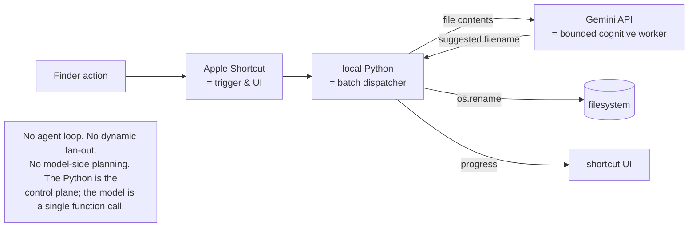
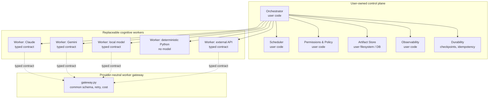
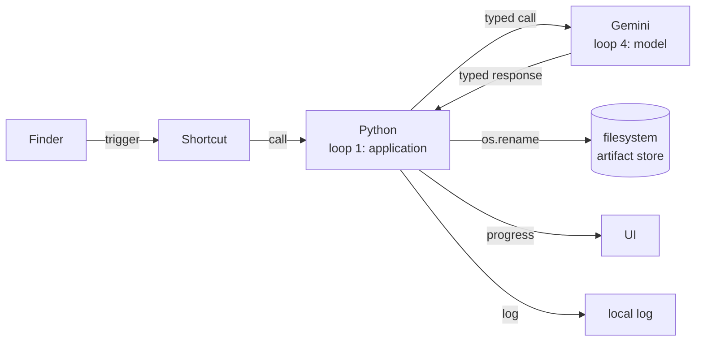

<!--
Provenance: this is the single CANONICAL preliminary study, consolidated on
2026-07-30 from two 2026-07-29 drafts written by parallel sessions against the
same research handoff:
  1. the longer "superseding draft" (previously only in ~/Downloads/) — the
     base of this document; and
  2. the shorter "primary" study previously at this path — now archived
     verbatim at docs/archive/ai-orchestration-study-2026-07-29/.
The ~/Downloads/ copies are no longer the canonical source and may be deleted
by the user. See section 13 (Consolidation notes and changelog) for exactly
what was merged and which discrepancies were reconciled.
-->

# User-Owned AI Orchestration: A Preliminary Study

| Field | Value |
| --- | --- |
| Prepared | 2026-07-29 |
| Consolidated | 2026-07-30 (two parallel drafts merged; see section 13) |
| Status | **Preliminary.** Source-grounded but bounded; not a final report. |
| Phase | Learning and research only. No implementation. |
| Project | `~/Developer/claude-local-bridge-playground` (branch `main`) |
| Location | `docs/ai-orchestration-preliminary-study-2026-07-29.md` (canonical; HTML companion alongside; superseded originals in `docs/archive/ai-orchestration-study-2026-07-29/`) |
| Governing principle | At every layer where practical, the user should own the loop. |
| Source handoff | `Downloads/ai-orchestration-study-preliminary-research-handoff-2026-07-29.md` |

> **Read this first.** Every claim in this report carries an evidence label, a
> primary URL, an access date (2026-07-29), and a confidence score. The labels
> are: `documented fact`, `source-code observation`, `measured result`,
> `vendor claim`, `research finding`, `inference`, `open question`. Claims I
> could not verify against a live URL are explicitly downgraded to
> `inference` or `open question` — this is by design, not a failure.

---

## 1. Executive summary (for a non-programmer)

Modern AI systems can do far more than chat: they can call external tools,
write and run code, schedule work, and delegate to other AI "workers." The
question this report investigates is: **who owns the loop that ties all of
this together?**

There are now three coherent positions in the market:

1. **Vendor-managed inner loop.** Anthropic's *Programmatic Tool Calling* and
   *Code Execution Tool* let a model write code, call your tools, and run for
   minutes — but the sandbox, the cost metering, the timeouts, and the
   transcript are all owned by the vendor. It is the easiest path. It is also
   the path on which you can see the least.
2. **Open-source code-action loop.** Hugging Face's *smolagents* lets a model
   write Python that directly calls your tools by name. You pick the executor
   (a local AST filter, Docker, E2B, Modal, Blaxel). The generated code can
   branch, loop, and compose tools with native Python — much closer to
   "the model writes the program."
3. **Durable workflow engine.** LangGraph (and to a lesser extent Google's
   *ADK* and Microsoft's *AutoGen* 0.4+) treats the LLM call as **one node
   in a graph** rather than the whole program. You own the graph, the
   checkpoints, the retries, and the durable state; the model is a replaceable
   worker.

In compressed form, the fork looks like this (summary box carried over from
the 2026-07-29 primary draft):

```text
+--------------------------------------------------------------------------+
|                          THE CONTROL PLANE FORK                          |
+--------------------------------------+-----------------------------------+
|   VENDOR-MANAGED (e.g. Anthropic)    |   USER-OWNED (e.g. local runner)  |
+--------------------------------------+-----------------------------------+
| Inner tool loop in vendor sandbox    | User runs the loop and executor   |
| Zero intermediate model round-trips  | User holds credentials            |
| Fixed hardware (5 GiB RAM, 1 CPU,    | Custom hardware and networks      |
|   no internet)                       | Full state and audit storage      |
| Vendor controls logs and context     |                                   |
|   suppression                        |                                   |
+--------------------------------------+-----------------------------------+
```

The user's own Gemini-powered file-renaming workflow — Finder action → local
Python → Gemini API → filesystem rename, processing 100+ files per minute —
already instantiates a user-owned control plane. The Shortcut is the trigger.
The Python is the deterministic batch dispatcher. The Gemini call is a
**bounded cognitive worker**, not an agent. The model does not decide what to
do next, when to stop, or what to write back. The user owns every one of
those decisions through code the user can read.

That is the thesis: the most important design choice in 2026 AI orchestration
is not which model to call but **where the control plane lives.** Owning the
loop, in practice, means owning the executor, the durable state, the approval
points, and the artifact store — not the model.

The rest of this report is the evidence for that claim and a sober map of
which pieces are mature, which are still research, and which remain
genuinely unsolved.

---

## 2. Working ontology (precise)

These are the working terms for the rest of the report. They are intentionally
narrower than the broader AI literature; the goal is to be able to say
"this system does X but not Y" without ambiguity.

| Term | Definition |
| --- | --- |
| Direct tool calling | The model requests a structured tool; the harness executes it, returns a result, and resamples the model. |
| Agent-authored scripting | The model writes Python, shell, JavaScript, or another program to automate work. |
| Programmatic tool orchestration | Executable logic, rather than repeated model turns, controls multiple tool calls and intermediate processing. Runtime location is not part of the definition. |
| Self-hosted programmatic tool calling | The user controls the generated-code runtime and tool-call protocol. |
| Provider-managed programmatic tool calling | A vendor manages the generated program and some or all of the inner tool loop. |
| Batch dispatcher | Deterministic software that fans bounded jobs out to workers and aggregates results. |
| Worker | A bounded deterministic or model-backed capability. |
| Agent | A worker with its own model loop, tools, state, or repeated decisions. |
| Agent-as-tool | An agent hidden behind a bounded tool contract while the manager retains control. |
| Orchestrator | Chooses jobs, dependencies, sequencing, and composition. |
| Scheduler | Enforces queues, concurrency, retries, timeouts, cancellation, and limits. |
| Control plane | User-owned policy, state, authority, observability, and lifecycle management above workers. |

**Important distinction.** *Programmatic invocation of a model* (calling an
LLM from a Python loop) is **not** the same thing as *programmatic
orchestration of tools* (the model itself running multiple tool calls in a
generated program). The first is a 2023-era pattern; the second is the
question this report investigates.

---

## 3. Loop-ownership diagram

The diagrams below show who owns the outer model loop, the inner tool/code
loop, and the durable state, for each architecture in the study set.

### 3.1 Vendor-managed inner loop (Anthropic programmatic)

```mermaid
sequenceDiagram
    participant U as User / Harness
    participant API as Anthropic API
    participant S as Managed Sandbox
    participant T as User Tool(s)
    U->>API: messages.create(tools=[...], allowed_callers=[...])
    API-->>U: server_tool_use (code block) + tool_use (paused)
    U->>API: messages.create(tool_result blocks, container=...)
    loop inside the sandbox (user-invisible)
        API->>S: run code cell
        S->>T: async function call
        T-->>S: result
        S-->>API: stdout/stderr/return_code
    end
    API-->>U: final text or another code block
    Note over U,T: User owns the request envelope; Anthropic owns<br/>the sandbox, the inner loop, the transcript shape,<br/>the cost, the timeout, and the cancellation.
```

### 3.2 Open-source code-action loop (smolagents CodeAgent)

```mermaid
sequenceDiagram
    participant U as User
    participant M as smolagents MultiStepAgent
    participant C as CodeAgent
    participant E as PythonExecutor<br/>(local | docker | e2b | modal | blaxel)
    participant T as User Tools<br/>(bound as Python names)
    U->>M: agent.run(prompt)
    loop up to max_steps
        M->>C: self.step()
        C->>C: build prompt<br/>(tools_namespace injected)
        C->>E: model output parsed as Python
        E->>T: tool invocation<br/>(treated as ordinary Python call)
        T-->>E: return value
        E-->>C: step memory
    end
    C-->>U: final_answer
    Note over U,T: User owns the executor, the tools namespace,<br/>the model, and the prompt; smolagents owns<br/>the outer ReAct loop.
```

### 3.3 Durable workflow engine (LangGraph)

```mermaid
flowchart LR
    A([Start]) --> N1[Node:<br/>classify intent]
    N1 -->|route| N2[Node:<br/>LLM worker A]
    N1 -->|route| N3[Node:<br/>LLM worker B]
    N2 --> N4[Node:<br/>aggregator]
    N3 --> N4
    N4 --> H{human approval?}
    H -->|approve| N5[Node:<br/>side effect]
    H -->|reject| A
    N5 --> Z([End])
    N1 -. checkpoint .-> CK[(PostgresSaver /<br/>SqliteSaver)]
    N2 -. checkpoint .-> CK
    N3 -. checkpoint .-> CK
    N4 -. checkpoint .-> CK
    H -. interrupt/resume .-> CK
    Note[Each node restarts from the top on resume.<br/>Side effects before interrupt() must be idempotent.]
```

### 3.4 AutoGen actor model

```mermaid
flowchart LR
    H[SingleThreadedAgentRuntime] -->|register| A1[RoutedAgent: planner]
    H -->|register| A2[RoutedAgent: coder]
    H -->|register| A3[RoutedAgent: critic]
    A1 <-->|TopicId| A2
    A2 <-->|TopicId| A3
    A2 -. uses .-> E[CodeExecutor<br/>(local / docker / jupyter / docker_jupyter / azure)]
    A3 -. uses .-> T[BaseTool list]
    Note[Tools page shows the executor is wrapped by<br/>PythonCodeExecutionTool; executor state does NOT<br/>cross the distributed runtime by default.]
```

### 3.5 The user's existing file-renaming pipeline



---

## 4. Source-grounded landscape analysis

For each system in the study set, the following sections summarize the
evidence and assign a maturity estimate. The rubric is defined in section 5.

### 4.1 Hugging Face `smolagents`

**What it is.** A small Python library with two top-level agent classes
sharing a `MultiStepAgent` base. `CodeAgent` is the default: it asks the
model to emit a Python source string, which a `PythonExecutor` parses and
runs. `ToolCallingAgent` is the JSON-only variant.
*(documented fact, high confidence)*

**The code-action trick.** `CodeAgent` injects a flat namespace into the
executor so that registered tools are callable as ordinary Python names.
`get_tools_definition_code` emits a `Tool` class stub whose `__call__`
delegates to `forward`, followed by `<name> = <ToolClass>()` bindings.
Generated code therefore composes tools with native Python control flow
(loops, conditionals, intermediate variables) rather than via a JSON
dispatcher. *(source-code observation, high confidence)*

**Sandbox story — explicit "this is not a security boundary."**
`LocalPythonExecutor` parses the AST, applies an `authorized_imports`
allowlist, blocks dangerous modules and dunder access, and caps operations
(10M), `while` iterations (1M), output length (50 000), and wall time
(30s default). The official documentation states this can be bypassed and
**must not be used as a security boundary.** *(documented fact, high
confidence)*

For real isolation, `CodeAgent` supports `executor_type` in
`["local", "blaxel", "e2b", "modal", "docker"]` — five backends behind one
loop. The docs explicitly warn about a two-mode tradeoff: "code snippets
only in a remote sandbox" breaks `managed_agents` (credentials aren't
forwarded into the sandbox), while "entire agent runs inside the sandbox"
supports multi-agent but requires shipping secrets into the sandbox.
*(documented fact, high confidence)*

**The outer loop is not pluggable.** `MultiStepAgent.run` / `_run_stream`
iterates `step_number` up to `max_steps` (default 20) and calls `self.step()`
which calls the model, parses an action, executes it, and appends a memory
step. Users can hook via `step_callbacks`, `reset()`, and `replay()` but
**cannot interleave custom logic between steps without subclassing**.
*(source-code observation, high confidence)*

**Composition pattern.** `managed_agents` is the hierarchical mode: a child
agent gets a name + description that are injected into the manager's system
prompt, and the manager invokes the child by generating a Python call to
that name. The same mechanism composes tools — a managed agent is
literally just another callable name in the generated code's namespace.
*(documented fact, high confidence)*

**What an unprivileged user can customize.** Swap the model
(InferenceClient / LiteLLM / OpenAI / Transformers / Azure / Bedrock),
customize the prompt (`prompt_templates` / `PromptTemplates` / `instructions`),
plug in a custom `PythonExecutor`, define tools with `@tool` or `Tool`
subclassing, set `planning_interval`, `final_answer_checks`, and
`step_callbacks`. ToDict / save / `push_to_hub` lets you serialize the
entire agent+tools+prompt graph. *(documented fact, high confidence)*

**Durability gap.** `smolagents` has no built-in checkpoint/resume API for
in-progress runs. `AgentMemory.steps` is in-memory; the only persistence is
saving the agent *definition* to the Hub and reconstructing it via
`from_folder` / `from_hub`. An interrupted run cannot be resumed from a
saved step list. *(inference, medium-high confidence — open question
pending deeper source read.)*

> **Resolved 2026-07-30 — verified (source-code observation, high
> confidence).** Read directly from current `main`: `AgentMemory.steps` is a
> plain in-process list with serialize-only `dict()` methods and no
> deserializer; `save()`/`push_to_hub()` persist the agent definition only;
> `interrupt()` discards run state. Feature request huggingface/smolagents
> #1216 ("Save/Load agent memory", 2025-04) remains open and unimplemented
> as of v1.26.0. Nuance: manual resume is achievable by hand-reconstructing
> step objects and calling `run(reset=False)` — the gap is "no built-in
> API," not "impossible." Evidence in `docs/ai-orchestration-study-review-and-next-steps-2026-07-30.html`.

**Principal limitation.** The outer loop is library-owned, the executor is
the only true isolation boundary, and the abstraction level is "model emits
Python." If you want explicit graphs, durable checkpoints, or human-in-the-loop
outside the model prompt, you have to build that yourself or pick a
different framework.

**Strongest lesson.** The injection of a flat Python namespace that maps
each tool to a callable name is a remarkably compact way to make generated
code feel like ordinary programming — *much* more composable than the
JSON-tool-calling idiom that dominates direct tool calling.

### 4.2 LangGraph

**What it is.** A low-level orchestration framework for long-running,
stateful agents, MIT-licensed, primarily Python (with a separate
LangGraph.js for TypeScript). Inspired by Pregel and Apache Beam, with a
public interface inspired by NetworkX. *(documented fact, high confidence)*

**Two parallel APIs.** The **Graph API** is explicit nodes and edges
(`StateGraph`, `add_node`, `add_edge`, `add_conditional_edges`). The
**Functional API** is `@task` and `@entrypoint` decorators that run
concurrently and return futures. Both are first-class.
*(documented fact, high confidence)*

**Nodes, not LLM calls.** A graph node is a unit of work — an LLM
invocation, a gate function, an aggregator, or a prebuilt helper like
`ToolNode`. **LLM calls are wrapped in nodes, not the graph itself.**
This is the most important architectural statement in the framework.
*(documented fact, high confidence)*

**Durability story.** `Checkpointers` persist thread-scoped graph state
snapshots identified by `thread_id` in the run config. They support
conversation continuity, human-in-the-loop, time travel, and fault
tolerance. `InMemorySaver` / `MemorySaver` do not survive process restarts;
`PostgresSaver` and `SqliteSaver` do. Postgres thread IDs must stay under
255 characters. *(documented fact, high confidence)*

**Interrupts and resume.** Dynamic interrupts are raised by calling
`interrupt()` inside a node with a JSON-serializable value; the value
supplied via `Command(resume=...)` becomes the return value of
`interrupt()`. The node **restarts from the beginning on resume**, so
side effects before the call must be idempotent. Multiple outstanding
interrupts are matched by strict index-based order; non-deterministic
looping causes index mismatches. *(documented fact, high confidence)*

**Dynamic fan-out.** The `Send` API lets an `assign_workers`-style node
return a list of `Send` invocations, each with its own state, and worker
outputs are written to a shared state key via the reducer pattern
`Annotated[list, operator.add]`. *(documented fact, high confidence)*

**Multi-agent.** Modeled as orchestrator-worker with a shared state key
plus `Send`, or as a router using structured output to classify input and
a conditional edge to dispatch to specialized subgraphs. The framework
explicitly distinguishes **workflows** (predetermined code paths) from
**agents** (dynamic, self-directed process and tool usage).
*(documented fact, high confidence)*

**Crash recovery is conditional.** The README claims agents
"automatically resum[e] from exactly where they left off" after failures,
but that claim is conditional on the chosen checkpointer backend. With
`InMemorySaver`, it does not survive a process restart; with `PostgresSaver`
or the LangGraph Platform Agent Server, it does. *(documented fact,
high confidence)*

**Managed runtime.** When using the LangGraph Platform Agent Server,
persistence infrastructure is handled automatically with no manual
configuration. On self-hosted deployments, the developer selects and
configures the checkpointer backend. The full self-host-vs-managed
tradeoff is not exhaustively documented on a single page. *(documented
fact + open question)*

**Principal limitation.** The framework is explicit, durable, and
provider-agnostic — but it requires you to *think* in graphs. The
abstraction cost is real: simple linear prompts become graphs, the
mental model shifts from "model loop with tools" to "graph of work units
where the model is one type of unit."

**Strongest lesson.** The clearest separation of *model* (replaceable
cognitive worker) from *control plane* (the graph, the checkpointer, the
interrupts) of any system in this study. This is the user-owned thesis
embodied.

### 4.3 OpenAI Agents SDK

**Agent-as-tool.** `Agent.as_tool()` requires `tool_name` and
`tool_description`; it returns a `FunctionTool`-shaped object that launches
a nested `Runner.run` for the sub-agent. *(documented fact, high
confidence)*

**Typed nested input.** `Agent.as_tool()` accepts a Pydantic `parameters`
model and an optional `include_input_schema=True` to embed the JSON schema
in the generated nested tool input. The parsed payload is available at
`RunContextWrapper.tool_input` inside the nested run.
*(documented fact, high confidence)*

**Output extraction.** `custom_output_extractor(run_result: RunResult) ->
str` lets you post-process the nested run — for example, walking the
reversed `new_items` stream looking for a `ToolCallOutputItem` whose output
starts with `'{'` to pull out a JSON payload.
*(documented fact, high confidence)*

**Handoffs vs. tool wrapping.** The `handoff()` helper supports
`tool_name_override`, `tool_description_override`, `on_handoff(ctx,
input_data)`, `input_type` (Pydantic), `input_filter`, `is_enabled`, and
`nest_handoff_history`. By default, **the entire prior conversation
history** is passed to the new agent; `input_filter` can replace or filter
`new_items` via `HandoffInputData` (input_history, pre_handoff_items,
new_items, input_items, run_context). Per-handoff `input_filter` takes
precedence over `RunConfig.handoff_input_filter`. *(documented fact, high
confidence)*

**Tracing.** Built-in with spans for agents, generations, function calls,
guardrails, handoffs, transcriptions, and speech. Default
`BatchTraceProcessor` ships to OpenAI's backend; `set_tracing_export_api_key()`
attaches a free OpenAI key for tracing even with non-OpenAI models. Long
list of third-party exporters (W&B, Arize-Phoenix, MLflow, Braintrust,
Logfire, AgentOps, LangSmith, Maxim, Comet Opik, Langfuse, Langtrace,
Galileo, Portkey, PostHog, Datadog). **Tracing is unavailable under
OpenAI ZDR.** *(documented fact, high confidence)*

**Human-in-the-loop.** `needs_approval: bool` or callable; when triggered,
the run surfaces `FunctionToolResult.interruptions: list[ToolApprovalItem]`
and pauses until `RunState.approve()` or `RunState.reject()` is called.
Also covers `MCPToolApprovalFunction`, `ShellApprovalFunction`,
`ApplyPatchApprovalFunction`, and `CustomToolOnApprovalFunction`. Works for
nested agent-as-tool runs. *(documented fact, high confidence)*

**Sessions and memory.** Automatic Sessions for conversation history; the
`redis` extra (`pip install 'openai-agents[redis]'`) enables a Redis-backed
session store. Other persistence backends beyond Redis are not enumerated
on the repo landing page. *(documented fact, medium-high confidence)*

**Provider portability.** Repo claims support for OpenAI Responses, OpenAI
Chat Completions, and 100+ other LLMs via `any-llm` and `LiteLLM` as
optional integrations. Realtime agents are pinned to `gpt-realtime-2.1`.
The "100+ LLMs" figure is a vendor claim. *(documented fact + vendor
claim, medium-high confidence)*

**Deployment.** No managed cloud deployment service described on the repo
landing page; deployment is left to the developer. Sandbox options
include `UnixLocalSandboxClient`, `DockerSandboxClient`, and a hosted
sandbox client for long-horizon tasks. *(documented fact, high
confidence)*

**Principal limitation.** The most polished agent-as-tool interface in the
study, but tracing is unavailable under OpenAI ZDR (zero data retention)
and the framework's "free tracing" comes with an implicit data
relationship to OpenAI's backend.

**Strongest lesson.** `Agent.as_tool()` with a Pydantic `parameters`
schema and a `custom_output_extractor` is the cleanest pattern in the
study for "hide a nested LLM run behind a typed function call." It is the
shape of a well-designed agent-as-tool contract.

### 4.4 Google ADK

**Two flavors of agent composition.** `sub_agents` (parent-owned children,
delegation via the `transfer_to_agent` mechanism) and `AgentTool` (an
agent instance placed in `tools=[...]` so the LLM calls it as a function).
The page enumerates `FunctionTool` / `BaseTool` / `AgentTool` as the
accepted `tools` parameter types. *(documented fact, high confidence)*

**Template workflow agents.** `SequentialAgent` (ordered pipeline),
`ParallelAgent` (concurrent fan-out), `LoopAgent` (iterative refinement
until a termination condition). In ADK 2.0 (Python and Go) these template
workflows are described as superseded by graph-based and dynamic
workflows; treat as legacy-but-supported. *(documented fact, high
confidence)*

**Artifacts.** `BaseArtifactService` with `InMemoryArtifactService` and
`GcsArtifactService` for persistent named, versioned binary data; values
are `google.genai.types.Part` objects; scope is per-session (default) or
per-user (filename prefix `user:`). Missing service raises `ValueError` on
save / load / list. *(documented fact, high confidence)*

**Sessions and memory.** Separates `Session` (single ongoing interaction,
scoped to a user and a conversation) from `Memory` (a searchable
cross-session store), each managed by its own service. In-memory
implementations are described as ephemeral; persistence backends are
"cloud-based and database" — not enumerated by name on the docs page.
*(documented fact, medium-high confidence)*

**Local-first execution.** `adk run path/to/my_agent` (interactive CLI)
and `adk web path/to/agents_dir` (web UI). The GitHub README does not
document managed cloud deployment; deployment guidance is deferred to the
external docs site. Vertex AI Agent Engine deployment is advertised
elsewhere but was not present on the page that was fetched.
*(source-code observation + open question)*

**Principal limitation.** The docs and the repo land on different things
when it comes to deployment. The model is sound — explicit artifact
service, explicit session/memory service, three template workflow agents
— but the operational story is incomplete on the public surface.

**Strongest lesson.** The explicit split between `Session` and `Memory`
is a cleaner abstraction than most frameworks offer, and the artifact
service is the right shape for "complete outputs move to an artifact
store while the model consumes summaries and references."

### 4.5 Microsoft AutoGen

**Five code executors.** `LocalCommandLineCodeExecutor` (host process, per-
block subprocess), `DockerCommandLineCodeExecutor` (stateless container),
`JupyterCodeExecutor` (stateful local kernel via `nbclient`),
`DockerJupyterCodeExecutor` (stateful kernel inside a container), and
`ACADynamicSessionsCodeExecutor` (remote Azure-managed sandbox). Local
and Jupyter variants carry explicit "Danger" callouts about host
execution. *(documented fact, high confidence)*

**Uniform async lifecycle.** Every executor exposes `start()`, `stop()`,
`restart()`, and `execute_code_blocks(code_blocks, cancellation_token) ->
CodeResult`. The recommended pattern is `async with Executor() as ex:`
so stop/cleanup run even on error. The local executor cleans up its temp
`work_dir` on stop; the docker executor waits for cancellation tasks to
finish on stop; the Azure executor's `restart()` generates a fresh
session_id. *(documented fact, high confidence)*

**Cooperative cancellation.** Through `autogen_core.CancellationToken`
passed to `execute_code_blocks`. The Jupyter variant is described as
**cooperative, not OS-level enforced**. Local relies on per-block
subprocess timeouts. Docker's `stop()` "waits for cancellation tasks to
finish," suggesting token-aware join semantics rather than SIGKILL.
*(documented fact, medium-high confidence)*

**Isolation is graded.** Only Azure (`ACADynamicSessions`) and Docker-
family executors provide an external trust boundary. `Local` and
`Jupyter` run on the host with at most a regex-based dangerous-command
filter and an `output_dir` scope. The local executor docs explicitly
disclose "regular expression match against a list of dangerous commands"
as the only host-side mitigation. *(documented fact, high confidence)*

**Security advisory.** `DockerCommandLineCodeExecutor`'s `bind_dir` mounts
a host directory into the container **without an allowlist**. GitHub
issue #7917 (2025) classified this as OWASP ASI10 trust-boundary violation
at CRITICAL severity. The advisory names
`autogen_ext/code_executors/docker/_docker_code_executor.py` and
recommends default-deny mounts, validated path allowlists, and read-only
mounts where possible. Found by AgentGuard v0.6.1. *(documented fact,
high confidence)*

> **Update 2026-07-30 — still unremediated (documented fact + source-code
> observation).** Two corrections and a status: (1) issue #7917 was filed
> **2026-07-05**, not 2025; (2) current `main` still mounts `bind_dir`
> read-write with no allowlist or default-deny, and the latest release
> (python-v0.7.5) predates the report; (3) the AutoGen repo now declares
> **maintenance mode**, pointing new work at Microsoft Agent Framework —
> a fix in this repo is unlikely. Whether the successor framework's
> executors share the mount behavior is a new open question. Evidence in
> `docs/ai-orchestration-study-review-and-next-steps-2026-07-30.html`.

**Tools wrap executors, not the other way around.** Code executors are
**not** `BaseTool` subclasses and are not registered into the model's
tool list directly. An executor is wrapped by `PythonCodeExecutionTool` (or
consumed by `CodeExecutorAgent`) so the LLM sees a JSON-schema function
whose runtime delegates into the executor. *(documented fact, high
confidence)*

**Generated code cannot import agent tools.** Tool/function calling is a
model-client contract, not a runtime import path. To make user-defined
Python callables reachable from generated code, the executor must be
initialized with a `functions=[...]` list (which is exposed via
`FUNCTION_PROMPT_TEMPLATE` rather than Python import), or the callables
must be installed in the executor's environment as a real Python module.
The original 0.2 `register_function` / `FUNCTION_PROMPT_TEMPLATE` is
deprecated in 0.4, but the executor still holds a functions list for
prompting. *(source-code observation, medium-high confidence)*

**Actor model.** AutoGen 0.4+ is built on an actor model: agents subclass
`RoutedAgent` and are registered into a `SingleThreadedAgentRuntime` (or
its gRPC distributed variant) via `MyAgent.register(runtime, "type",
factory)`, yielding an `AgentType`. Messages are routed to instances by
`AgentId(type, key)`. *(documented fact, high confidence)*

**Distributed runtime is experimental.** `GrpcWorkerAgentRuntimeHost` +
`GrpcWorkerAgentRuntime` is the cross-process / cross-host variant. It is
explicitly marked "experimental" and "expect breaking changes." The
distributed runtime page **does not document how code executors behave
across worker boundaries** — executors are typically instantiated per
worker process, not serialized over gRPC. *(documented fact, high
confidence)*

**Open question.** There is no documented "remote code executor over the
actor runtime." The gRPC transport carries agent messages, not executor
invocation results. The Azure executor is the only "remote" option, and
it uses a Microsoft-managed sandbox, not the actor runtime. *(open
question, medium confidence)*

**Component composition.** Built around `Component[TConfig]` with
`_to_config()` / `_from_config()` for serialization; model clients, tools,
and code executors all implement this base. The composition graph is:
`ModelClient → (RoutedAgent holding List[BaseTool]) → CodeExecutor wrapped
as PythonCodeExecutionTool`, all registered into a runtime. *(source-code
observation, high confidence)*

**Principal limitation.** The 0.4+ actor model is the right abstraction
for distributed agents, but the documentation of how code execution
behaves across worker boundaries is missing. The trust-boundary
weakness in the docker executor (issue #7917) is real and CRITICAL.

**Strongest lesson.** The clearest separation of "the executor is a
resource" from "the tool is the LLM-facing schema" from "the agent is the
router" in the study. The recommended user flow
(`async with Executor() as ex: tool = PythonCodeExecutionTool(ex); agent =
AssistantAgent(..., tools=[tool])`) is a clean composition.

### 4.6 Anthropic Programmatic Tool Calling and Code Execution Tool

**What PTC is.** A per-tool `allowed_callers` array on the user's tool
definition. Values are `"direct"`, `"code_execution_20260120"`, or both.
The two code-execution version strings are accepted interchangeably; the
response block always tags the caller as `code_execution_20260120`.
*(documented fact, very high confidence)*

**`allowed_callers` is presentation guidance, not a security boundary.**
The doc warns: **"Do not rely on `allowed_callers` as a security
boundary"** — Claude may still issue a direct `tool_use` even when a tool
lists only the code-execution caller. *(documented fact, very high
confidence)*

**`caller` metadata.** Every programmatic `tool_use` block carries a
`caller` object whose `tool_id` matches the id of the parent
`server_tool_use` code-execution block. This is the **only** metadata that
links an awaited tool call back to the code that issued it. *(documented
fact, high confidence)*

**Context suppression.** Intermediate tool results from a programmatic
call are **not** added to Claude's context window; only the final code-
execution output (`stdout` / `stderr` / `return_code`) is. Anthropic's
published numbers: ~38% billed-input-token reduction on a 75-tool PM
benchmark, ~24% fewer input tokens on BrowseComp / DeepSearchQA, 20-40%
typical savings on requests with 10-49 tool definitions. *(documented
fact, high confidence)*

**Message-formatting restriction.** The user's reply to a paused
programmatic `tool_use` **must** be a user message whose content is
**exclusively** `tool_result` blocks (no text, no images, no other
content types) and each `tool_result.content` must be a string or `text`
block; other block types are rejected. Hard server-side contract.
*(documented fact, very high confidence)*

**Container lifecycle.** A pending programmatic tool call inside a
container times out at about 4 minutes (the example shows 270 s) and
raises a `TimeoutError` inside Claude's running code. Idle containers
are checkpointed after about 5 minutes. **No container can be reused
more than 30 days after creation.** *(documented fact, high confidence)*

**Container parameter becomes required.** Programmatic tool calling
requires the code-execution container to be passed back on the
continuation request while a programmatic call is pending; the API
rejects the request without the `container` ID in that case. `tool_choice`
cannot name a tool whose `allowed_callers` does not include `"direct"`.
*(documented fact, high confidence)*

**Code Execution Tool sandbox limits.** Linux/x86_64, no internet access,
5 GiB RAM, 5 GiB workspace storage, 1 CPU. For
`code_execution_20260521`, a 90-second wall-clock limit per REPL cell is
surfaced to Claude via a `detection_timeout` status; a whole tool
invocation can still fail with `execution_time_exceeded`. *(documented
fact, very high confidence)*

**Platform availability.** Code Execution Tool is unavailable on Amazon
Bedrock and Google Cloud. On Microsoft Foundry, it requires a
"Hosted on Anthropic" deployment. Programmatic tool calling shares that
footprint and is not available on Bedrock or GCP at all. *(documented
fact, high confidence)*

**Model compatibility.** Claude Haiku 4.5 accepts the
`code_execution_20260120` and `code_execution_20260521` tool types but
**does not** get programmatic tool calling or REPL state persistence; the
newer versions degrade to `code_execution_20250825` behavior on that
model. The tool type string does not tell the client whether PTC is
actually active — model matters. *(documented fact, high confidence)*

**File retrieval.** `bash_code_execution_result.content` carries a list
of `file_id` values for any files Claude created, retrievable only via
the Files API (`client.beta.files.download`); the Files API integration
with code execution still requires the `files-api-2025-04-14` beta
header. *(documented fact, high confidence)*

**No internet; fixed package set.** Code execution containers are
workspace-scoped to the API key and run without internet; the Python
environment is fixed (pandas, numpy, scipy, scikit-learn, matplotlib,
etc.) and packages cannot be installed at runtime. *(documented fact,
very high confidence)*

**Pricing.** Code execution is free when bundled with
`web_search_20260209` / `web_fetch_20260209`; otherwise billed at
$0.05/hr per container with a 5-minute minimum, plus 1,550 free
org-hours per month. Execution time is metered even when files were
uploaded but Claude did not call the tool. *(documented fact, high
confidence)*

**The honest admission.** Programmatic tool calling is documented as one
of three implementations of the same pattern; "Client-side direct
execution" (the user's own code-execution tool with local functions)
and "Self-managed sandboxed execution" are listed as alternatives, and
Anthropic warns that client-side execution "Executes untrusted code
outside of a sandbox" and "Tool invocations can be vectors for code
injection." *(documented fact, very high confidence)*

**Multicomputer environment.** When the user provides a client-side
shell tool alongside the managed code execution tool, Claude is operating
in a "multicomputer environment." The doc recommends explicit
system-prompt instructions because "Variables, files, and state do NOT
persist between different execution environments" and Claude can
otherwise confuse them. *(documented fact, very high confidence)*

**API-surface note (negative).** The PTC doc does not mention any of:
a separate `response_model` parameter, a `response.create_with_tool_stream`
method, or async functions exposed at the API surface. PTC's async
behavior is purely inside the sandbox. The vocabulary used is
`allowed_callers` + `caller.tool_id` + a paused `tool_use` round-trip.
The user-supplied focus list mentioned those terms; I could not find any
of them in the current PTC or CET docs. They may be older API names,
draft specifications, or a different vendor's vocabulary.
*(inference, medium confidence)*

**Inner-loop visibility (inference).** Inner-loop timeout, cost, and
sandboxing are user-invisible. A user reading a transcript sees the
`server_tool_use` code block and its single `code_execution_tool_result`,
with no record of how many client-tool round-trips the model made
inside the cell, how long the cell ran, or how many retries on
`TimeoutError` occurred. The only "inner" evidence is the per-block
`return_code`, `stdout`, `stderr`, and (for `code_execution_20260521`) the
`detection_timeout` marker. Container hours and `code_execution_requests`
are at the top-level `usage` object, not per inner call. *(inference,
high confidence)*

> **Resolved 2026-07-30 — partially refuted (documented fact).** For
> **client tools**, the inner loop is not opaque: every programmatic call
> pauses the request and surfaces a fully attributed `tool_use` block
> (`caller.tool_id` links it to its code cell), the generated Python source
> is fully visible in `server_tool_use.input.code`, `TimeoutError`s appear
> verbatim in `stderr` with elapsed seconds, and retries are countable as
> repeated blocks. Opacity is **confirmed** for server-side execution:
> no per-call wall-time or token/cost attribution, and — correcting the
> paragraph above — container hours do **not** appear in `usage` at all
> (billing is out-of-band; only `code_execution_requests` is in-band).
> Server tools invoked in-cell with `response_inclusion: "excluded"` can
> leave no transcript trace. Net: visibility per awaited client-tool call;
> opacity for server-side timing, cost, and in-cell server-tool activity.
> Evidence in `docs/ai-orchestration-study-review-and-next-steps-2026-07-30.html`.

**Principal limitation.** You get context suppression, you get async
inside the sandbox, you do **not** get visibility into the inner loop.
For research, observability, and replay, this is the most opaque
architecture in the study.

**Strongest lesson.** The PTC doc itself is the strongest single piece
of evidence in the study for the *user-owned thesis*: the vendor is
telling the user that client-side direct execution and self-managed
sandboxed execution are real alternatives. The "easy" path is not the
only path.

### 4.7 CodeAct (research lineage)

**The paper.** Wang et al., "Executable Code Actions Elicit Better LLM
Agents," arXiv:2402.01030, v1 2024-02-01, v4 2024-06-07. Accepted at
ICML 2024. Open-source code at `github.com/xingyaoww/code-act`.
*(research finding, high confidence — verified against the canonical
arXiv page)*

**The claim.** CodeAct proposes executable Python code as a unified
action space, integrated with a Python interpreter, able to execute code
actions and dynamically revise prior actions or emit new actions upon
new observations through multi-turn interactions. The paper analyzes
**17 LLMs on API-Bank and a newly curated benchmark** and reports
**up to 20% higher success rate** vs. widely used alternatives (JSON /
text in pre-defined format). The paper also releases **CodeActInstruct**,
a 7k multi-turn instruction-tuning dataset, and shows that fine-tuning
Llama2 and Mistral with it improves agent-oriented tasks without
compromising general capability. CodeActAgent, the fine-tuned model, is
integrated with a Python interpreter and can perform sophisticated tasks
(e.g., model training) using existing libraries and autonomously self-
debug. *(research finding, high confidence)*

**Research lineage gap.** Without a web search MCP available in this
environment, I cannot list follow-on papers (e.g., on the lineage
through OpenCodeInterpreter, OpenHands, Aider, or specific
self-debug / self-evolve variants). **Marked as open question** —
second-phase research should enumerate the follow-on corpus and the
specific self-debug / self-evolve evidence.

> **Resolved 2026-07-30 — corpus enumerated (research findings).** A
> 23-item sweep (OpenHands/ICLR 2025, OpenCodeInterpreter, DynaSaur/COLM
> 2025, CoAct-1, CodeTool/ACL 2025, SICA, Darwin Gödel Machine, Aider
> Polyglot, RedCode/NeurIPS 2024, SWE-agent/NeurIPS 2024, CodeDelegator,
> CaveAgent, Anthropic "code execution with MCP", Cloudflare "Code Mode",
> and more) finds the code-as-action thesis **strengthened** — no paper
> shows JSON tool calling beating code actions head-to-head — but
> **complicated** three ways: unconstrained action spaces fail without
> curated interfaces (SWE-agent), execute risky code at measured rates
> (RedCode), and degrade on long horizons from context pollution and lost
> runtime state (CodeDelegator, CaveAgent). Full annotated list in
> `docs/ai-orchestration-study-review-and-next-steps-2026-07-30.html`.

**Why this matters.** CodeAct is the *primary citation* in the study
for "code is a unified action space." It is also the academic
underpinning of `smolagents`' `CodeAgent`. If a future agent questions
the thesis "generated code is the right action-composition language,"
the CodeAct paper is the answer to point them at — with the caveat that
its evidence is "up to 20%," not "always," and that the comparison is
against JSON/text tool-calling, not against deterministic code.

---

## 5. Maturity rubric and scoring

### 5.1 Rubric

| Score | Meaning |
| --- | --- |
| 0 | Research concept. Idea in a paper, no working implementation. |
| 1 | Experimental implementation. Working but not production-tested. |
| 2 | Usable feature with material caveats. Documented, can be deployed, but has known gaps or risks that need mitigation. |
| 3 | Repeated production pattern with operational guidance. Multiple adopters, ops runbooks, public incident lore. |
| 4 | Interoperable or standardized infrastructure. Multiple competing implementations, or a formal standard, or a single dominant one with public failure modes. |

### 5.2 Scoring

The following table is the preliminary score for each layer. Every cell
carries the evidence anchor and a confidence note. "Anchor" is a
short tag that points to one or more claims in the landscape analysis.

| Layer | Score | Anchor | Confidence | Notes |
| --- | --- | --- | --- | --- |
| Structured model-to-tool calling | **4** | OpenAI Agents SDK FunctionTool; smolagents @tool | high | Mature, multiple competing implementations, public failure modes documented. |
| Agent exposed as a bounded tool | **3** | `Agent.as_tool()`; `AgentTool`; managed_agents | high | Production pattern; the handoff itself maps this layer as "common in modern SDKs." |
| Developer-authored parallel worker fan-out | **3** | LangGraph `Send`; ADK `ParallelAgent` | high | Mature as a workflow/distributed-systems pattern; integration with LLM agents is the "still research" part. |
| Provider-neutral model adapters | **3** | LiteLLM, any-llm, OpenAI Agents SDK 100+ claim | medium | Common but behavioral parity is incomplete; vendor-specific tool types and structured output differ. |
| Generated code composing multiple tools | **2** | smolagents CodeAgent; AutoGen executors | high | Demonstrated and usable, but harder to secure, persist, and replay. Local executors are explicitly **not** a security boundary. |
| Generated code invoking nested agents | **2** | smolagents managed_agents; AutoGen composed tools | medium-high | Implemented, still specialized; the agent-as-tool pattern lives at the LLM-schema level, not the code-import level. |
| Durable cross-provider worker orchestration | **2** | LangGraph PostgresSaver; AutoGen gRPC runtime (experimental) | medium | Active engineering territory without a settled standard. LangGraph Platform Agent Server is the closest thing to "managed" but ties you to the LangChain ecosystem. |
| Dependable autonomous agent organizations | **1** | None of the studied systems | high | Unsolved and often overclaimed. The OpenAI Agents SDK and Google ADK both hide the multi-agent boundaries behind typed contracts precisely because the open research question is whether that can be reliable. |

### 5.3 Reading the table

- Layers at score 3-4 are *safe to build on* with the standard caveats.
- Layers at score 2 are *usable but require you to bring the operational
  story yourself* — durability, observability, security, and recovery.
- The layer at score 1 (autonomous agent organizations) is the place
  where vendor marketing exceeds evidence by the widest margin. The
  study's central recommendation is to **not** attempt that layer as
  an end goal; if a use case appears to require it, the right answer is
  almost always to back out and build it as a deterministic workflow
  with bounded model calls.

---

## 6. Comparison matrix

The matrix below uses one row per framework. Cells summarize the most
material property in that column. "—" means "not part of the design
surface." "open" means "explicitly left to the user."

| | **smolagents** | **LangGraph** | **OpenAI Agents SDK** | **Google ADK** | **Microsoft AutoGen** | **Anthropic PTC / CET** |
| --- | --- | --- | --- | --- | --- | --- |
| Orchestration language | generated Python | explicit graph DSL | Python with `as_tool`/`handoff` | Python with `sub_agents` / `AgentTool` | Python with actor model | generated Python inside managed sandbox |
| Owner of outer model loop | smolagents (`MultiStepAgent.run`) | user (graph nodes) | OpenAI SDK (`Runner.run`) | ADK (per-agent run) | AutoGen runtime | Anthropic API |
| Owner of inner tool loop | smolagents executor | user (graph node) | nested `Runner.run` for `as_tool` | nested ADK run for `AgentTool` | `PythonCodeExecutionTool` wraps executor | Anthropic sandbox |
| Generated-code support | yes (Python, default `CodeAgent`) | no (graph nodes are user-authored) | limited (model emits JSON tool calls) | limited (workflow agents are deterministic) | yes (model emits Python, executor runs it) | yes (model emits Python, sandbox runs it) |
| Tools callable from generated code | yes — by name, via injected namespace | no — tools are graph nodes | no — JSON tool calls | no — JSON tool calls | yes — via `functions=[...]` prompting only; not Python-importable | yes — async functions, with `allowed_callers` declaration |
| Agents callable as tools | yes — `managed_agents` | yes — subgraph | yes — `Agent.as_tool()` | yes — `AgentTool` | yes — agent-as-tool composition | no (no nested managed execution surface) |
| Deterministic workflow support | no | yes — `Sequential`, `Parallel`, `Loop`-shaped graphs | partial — workflow traces | yes — `SequentialAgent` / `ParallelAgent` / `LoopAgent` | yes — actor-message ordering is deterministic per topic | no — generated code is the workflow |
| Concurrency mechanism | `asyncio` inside the executor; `max_steps` for the outer loop | `Send` API for fan-out; `Annotated[list, operator.add]` for aggregation | `asyncio.gather`-style tracing; not a first-class workflow primitive | `ParallelAgent` for fan-out | actor messages on topics; `RoutedAgent` is single-threaded per instance | `asyncio.gather` inside the sandbox only |
| Checkpoint / resume | no (in-memory `AgentMemory.steps` only) | yes — `PostgresSaver` / `SqliteSaver` / Agent Server | sessions (Redis extra) | session + memory services (in-memory or cloud/db) | not built-in to the executor; runtime-level via gRPC | no (container resumed via `container=...` parameter) |
| Artifact handling | generated code writes to local filesystem / E2B / Docker | graph state; long-term memory via `Store` | trace spans ship to OpenAI backend or third-party exporter | `BaseArtifactService` (in-memory or GCS) | component config; no first-class artifact service | `file_id`s via Files API |
| Approvals and permissions | `step_callbacks`; no first-class approval | `interrupt()` + `Command(resume=...)` | `needs_approval` / `RunState.approve()` | guardrails on tools (not deeply verified here) | not built-in to the executor | none inside the sandbox; system prompt only |
| Execution backends | local AST / Docker / E2B / Modal / Blaxel | user-supplied nodes; ToolNode calls user tools | user-supplied tool implementations | user-supplied tool implementations | local / Docker / Jupyter / DockerJupyter / Azure (ACADynamicSessions) | managed Linux/x86_64, no internet, fixed package set |
| Provider portability | high — `LiteLLMModel`, `OpenAIModel`, `TransformersModel`, `BedrockModel`, `AzureOpenAIModel`, `InferenceClientModel` | high — model client is a node implementation | high via LiteLLM / any-llm; realtime is OpenAI-only | Gemini-native; other providers via integration | model client is a `Component`; `AzureOpenAI` and others supported | Anthropic-only (Claude); not on Bedrock or GCP |
| Observability and replay | `replay()` / `write_memory_to_messages()`; Hub save/restore | traces via LangSmith; checkpoint time travel | built-in tracing with many exporters | traces via Vertex AI Agent Engine | runtime-level event log | per-block `return_code` / `stdout` / `stderr`; inner loop opaque |
| Maturity level (rubric of section 5; framework view from the primary draft) | **2** — usable with caveats | **3** — production pattern | **3** — production pattern | **2** — usable with caveats | **2** — usable with caveats | **2** — usable with caveats |
| Maturity / stability signals | ICML-style research lineage via CodeAct; multiple executor backends; rapid iteration | 38.4k GitHub stars; v1.0 API; LangGraph Platform managed runtime | OSS SDK, multiple exporters, OpenAI ZDR caveat | active OSS repo, Vertex AI Agent Engine deployment | OSS, 0.4+ actor model, distributed runtime marked experimental | production feature on Anthropic API; PTC has known inner-loop opacity |
| Strongest lesson | inject a flat Python namespace so generated code composes tools as ordinary calls | nodes, not LLM calls; the graph is the control plane | `Agent.as_tool()` + Pydantic `parameters` + `custom_output_extractor` is the cleanest agent-as-tool contract in the study | separate `Session` from `Memory`; first-class `BaseArtifactService` | `async with Executor() as ex: tool = PythonCodeExecutionTool(ex); agent = AssistantAgent(..., tools=[tool])` — clean composition | the vendor itself lists client-side direct execution and self-managed sandboxed execution as real alternatives |
| Principal limitation | no checkpoint / resume; outer loop not pluggable | mental model shift from "model loop" to "graph of work units" | tracing unavailable under OpenAI ZDR; managed runtime absent | deployment story incomplete on the public surface | distributed runtime is experimental; docker executor has a CRITICAL trust-boundary issue (issue #7917) | inner loop is user-invisible; per-call cost / retries / timeout are not in the transcript |
| Evidence type | documented fact + source-code observation | documented fact | documented fact | documented fact + source-code observation | documented fact + source-code observation + measured result (issue #7917) | documented fact + inference (inner-loop opacity) |
| Confidence (overall) | 0.90 | 0.90 | 0.90 | 0.80 | 0.90 | 0.95 |

---

## 7. Emerging engineering trends assessment

Carried over from the 2026-07-29 primary draft and re-labeled during
consolidation with this report's stricter claim taxonomy (the primary draft
labeled the smolagents step-reduction figure a measured result; it is a
vendor-reported benchmark and is downgraded accordingly).

| # | Trend | Status | Evidence and impact |
| --- | --- | --- | --- |
| 1 | Code as the action-composition language | `research finding` (strong) + `vendor claim` | CodeAct reports up to 20% higher success vs JSON/text tool calling across 17 LLMs (arXiv:2402.01030). smolagents' "~30% fewer steps" figure is a vendor-reported benchmark from Hugging Face documentation. |
| 2 | Specialists encapsulated as bounded tools | `documented fact` | Standardized in OpenAI Agents SDK (`Agent.as_tool()`), Google ADK (`AgentTool`), smolagents (`managed_agents`). Prevents context bloat in multi-agent systems. |
| 3 | Durable workflow engines surrounding probabilistic models | `documented fact` (conditional) | LangGraph checkpointers and super-steps; durability is conditional on the chosen backend (`InMemorySaver` does not survive restarts). |
| 4 | Generated programs remaining ephemeral optimization layers | `inference` | No studied framework persists generated code as a source of truth; durable logic is promoted to application code or graph definitions. |
| 5 | Complete artifacts moving to external storage | `documented fact` | ADK `BaseArtifactService`; Anthropic container workspace + Files API; LangGraph `Store`. Context windows stay lean; models consume summaries and references. |
| 6 | Provider-neutral worker gateways | `open question` | LiteLLM / any-llm exist, but behavioral parity across providers is incomplete and no settled standard has emerged. |
| 7 | Explicit separation of deterministic and cognitive nodes | `documented fact` | LangGraph's workflows-vs-agents distinction; ADK workflow agents; graph nodes isolate deterministic routing from probabilistic generation. |
| 8 | Sandboxed execution as a first-class runtime abstraction | `documented fact` | smolagents `executor_type` family; AutoGen's five executors; Anthropic's managed sandbox; E2B/Docker/microVM integration in agent SDKs. |
| 9 | Evaluation shifting to trajectories, routing, cost, recovery | `research finding` (early) | CodeAct separates action format from model quality; SDK tracing spans exist; no framework yet separates decomposition/routing/recovery quality as first-class metrics. |
| 10 | Deferred tool loading and discovery replacing static catalogs | `inference` (weakly evidenced) | On-demand tool-schema loading appears in vendor harnesses; not yet a documented cross-framework standard. Flagged for the phase-2 Claude Agent SDK / MCP review. |
| 11 | Policy, budgets, and authority above models, not in prompts | `documented fact` as principle; `open question` as standard | Approval surfaces exist (`interrupt()`, `needs_approval`); budget and authority enforcement remains user-built in every studied system (see sections 8.1 and 8.3). |

---

## 8. Difficult and unsolved areas

### 8.1 Authority

**What it means.** Separating planning from execution authority;
enforcing permissions below generated code and workers; avoiding
ambient credentials, filesystem, and network access.

**Current state.** smolagents explicitly states `LocalPythonExecutor` is
not a security boundary. AutoGen issue #7917 is a CRITICAL trust-boundary
violation. Anthropic PTC's "multicomputer environment" warning says
"Variables, files, and state do NOT persist between different execution
environments" — i.e., even Anthropic is not promising that the model
will not confuse the boundaries. LangGraph has the cleanest story here:
nodes own the side effects, the user owns the graph, `interrupt()` is
the explicit approval point. *(documented fact across the study.)*

**Open question.** There is no mature cross-framework authority model.
A "model issued a tool call, the tool call is denied, the model needs to
know" loop exists in pieces in each framework but is not standardized.
In particular, *what does the model see when a tool is denied?* The
answer varies from framework to framework and is rarely documented.

### 8.2 Durability

**What it means.** Checkpointing nested loops; resuming without
duplicated side effects; idempotency; exactly-once versus at-least-once
execution.

**Current state.** LangGraph `PostgresSaver` is the most mature.
LangGraph's own docs warn that the node restarts from the top on resume,
so side effects before `interrupt()` must be idempotent. smolagents has
no built-in checkpointing for in-progress runs. AutoGen's executor has
`restart()` but no automatic snapshotting. Anthropic PTC has the
container parameter, but the inner loop is opaque and retry semantics
inside the sandbox are not documented. *(documented fact + inference.)*

**Open question.** Exactly-once execution across a model call, a tool
call, and a side effect is **not solved** in any of the studied systems.
LangGraph's restart-from-the-top pattern is at-least-once, not
exactly-once; idempotency is the developer's problem.

> **Measured 2026-07-30 (measured result, langgraph 1.2.10, local
> no-model experiment).** A side effect placed before `interrupt()` inside
> a node executed **twice** for a single interrupt-and-resume (once on the
> initial invoke, once on resume) and **N+1 times** for a node containing
> N interrupts (once per resume — 3x for two interrupts). The docs'
> "must be idempotent" warning is exact, and the cost scales linearly with
> interrupts per node. Method and script noted in `docs/ai-orchestration-study-review-and-next-steps-2026-07-30.html`.

### 8.3 Concurrency

**What it means.** Quotas, backpressure, cancellation, retry storms,
adaptive limits, and nested cost/token budgets.

**Current state.** AutoGen's `CancellationToken` is the most explicit
public surface — but cancellation is *cooperative* (not OS-level) in the
Jupyter variant and the local executor relies on per-block subprocess
timeouts. LangGraph's `Send` API supports dynamic fan-out with a
`Annotated[list, operator.add]` reducer; cancellation propagates via the
graph runtime. ADK's `ParallelAgent` is a fan-out primitive; its
cancellation story is less explicit. Anthropic PTC is single-cell at a
time — there is no outer fan-out inside the sandbox. *(documented fact.)*

**Open question.** Nested cost/token budgets (one orchestrator spending
across N sub-agents, each of which has its own model client) are
**not** a first-class concept in any of the studied systems. The user
must compose this themselves.

### 8.4 Context and artifacts

**What it means.** Keeping complete evidence outside model context;
returning summaries and stable references; preserving provenance after
filtering.

**Current state.** Anthropic PTC's whole selling point is context
suppression — intermediate tool results do not enter Claude's context.
The cost is opacity: there is no per-tool-call record in the transcript.
Google ADK's `BaseArtifactService` is the cleanest explicit
implementation. LangGraph's `Store` primitive is the most flexible.
smolagents' only context store is the in-memory `AgentMemory.steps`.
*(documented fact.)*

**Open question.** Provenance across filtering — "where did this summary
come from and which exact tool call produced it?" — is not a first-class
concept. Anthropic PTC's `caller.tool_id` is a partial answer; LangGraph
traces are a partial answer; neither is a complete answer.

### 8.5 Worker contracts

**What it means.** Typed inputs/outputs, partial success, timeouts,
confidence, schema versions, and avoiding an unreviewable `run_anything`
authority tunnel.

**Current state.** OpenAI Agents SDK's `Agent.as_tool()` with Pydantic
`parameters` and `custom_output_extractor` is the cleanest contract in
the study. Google ADK's `AgentTool` provides a similar shape. smolagents
tools are typed via the JSON schema derived from the Python signature.
Anthropic PTC's `allowed_callers` is presentation guidance, not a
security boundary. *(documented fact.)*

**Open question.** Confidence scores and schema versioning on worker
outputs are not first-class. A `run_anything` authority tunnel — a tool
whose description is "do whatever needs doing" — is the single biggest
threat to the user-owned thesis, and none of the studied frameworks
prevent it.

### 8.6 Evaluation

**What it means.** Separating model quality from decomposition, routing,
aggregation, recovery, cost, and provenance quality; detecting
correlated worker failures.

**Current state.** The CodeAct paper separates model quality from the
action format. None of the studied SDKs separate "the model was wrong"
from "the decomposition was wrong" from "the routing was wrong" from
"the recovery was wrong." The user must instrument this themselves.
*(documented fact + open question.)*

**Open question.** Correlated worker failures (e.g., the same model
vendor having an outage that affects N workers at once) is not
addressed by any framework. Multi-vendor fan-out is the obvious
mitigation; none of the studied systems make this easy.

### 8.7 Generated-code reliability

**What it means.** Syntax/runtime errors, unbounded loops, auditing
ephemeral code, injection, sandboxing, and deciding what logic must
become durable application code.

**Current state.** smolagents has hard limits on operations (10M), while
iterations (1M), output length (50 000), and wall time (30 s). AutoGen
has per-block subprocess timeouts on the local executor. Anthropic PTC
has a 90-second REPL cell limit (for `code_execution_20260521`) and a
~4-minute container pause timeout. None of these is sufficient for
untrusted code. *(documented fact.)*

**Open question.** "What logic must become durable application code
rather than generated code" is a design heuristic, not a measured
property. The CodeAct paper's self-debug capability is a research
result, not a production guarantee.

### 8.8 Human control

**What it means.** Useful approval points, cost/authority previews,
pause / stop / redirection, and understandable nested activity.

**Current state.** LangGraph's `interrupt()` is the most explicit
approval primitive. OpenAI Agents SDK's `needs_approval` is similar.
Anthropic PTC has none inside the sandbox. smolagents has no
first-class approval. ADK has guardrails on tools. *(documented fact.)*

**Open question.** "Understandable nested activity" — can a human read
a transcript of a multi-agent system and know what happened and why? —
is a research question, not a solved problem. LangGraph traces are
closest; Anthropic PTC is farthest.

---

## 9. What existing systems teach us

Six lessons that hold across the study set.

1. **The most important abstraction is not "agent" or "tool" — it is
   "node."** LangGraph is the clearest example, but every framework
   eventually lands on a graph-of-nodes mental model because that is the
   shape that lets the user own the loop.

2. **Generated Python is a real action language.** CodeAct (Wang et
   al., 2024) and smolagents both demonstrate that "model emits Python
   that calls tools by name" outperforms "model emits JSON tool calls"
   on standard benchmarks. The claim is "up to 20%" — not always — and
   the comparison is against JSON tool calling, not against
   deterministic code.

3. **The vendor-managed inner loop is a real cost-saving tool, and a
   real loss of visibility.** Anthropic PTC's context suppression
   numbers (~38% on a 75-tool benchmark) are real. The corresponding
   loss — no per-call record, no inner-loop transcript, container
   timeouts that are not surfaced — is also real. The trade is
   documented; the choice should be the user's, not the model's.

4. **Isolation is graded, not uniform.** smolagents' `LocalPythonExecutor`
   is explicitly "not a security boundary." AutoGen's `bind_dir` is a
   CRITICAL trust-boundary violation per issue #7917. The only mature
   isolation story in the study is "use Docker" or "use a managed
   sandbox."

5. **Provider-neutral is real but not symmetric.** LiteLLM, any-llm, and
   the OpenAI Agents SDK 100+ claim all exist. They do not eliminate
   per-vendor surface: tool types, structured output shapes, audio /
   realtime APIs, and managed features (Anthropic PTC, Google Vertex
   Agent Engine) remain vendor-specific. The mental model should be
   "model call is replaceable; managed runtime is not."

6. **Durability is the unsolved primitive.** Exactly-once execution,
   cross-vendor checkpointing, and provenance after filtering are all
   open. LangGraph's `PostgresSaver` is the most mature local answer;
   LangGraph Platform Agent Server is the most mature managed answer;
   neither is a standard. Everything else in the study is at most
   "save the agent definition and replay from the start."

---

## 10. What remains genuinely open

The following are not implementation gaps. They are research questions
that the user-owned thesis needs answered before it can be considered
mature.

1. **Exactly-once execution across model + tool + side effect.** No
   framework has this. The current state of the art is "be idempotent
   and accept at-least-once."
2. **Cross-vendor checkpointing.** A PostgresSaver-equivalent that
   snapshots a run across Claude + Gemini + local model + Python
   worker, with replay, does not exist.
3. **Provenance across filtering.** Once you summarize a tool result
   before passing it to the model, the model's downstream claims
   cannot be traced back to the original bytes. The handoff's
   principle "complete evidence outside model context" is the right
   framing, but the tooling to enforce it is not standardized.
4. **Nested cost and token budgets.** An orchestrator with N sub-agents,
   each with its own model client, needs a parent budget that
   propagates and a child exhaustion story that is visible. None of
   the studied systems ship this.
5. **Reliable autonomous agent organizations.** The single most over-
   claimed area in vendor marketing. CodeAct's 20% improvement is on
   single-agent action format, not on multi-agent cooperation. The
   state of the art on "cooperating agents" is bounded worker
   contracts (AgentTool, handoff, managed_agents) with explicit
   check-in points, not autonomous coordination.
6. **Authority as a first-class concept.** A standard for "this tool
   call is denied; the model needs to know; the model needs to
   adjust." Each framework implements a piece. None of them implements
   the whole.

---

## 11. A user-owned reference architecture (synthesis, not implementation)

This section is the synthesis the handoff asks for. It is **not** an
implementation plan and it is **not** something the runner will adopt
on this turn. It is the shape a user-owned system could take if the
open questions above were answered.

### 11.1 Layers, owners, and surfaces



### 11.2 The five-loop stack

The user-owned thesis implies five nested loops, each with a clear owner:

1. **Application loop** (user code). What the user actually wants done.
   Pure code, no model.
2. **Orchestration loop** (user code, possibly LangGraph-shaped).
   Decomposes work, schedules workers, enforces policy, checkpoints.
3. **Worker loop** (each worker). A bounded contract: typed input,
   typed output, declared cost, declared timeout, declared authority.
4. **Model loop** (the vendor). The model itself, on the model's
   infrastructure, behind a contract.
5. **Approval loop** (user code, possibly via `interrupt()`-equivalent).
   The places where the user can pause, inspect, redirect, or stop.

The non-trivial claim is that **loop 1, 2, 3, and 5 are all user code**
— that is what "user owns the loop" means in practice. Loop 4 is the
only loop the vendor owns.

### 11.3 What this looks like against the studied systems

- **smolagents** is a good fit for the *worker* layer (loop 3) when
  the worker is a generated-Python cognitive loop, and a poor fit
  for loop 2 (no durable graph).
- **LangGraph** is a good fit for loop 2 (the orchestration loop)
  with built-in durability, and a poor fit for loop 3 (no built-in
  code executor).
- **OpenAI Agents SDK** is a good fit for loop 3 (the `Agent.as_tool()`
  pattern) and a poor fit for loop 2 (no graph primitive).
- **Google ADK** has the right *vocabulary* for loop 2 (`SequentialAgent`
  / `ParallelAgent` / `LoopAgent`) but the deployment story is not
  fully public, and the artifact/session/memory split is right.
- **AutoGen** is a good fit for loop 3 in the docker executor mode
  (with the bind_dir fix from issue #7917) and a poor fit for loop 2
  in the cross-process case (distributed runtime is experimental).
- **Anthropic PTC / CET** is a good fit for loop 4 *if and only if*
  the user is willing to give up inner-loop visibility. For research
  and audit-heavy workflows, this is a non-starter.

### 11.4 The user's local AI-renaming pipeline as the proof



The user's pipeline is already the shape: application loop (Python) →
typed worker call (Gemini) → typed response → side effect on the
artifact store (filesystem) → log. There is no model-side planning
beyond "give me a filename." The user owns every loop. This is
**the existence proof** of the user-owned thesis, in production, at
100+ files per minute. The interesting question is not "does it
work" but "how do we keep the same shape when the worker needs to
call N tools, and the model needs to think for longer than one
filenames-worth of context?"

The reference architecture is the answer to that question: add an
orchestration loop above the application loop, and a gateway in
front of the workers. Do not add a model-side planning loop.

---

## 12. Second-phase research agenda

A bounded list of open questions for the next phase. Each is sized to
fit one focused research turn, with named primary sources.

1. **Re-verify the bind_dir fix in AutoGen 0.4+.** Confirm whether
   the docker executor in the current release uses default-deny
   mounts, validated path allowlists, or read-only mounts by default,
   or whether the user still has to opt in. Primary source: the
   AutoGen 0.4.x release notes and the resolved-state of issue
   #7917.
2. **Map the Anthropic PTC inner-loop surface.** Use the Anthropic
   cookbook notebooks and the latest release notes to enumerate
   exactly which fields are visible in the transcript for a
   programmatic call: number of inner client-tool round-trips, wall
   time, retry counts, `TimeoutError` frequency, `return_code`,
   `detection_timeout`. The current study marks inner-loop opacity
   as an inference; this would convert it to a documented fact.
3. **Enumerate the CodeAct follow-on corpus.** The current study
   marks this as an open question. A focused arXiv pass on
   executable-code-action research since 2024-02 would close it.
   Target papers: OpenHands (formerly OpenDevin), OpenCodeInterpreter,
   Aider, Self-Debug, Self-Evolve, and the ICML / NeurIPS 2024-2025
   track on agent benchmarks.
4. **Compare OpenAI Agents SDK, Google ADK, and smolagents on the
   same agent-as-tool contract.** Pick one canonical example (e.g.,
   "translate a paragraph to French, then summarize the
   translation") and run it through all three with the same model
   parameters. Capture: tool-call shape, output extraction, session
   continuation, approval surface. Goal: convert the comparison-
   matrix row "agent-as-tool contract" from "described" to
   "measured."
5. **Measure LangGraph restart-from-the-top semantics in practice.**
   A side-effect (file write, network call) just before an
   `interrupt()` runs how many times on resume? The docs say "must be
   idempotent." A measured answer ("exactly N times in K runs") is a
   more useful piece of evidence.
6. **Document the provider-neutral worker gateway shape.** The
   reference architecture implies a gateway. What does its minimum
   viable shape look like? A typed-input / typed-output contract,
   per-worker cost and timeout, retry-with-jitter, an audit log
   keyed by an idempotency key. None of this is novel; the
   question is what the existing libraries (LiteLLM, any-llm,
   Portkey) do and do not cover.
7. **A short study on the local AI-renaming workflow as a
   reference worker.** The handoff explicitly asks for this. The
   current study maps the pipeline to the ontology. A second-phase
   deliverable could enumerate the contract surface (typed input =
   `{path, content_hash}`, typed output = `{suggested_name,
   confidence}`, declared cost = `tokens / file`, declared timeout
   = `5s`, declared authority = `read file by hash`) and show how
   the same contract could be served by Claude, Gemini, a local
   model, or a deterministic Python regex — with no change to the
   Python dispatcher.
8. **A "what to build next" memo.** The current study is research.
   The next deliverable should be a short memo: "Of the open
   questions, which three are most worth a prototype in the
   playground runner, and what would each prototype prove?" The
   answer is constrained by the handoff's "no implementation"
   rule, but the memo can be written now.
9. **Local zero-round-trip execution** *(carried from the primary draft).*
   How can a user-owned local runner replicate Anthropic PTC's
   context-suppression efficiency — intermediate tool results staying out
   of model context — without ceding execution to provider containers?
   Candidate shape: a local code-action executor that returns only a
   bounded stdout summary to the model, with complete results written to
   the artifact store.
10. **Mid-script checkpointing** *(carried from the primary draft).* Can
    local code-action execution be paired with lightweight state freezing
    (interpreter snapshot, VM memory snapshot, or re-entrant generated
    code) so a paused generated script resumes mid-loop instead of
    restarting? Directly related to open question 1 (exactly-once) and
    LangGraph's restart-from-the-top semantics.

*(The primary draft's third question — cross-provider schema
harmonization — is subsumed by item 6, the worker-gateway shape.)*

---

## 13. Consolidation notes and changelog

### 13.1 What was consolidated

Two drafts answered the same 2026-07-29 research handoff in parallel
sessions. On 2026-07-30, per the user's decision, they were merged into
this single canonical study:

- **Base:** the longer "superseding draft" (sections 1-12 and 14-15 here
  are its text, lightly renumbered), chosen for its per-claim evidence
  labels, confidence scores, and live-verified sources.
- **Carried in from the shorter "primary" draft:** the emerging-trends
  assessment (section 7), the per-framework maturity row in the
  comparison matrix (section 6), the control-plane fork summary box
  (section 1), and two second-phase agenda items (section 12, items 9-10).
- **Archived verbatim:** the previous primary study pair, at
  `docs/archive/ai-orchestration-study-2026-07-29/`.

### 13.2 Discrepancies reconciled

| Discrepancy | Resolution |
| --- | --- |
| The primary draft cited older `docs.anthropic.com` documentation paths; this draft cites current `platform.claude.com` paths. | Current paths kept. |
| The primary draft labeled smolagents' "30% fewer steps" a `measured result`. | Downgraded to `vendor claim` (a vendor-reported benchmark, not independently reproduced). |
| The primary draft scored maturity per framework; this draft scores per layer (section 5.2). | Both views kept: layer scores in section 5.2, framework levels as a matrix row in section 6. |
| The primary draft's matrix listed Anthropic PTC checkpoint/resume as "None (session-bound)". | The more precise container-parameter nuance from section 4.6 kept. |

### 13.3 Changelog

| Date | Change |
| --- | --- |
| 2026-07-29 | Two parallel drafts produced against the research handoff. |
| 2026-07-30 | Drafts consolidated into this canonical study; original primary archived; trends assessment, matrix maturity row, fork summary, and agenda items 9-10 folded in; labels tightened per section 13.2. |
| 2026-07-30 | Deep-review pass resolved five carried open questions in place (sections 4.1, 4.5, 4.6, 4.7, 8.2 update blocks; appendix status list). One prior inference was partially refuted (PTC inner-loop visibility) and one section-4.6 detail corrected (container hours are not reported in `usage`). Evidence: the review-and-next-steps companion doc. |

---

## 14. Source appendix

Access date: 2026-07-29.

### Primary sources (live URLs verified this session)

- smolagents
  - <https://huggingface.co/docs/smolagents/reference/agents>
  - <https://github.com/huggingface/smolagents/blob/main/src/smolagents/tools.py>
  - <https://huggingface.co/docs/smolagents/tutorials/secure_code_execution>
  - <https://github.com/huggingface/smolagents/blob/main/docs/source/en/guided_tour.md>
- LangGraph
  - <https://docs.langchain.com/oss/python/langgraph/workflows-agents>
  - <https://docs.langchain.com/oss/python/langgraph/persistence>
  - <https://docs.langchain.com/oss/python/langgraph/interrupts>
  - <https://github.com/langchain-ai/langgraph>
- OpenAI Agents SDK
  - <https://openai.github.io/openai-agents-python/tools/>
  - <https://openai.github.io/openai-agents-python/handoffs/>
  - <https://openai.github.io/openai-agents-python/tracing/>
  - <https://openai.github.io/openai-agents-python/ref/tool/>
  - <https://github.com/openai/openai-agents-python>
- Google ADK
  - <https://adk.dev/tools/function-tools/>
  - <https://adk.dev/agents/llm-agents/>
  - <https://adk.dev/agents/workflow-agents/>
  - <https://adk.dev/artifacts/>
  - <https://adk.dev/sessions/>
  - <https://github.com/google/adk-python>
- Microsoft AutoGen
  - <https://microsoft.github.io/autogen/stable/user-guide/core-user-guide/components/tools.html>
  - <https://microsoft.github.io/autogen/stable/user-guide/core-user-guide/components/command-line-code-executors.html>
  - <https://microsoft.github.io/autogen/stable/reference/python/autogen_ext.code_executors.local.html>
  - <https://microsoft.github.io/autogen/stable/reference/python/autogen_ext.code_executors.docker.html>
  - <https://microsoft.github.io/autogen/stable/reference/python/autogen_ext.code_executors.azure.html>
  - <https://microsoft.github.io/autogen/stable/user-guide/core-user-guide/framework/distributed-agent-runtime.html>
  - <https://github.com/microsoft/autogen/issues/7917>
- Anthropic programmatic + code execution
  - <https://platform.claude.com/docs/en/agents-and-tools/tool-use/programmatic-tool-calling>
  - <https://platform.claude.com/docs/en/agents-and-tools/tool-use/code-execution-tool>
- CodeAct
  - <https://arxiv.org/abs/2402.01030> (Wang et al., v4 2024-06-07, ICML 2024)
  - <https://github.com/xingyaoww/code-act>

### Claim label legend

| Label | Meaning |
| --- | --- |
| `documented fact` | Found in official docs or repository, verified live this session. |
| `source-code observation` | Read directly from the source; not necessarily documented. |
| `measured result` | A number, threshold, or quantitative finding reported by a primary source. |
| `vendor claim` | A claim from a vendor's marketing or landing page. |
| `research finding` | A claim from a peer-reviewed paper or arXiv preprint. |
| `inference` | A reasonable conclusion from the evidence, but not directly stated. |
| `open question` | Could not be verified this session; flagged for second-phase research. |

### Open questions carried into phase two

Statuses updated by the 2026-07-30 deep review (details in
`docs/ai-orchestration-study-review-and-next-steps-2026-07-30.html`):

- CodeAct follow-on corpus since 2024-02. — **Closed 2026-07-30** (23-item sweep; see section 4.7 update).
- Anthropic PTC inner-loop surface (per-call round-trips, wall time, retries). — **Closed 2026-07-30** (partially refuted; see section 4.6 update).
- AutoGen docker executor `bind_dir` remediation status. — **Closed 2026-07-30** (still unremediated; repo in maintenance mode; see section 4.5 update).
- LangGraph restart-from-the-top empirical count. — **Closed 2026-07-30** (measured: 2x per interrupt/resume, N+1 for N interrupts; see section 8.2 update).
- Provider-neutral worker gateway minimum viable shape. — **Substantially closed 2026-07-30** (LiteLLM/Otari/Portkey coverage mapped; MCP is the converged tool-contract half; four genuinely unbuilt pieces identified: idempotency+audit store, worker manifest, output validation/repair, durable job wrapper).
- "What to build next" memo constrained to the playground runner. — **Open**; the review-and-next-steps companion carries the prioritized agenda toward it.

---

## 15. Handoff

| Field | Value |
| --- | --- |
| Folder | Remote-session clone of `alankatanoisi/claude-local-bridge-playground` (Claude Code on the web); Alan's local clone is `~/Developer/claude-local-bridge-playground`. |
| Branch | `claude/user-owned-ai-orchestration-qaxol8` (draft PR into `main`). |
| Files | This file consolidated in place; HTML companion regenerated; originals archived at `docs/archive/ai-orchestration-study-2026-07-29/`; review-and-next-steps deliverable at `docs/ai-orchestration-study-review-and-next-steps-2026-07-30.html`. |
| Checks run | `npm run check:docs`, `npm run format:check`. |
| Skipped | `npm test`, `npm run lint` (documentation-only change; no runner/bridge source touched). |
| Boundaries kept | No runner/bridge/auth/proxy edits; no live paid model calls; Safari 3 Phase B remains gated. |
| Risks | Consolidation is editorial: both source drafts are preserved verbatim (archive + the user's `~/Downloads/` copies) so any merge mistake is recoverable. Deep-review findings in the companion doc are web-research-grounded snapshots dated 2026-07-30 and can drift. |
| Next steps | See `docs/ai-orchestration-study-review-and-next-steps-2026-07-30.html` (review verdict, merged phase-2 agenda, deep-review findings). |
