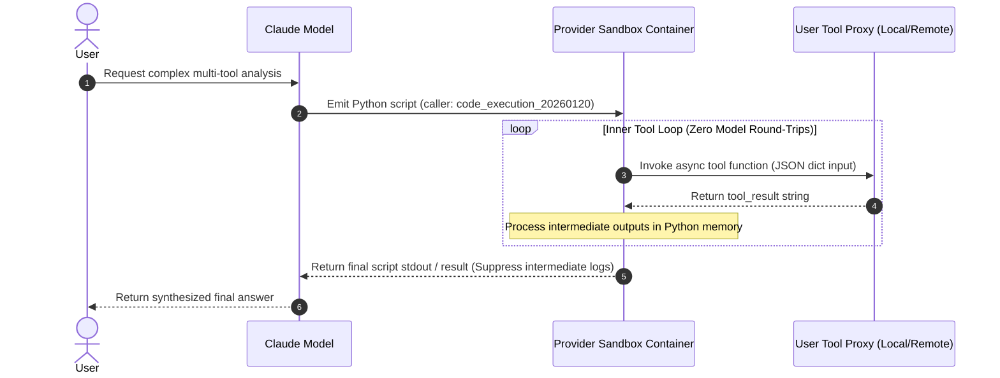
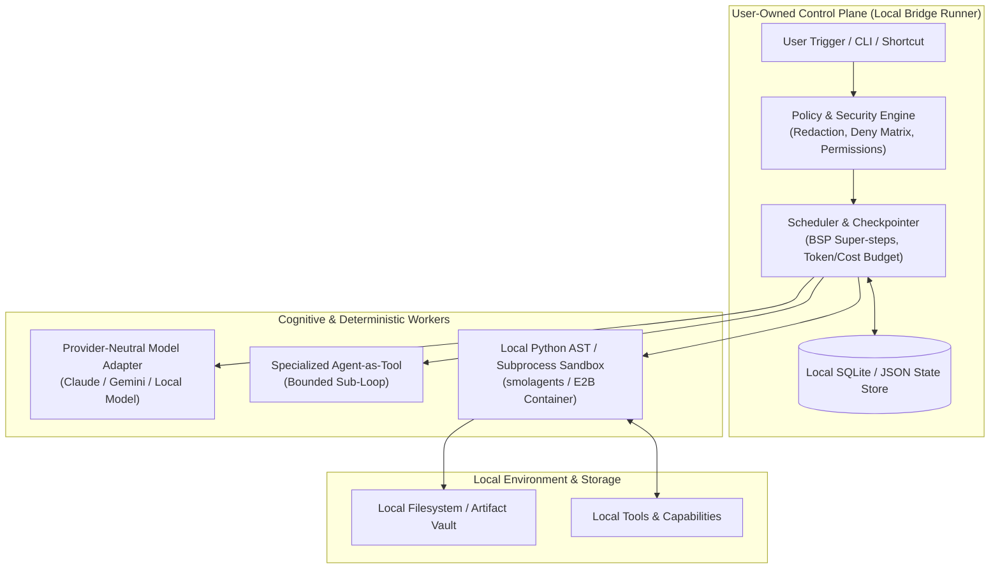
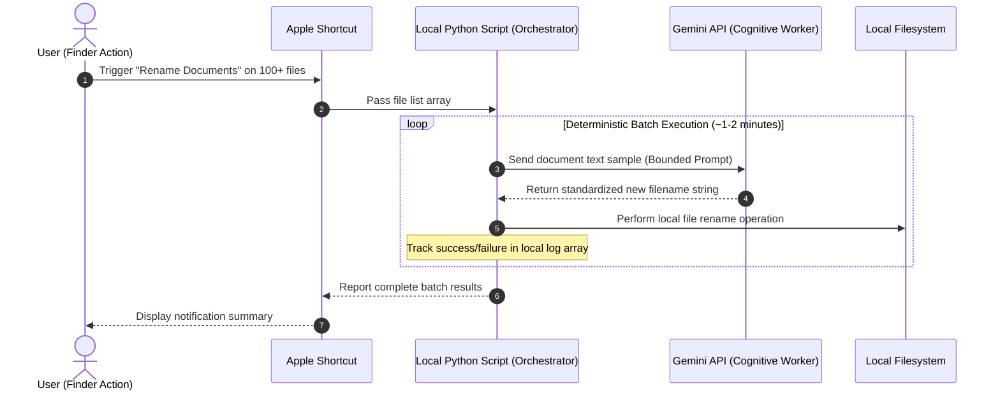

<!--
ARCHIVED 2026-07-30: superseded by the consolidated canonical study at
docs/ai-orchestration-preliminary-study-2026-07-29.md (its section 13 records
what was merged). Kept verbatim below for provenance; do not update.
-->

<!--
Provenance: this file in `docs/` is the **primary** preliminary study (smaller,
"Completed Preliminary Study"). A separate, longer draft from a parallel session
lives at `~/Downloads/ai-orchestration-preliminary-study-2026-07-29.{md,html}`
(marked "Superseding draft — provenance only"). Both pairs are kept per user
decision on 2026-07-29; do not delete either without checking with the user.
-->

# Preliminary Research Report: User-Owned AI Orchestration, Programmatic Tool Calling, and Agent-as-Tool Architectures

**Date:** July 29, 2026  
**Status:** Completed Preliminary Study (Phase 1 Research & Architecture Map)  
**Target Repository:** `claude-local-bridge-playground` (Branch: `main`)  
**Scope:** Research and Synthesis only — No runner code modified.  

---

## 1. Executive Summary

### 1.1 The Core Problem: Beyond Micro-Managed Tool Calling
Early LLM application architectures relied exclusively on **direct tool calling**. In this pattern, the language model acts like a supervisor who must walk over to a specialist's desk for every single micro-step. For instance, to process 50 files, the model calls `list_files`, waits for the response, calls `read_file` for file #1, waits, calls `summarize`, waits, and repeats this 50 times. Each turn requires a complete round trip across the internet, sending the entire ever-growing conversation history back to the model. This results in severe network latency, explosive token billing, and brittle state tracking.

Modern AI orchestration is undergoing a fundamental shift toward **programmatic tool calling** and **code-as-action** (CodeAct). In this paradigm, the model acts as a software architect: it writes a self-contained program (such as a Python script with loops, conditions, and error handling) or configures a graph-based workflow. The execution runtime then runs the script locally or in a sandbox, performing all 50 operations in a single execution pass and returning only the final consolidated summary.

### 1.2 The Central Tradeoff: User-Owned Control vs. Vendor-Managed Efficiency
While programmatic tool execution solves latency and token bloat, it introduces a critical architectural fork: **Who owns the control plane?**

1. **Provider-Managed Programmatic Tool Calling (e.g., Anthropic):** The model vendor hosts the execution container. Claude writes Python code that invokes user tools as async Python functions inside Anthropic's cloud container (5 GiB RAM, 1 CPU, 0 network access). This achieves zero intermediate model round trips, but delegates hardware scheduling, container isolation, and inner-loop execution entirely to the vendor.
2. **User-Owned Programmatic Control Planes (e.g., LangGraph, smolagents, Local Bridge Runner):** The user operates the outer loop, scheduler, state storage, credential vault, and execution sandbox. The model is treated as a replaceable cognitive worker rather than the owner of the infrastructure.

```
┌────────────────────────────────────────────────────────────────────────────────────────┐
│                                 THE CONTROL PLANE FORK                                 │
├────────────────────────────────────────────────────────┬───────────────────────────────┤
│           VENDOR-MANAGED (e.g. Anthropic)             │     USER-OWNED (e.g. Runner)   │
├────────────────────────────────────────────────────────┼───────────────────────────────┤
│ • Inner tool loop runs in vendor cloud sandbox         │ • User runs local loop & AST  │
│ • Zero intermediate model round-trips                  │ • User holds credentials      │
│ • Fixed hardware (5 GiB RAM, 1 CPU, 0 internet)        │ • Custom hardware & networks  │
│ • Vendor controls logs & context suppression           │ • Full state & audit storage  │
└────────────────────────────────────────────────────────┴───────────────────────────────┘
```

---

## 2. Working Ontology & Loop Ownership

### 2.1 Definitive Terminology Map

| Term | Definition | Primary Responsibility |
| --- | --- | --- |
| **Direct Tool Calling** | Model emits a structured tool request (e.g. JSON); harness executes it and returns `tool_result` to resample the model. | High-latency, multi-turn interaction. |
| **Agent-Authored Scripting** | Model writes Python, Shell, or JS code to automate multi-step operations in an execution environment. | Imperative automation of complex logic. |
| **Programmatic Tool Orchestration** | Executable code or deterministic graph logic, rather than repeated model sampling, controls tool invocation and intermediate state. | Efficient, low-latency execution pass. |
| **Self-Hosted Programmatic Execution** | User controls the code execution runtime (AST interpreter, local subprocess, or local Docker container) and tool protocol. | Total policy, network, and security control. |
| **Provider-Managed Programmatic Execution** | Vendor hosts the execution sandbox and manages the inner tool-execution loop on provider infrastructure. | Turnkey zero-round-trip performance. |
| **Batch Dispatcher** | Deterministic software that fans out bounded jobs to workers and aggregates results without model intervention. | High-throughput, predictable execution. |
| **Worker** | A bounded, task-specific capability (either deterministic code or a focused model call). | Execution of a single discrete task. |
| **Agent** | A worker possessing its own internal model loop, tools, state, and multi-turn decision capability. | Autonomous problem-solving. |
| **Agent-as-Tool** | An agent encapsulated behind a single, bounded tool interface (`sub_agent.as_tool()`) so the manager sees only inputs/outputs. | Context-isolated specialization. |
| **Orchestrator** | Selects tasks, dependencies, sequencing, and composition strategies. | High-level strategy & workflow routing. |
| **Scheduler** | Enforces queues, concurrency limits, retries, timeouts, cancellation, and token/cost budgets. | Operational stability & resource limits. |
| **Control Plane** | User-owned state, policy enforcement, secret redaction, audit logging, and lifecycle management above workers. | Ultimate authority and governance. |

### 2.2 Loop Ownership Diagrams

#### Diagram 1: Vendor-Managed Programmatic Tool Execution (Anthropic)


#### Diagram 2: User-Owned Control Plane Architecture (Reference Model)


#### Diagram 3: Existing User-Owned Benchmark (Apple Shortcut + Python + Gemini)


---

## 3. Source-Grounded Landscape Analysis

### 3.1 Framework Deep-Dives

#### 1. Hugging Face `smolagents`
* **Primary Sources:** [GitHub Repository](https://github.com/huggingface/smolagents), [Guided Tour Docs](https://huggingface.co/docs/smolagents/guided_tour)
* **Architecture:** Focuses on the `CodeAgent` paradigm, where LLM actions are expressed as Python code snippets rather than JSON tool calls.
* **Code Execution Mechanics:** Offers two execution backends:
  1. `LocalPythonExecutor`: Uses Python's native `ast` module to parse and interpret code locally. Enforces a strict whitelist of safe imports and functions, blocking submodules by default.
  2. Containerized Executors (`DockerExecutor`, `E2BExecutor`, `BlaxelExecutor`): Runs code in isolated virtual microVMs/containers for production security.
* **Key Findings:** Benchmarks demonstrate that `CodeAgent` achieves up to **30% fewer steps** compared to standard `ToolCallingAgent` implementations on complex multi-step tasks.
* **Limitations:** The local AST interpreter is explicitly **not a security boundary**; it provides best-effort AST filtering but cannot guarantee isolation against sophisticated sandbox escape vectors without containerization.

#### 2. LangGraph (LangChain Inc.)
* **Primary Sources:** [LangGraph Conceptual Guide](https://langchain-ai.github.io/langgraph/concepts/persistence/), [Human-in-the-Loop Docs](https://langchain-ai.github.io/langgraph/concepts/human_in_the_loop/)
* **Architecture:** Models agentic applications as explicit directed graphs (`StateGraph`). Operations are structured into Bulk Synchronous Parallel (BSP) **super-steps**.
* **Persistence & State:** Segregates state into short-term thread memory (`checkpointers`) and long-term cross-thread persistence (`stores`). Checkpoints are persisted strictly at super-step boundaries.
* **Interrupt & Human-in-the-Loop Semantics:** A node can call `interrupt()` to halt graph execution. When resumed via `Command(resume=...)`, **LangGraph re-executes the entire node function from line 1** rather than resuming mid-function.
* **Dynamic Concurrency:** Supports dynamic map-reduce fan-out by returning `Send(node_name, state_payload)` objects from conditional edges.

#### 3. OpenAI Agents SDK (Superseding Swarm)
* **Primary Sources:** [OpenAI Swarm Deprecation Notice](https://github.com/openai/swarm), [OpenAI Agents Python Repository](https://github.com/openai/openai-agents-python)
* **Architecture:** OpenAI has officially deprecated the experimental `Swarm` library, replacing it with the production-grade `OpenAI Agents SDK`.
* **Agent-as-Tool Abstraction:** Introduces `Agent.as_tool()`, which wraps an entire sub-agent loop (with its own system prompt, tools, and model choices) into a standard function tool that an outer orchestrator can invoke.

#### 4. Google ADK (Agent Development Kit)
* **Primary Sources:** [Google ADK Python Repository](https://github.com/google/adk-python)
* **Architecture:** A code-first Python framework for building, evaluating, and deploying agents. Uses `AgentTool` to encapsulate agentic sub-graphs into deterministic workflows.

#### 5. Microsoft AutoGen
* **Primary Sources:** [AutoGen Code Executors User Guide](https://microsoft.github.io/autogen/stable/user-guide/core-user-guide/components/command-line-code-executors.html)
* **Architecture:** Provides event-driven agent orchestration via `AutoGen Core`.
* **Execution Infrastructure:** Features `LocalCommandLineCodeExecutor` and `DockerCommandLineCodeExecutor`.
* **Security & Operational Model:** Operates statelessly by writing each extracted code block to a distinct temporary file and executing it in a standalone subprocess.
* **Risk Warning:** Running `LocalCommandLineCodeExecutor` directly on the host machine presents severe security risks, including arbitrary host code execution and unmonitored file access.

#### 6. Anthropic Programmatic Tool Calling & Code Execution
* **Primary Sources:** [Anthropic Programmatic Tool Calling Docs](https://docs.anthropic.com/en/docs/build-with-claude/tool-use/programmatic-tool-calling), [Code Execution Tool Docs](https://docs.anthropic.com/en/docs/agents-and-tools/tool-use/code-execution)
* **Architecture:** Claude generates Python code inside a provider-hosted container. Tools configured with `'allowed_callers': ['code_execution_20260120']` are exposed inside the container as async Python functions taking a single dictionary parameter.
* **Container Isolation:** The execution container is enforced with **zero outbound internet access**, 5 GiB RAM, 5 GiB workspace storage, and 1 CPU.
* **Context Efficiency:** Intermediate tool results generated inside the Python loop remain inside container memory; only the final stdout/result is returned to Claude's context, drastically suppressing token consumption.

#### 7. CodeAct Empirical Research (Wang et al., arXiv:2402.01030)
* **Primary Source:** [arXiv Paper: Executable Code Actions for LLM Agents](https://arxiv.org/abs/2402.01030)
* **Key Finding:** Evaluated 17 language models across multi-turn agent benchmarks. Using executable Python code as a unified action space outperformed traditional JSON/text tool calling formats by **up to 20% higher task success rate**.

---

## 4. Maturity Rubric & Comparison Matrix

### 4.1 Maturity Rubric Definitions
* **Level 0 (Research Concept):** Academic proposal or prototype; no production implementations.
* **Level 1 (Experimental Implementation):** Available in open-source repos or experimental APIs; unstable interfaces and unmitigated security risks.
* **Level 2 (Usable Feature with Caveats):** Mainstream framework feature with documented operational constraints, manual sandbox setup, or provider lock-in.
* **Level 3 (Production Pattern):** Hardened SDK pattern with operational guidance, enterprise security backends, and full observability.
* **Level 4 (Standardized Infrastructure):** Interoperable cross-vendor standard with broad industry compliance.

### 4.2 Comprehensive Landscape Comparison Matrix

| Feature / Dimension | `smolagents` | LangGraph | OpenAI Agents SDK | Google ADK | Microsoft AutoGen | Anthropic Programmatic | CodeAct Research |
| --- | --- | --- | --- | --- | --- | --- | --- |
| **Orchestration Language** | Python (AST / Code) | Python / TS Graphs | Python | Python | Python / .NET | Python in Container | Executable Python |
| **Outer Loop Owner** | User | User | User | User | User | Model / Provider | Model Loop |
| **Inner Tool Loop Owner** | User AST / E2B | User Graph Engine | User SDK Runtime | User ADK Engine | User Subprocess | Vendor Container | Interpreter Subprocess |
| **Generated-Code Support** | Primary (`CodeAgent`) | Optional Node Code | Secondary | Optional | Primary (`CodeExecutor`) | Primary | Primary |
| **Agents-as-Tools** | Supported (`ManagedAgent`) | Supported (`Sub-Graph`) | Supported (`as_tool()`) | Supported (`AgentTool`) | Supported (`NestedChat`) | Not Supported | Conceptually Compatible |
| **Deterministic Workflow** | Moderate | Native (`StateGraph`) | Moderate | Native | Native (Actor Model) | Low (Model-driven) | Low |
| **Concurrency Model** | Sequential / Threaded | Native BSP / `Send` | Async asyncio | Async / Graph | Event-driven Actors | Single Container CPU | Sequential |
| **Checkpoint / Resume** | Minimal | Native Checkpointers | State Handlers | Session Stores | State Snapshots | None (Session-bound) | N/A |
| **Artifact Handling** | Memory / File Dict | State / Stores | Object Outputs | Artifact API | Temporary Disk Files | 5 GiB Workspace | Disk / stdout |
| **Approvals & Policy** | AST Import Whitelist | Node `interrupt()` | Guardrails / Triggers | Policy Callbacks | Human-in-the-Loop | Sandbox Isolation | User Sandbox |
| **Execution Backends** | Local AST, Docker, E2B | Local / LangGraph Cloud | Local Runtime | Local / Vertex AI | Subprocess, Docker | Provider Container | Subprocess / Docker |
| **Provider Portability** | High (Any LLM) | High (Agnostic) | Low (OpenAI Focus) | Moderate (Gemini/GCP) | High (Agnostic) | Low (Anthropic Only) | Model Agnostic |
| **Observability / Replay** | Print / Telemetry | LangSmith / Checkpoints | Tracing / Logs | ADK Inspector | Agent Logs | Provider API Traces | Research Logs |
| **Maturity Level** | **Level 2** | **Level 3** | **Level 3** | **Level 2** | **Level 2** | **Level 2** | **Level 1** |
| **Principal Limitation** | Local AST not secure | Node re-execution on pause | Vendor SDK coupling | GCP ecosystem lean | Host execution unsafe | Zero network / Locked sandbox | Ephemeral code stability |

---

## 5. Difficult & Unsolved Engineering Problems

1. **Authority & Privilege Delegation below Code:** When an LLM writes Python code that executes multiple tools, standard per-tool authorization prompts break down. Either the user pre-approves the entire script sight-unseen (granting ambient authority), or execution halts continuously for mid-script approvals.
2. **Imperative Code Execution vs. Declarative Checkpointing:** Graph engines (like LangGraph) snapshot state cleanly at node boundaries. However, if a model generates a 50-line Python script with internal loops and pauses midway for human input, current runtimes cannot serialize the live Python stack frame without VM snapshotting (e.g., Firecracker memory state). Resuming requires restarting the node function from line 1.
3. **Cascading Failure & Concurrency Backpressure:** Fanning out parallel worker agents using dynamic map-reduce (`Send` primitives) can trigger rate-limit storms, exhaustion of token budgets, or recursive retry loops without strict adaptive backpressure and centralized cost accounting.
4. **Context Preservation vs. Evidence Vaults:** Passing complete outputs (e.g., 50 MB PDFs or raw API payloads) into model context degrades reasoning quality and inflates cost. The system must store raw artifacts in a user-owned evidence vault while providing the model with deterministic summaries and content-addressed pointers.

---

## 6. Emerging Engineering Trends Assessment

| Trend Description | Status / Claim Label | Architectural Evidence & Impact |
| --- | --- | --- |
| **1. Code as the Action Composition Language** | `[Measured Result]` / `[Research Finding]` | CodeAct research (20% benchmark boost) and `smolagents` (30% step reduction) prove Python code outperforms static JSON tool calls for multi-step tasks. |
| **2. Specialists Encapsulated as Bounded Tools** | `[Documented Fact]` / `[Source-Code Observation]` | Standardized in OpenAI Agents SDK (`Agent.as_tool()`) and Google ADK (`AgentTool`). Prevents context bloat in multi-agent systems. |
| **3. Durable Workflow Engines Surrounding Models** | `[Documented Fact]` | Championed by LangGraph's BSP super-steps and checkpointers. Ensures fault-tolerant state recovery across LLM sampling failures. |
| **4. Generated Programs Remaining Ephemeral** | `[Inference]` | Generated scripts serve as disposable execution plans; durable logic is promoted to application code or graph definitions. |
| **5. Complete Artifacts Moving to External Storage** | `[Documented Fact]` | Implemented in Anthropic's 5 GiB container workspace and Google ADK Artifact APIs. Keeps context windows lean. |
| **6. Provider-Neutral Worker Gateways** | `[Open Question]` | Actively evolving territory; current frameworks struggle with behavioral parity across Claude, Gemini, and open-source models. |
| **7. Strict Separation of Deterministic & Cognitive Nodes** | `[Documented Fact]` | Graph architectures explicitly isolate deterministic Python routing from probabilistic LLM generation nodes. |
| **8. Sandboxed Execution as First-Class Runtime** | `[Documented Fact]` | Integration of E2B, Docker, and Firecracker microVMs directly into agent SDKs (`smolagents`, AutoGen, Anthropic). |
| **9. Trajectory & Cost-Based Evaluation** | `[Research Finding]` | Evaluation focus is shifting from single-turn output accuracy to full execution trajectory, token cost, and recovery rate. |
| **10. Deferred Tool Loading & Discovery** | `[Source-Code Observation]` | Tool catalogs dynamically serve schemas on-demand (e.g. Anthropic `ToolSearch`) to prevent prompt saturation. |
| **11. Policy & Budgets Enforced Outside Prompts** | `[Source-Code Observation]` | Essential safety invariant: permission deny-matrices and token budget caps must sit in the host control plane, not in prompts. |

---

## 7. Synthesis: A User-Owned Reference Architecture

Based on source-grounded findings, a complete **User-Owned Agent Control Plane** must decouple cognitive labor from operational control:

```
┌────────────────────────────────────────────────────────────────────────────────────────┐
│                        USER-OWNED AGENT CONTROL PLANE (SYNTHESIS)                      │
├────────────────────────────────────────────────────────────────────────────────────────┤
│ 1. POLICY & SECURITY LAYER (Host Runtime)                                              │
│    • Secret Redaction Boundary (Regex + Entropy scrubbing across stdout/logs/transcripts)│
│    • Path Confinement & Deny Matrix (Restricting filesystem access & blocking .env)     │
│    • Explicit Opt-in Flags (--allow-shell, --accept-edits, token budget caps)          │
├────────────────────────────────────────────────────────────────────────────────────────┤
│ 2. DETERMINISTIC SCHEDULER & STATE ENGINE                                              │
│    • Bulk Synchronous Parallel (BSP) Super-step Checkpointer (SQLite/JSON disk store)  │
│    • Human-in-the-Loop Interrupt & Approval Engine                                     │
│    • Adaptive Rate Limiter & Concurrency Backpressure Control                          │
├────────────────────────────────────────────────────────────────────────────────────────┤
│ 3. PROVIDER-NEUTRAL WORKER GATEWAY                                                     │
│    • Unified Model Adapter (Routing prompts to Claude, Gemini, or Local LLMs)          │
│    • Bounded Worker / Agent-as-Tool Interface (Encapsulating specialized sub-loops)    │
├────────────────────────────────────────────────────────────────────────────────────────┤
│ 4. ISOLATED CODE EXECUTION SANDBOX                                                     │
│    • Local AST Interpreter (For safe, non-mutating data manipulation)                  │
│    • Container / MicroVM Runtime (Docker/E2B for executing model-generated scripts)    │
├────────────────────────────────────────────────────────────────────────────────────────┤
│ 5. EVIDENCE & ARTIFACT VAULT                                                           │
│    • Disk-backed Storage for raw outputs, files, and transcripts                       │
│    • Deterministic Summarizer returning content-addressed references to LLM context    │
└────────────────────────────────────────────────────────────────────────────────────────┘
```

---

## 8. Second-Phase Research Agenda & Open Questions

1. **Local Zero-Round-Trip Execution:** How can a user-owned local runner replicate Anthropic's context-suppression efficiency without sending execution to provider containers?
2. **Mid-Script Checkpointing:** Can local AST execution environments be paired with lightweight state-freezing mechanisms to allow resuming paused Python scripts mid-loop?
3. **Cross-Provider Schema Harmonization:** What is the optimal gateway abstraction to seamlessly translate Anthropic's programmatic async tool protocol, OpenAI's tool definitions, and Google's ADK schemas?

---

## 9. Primary Source Appendix

| Source URL | Access Date | Resource Type | Key Claims Verified | Claim Label |
| --- | --- | --- | --- | --- |
| [Anthropic Programmatic Tool Calling](https://docs.anthropic.com/en/docs/build-with-claude/tool-use/programmatic-tool-calling) | 2026-07-29 | Primary Vendor Documentation | Container sandbox specifications (5 GiB RAM, 1 CPU, 0 network), async Python tool interface, context suppression. | `[Documented Fact]` |
| [Anthropic Code Execution Tool](https://docs.anthropic.com/en/docs/agents-and-tools/tool-use/code-execution) | 2026-07-29 | Primary Vendor Documentation | Sandbox containment, zero internet access policy. | `[Documented Fact]` |
| [Hugging Face `smolagents`](https://github.com/huggingface/smolagents) | 2026-07-29 | Open-Source Source Code & Docs | `CodeAgent` Python AST execution, 30% step reduction benchmark, Docker/E2B sandbox backends. | `[Source-Code Observation]` |
| [LangGraph Persistence Concepts](https://langchain-ai.github.io/langgraph/concepts/persistence/) | 2026-07-29 | Primary Framework Documentation | StateGraph BSP super-steps, checkpointers vs stores, node-level re-execution upon resumption. | `[Documented Fact]` |
| [LangGraph Human-in-the-Loop](https://langchain-ai.github.io/langgraph/concepts/human_in_the_loop/) | 2026-07-29 | Primary Framework Documentation | Dynamic `interrupt()` semantics and `Command(resume=...)` behavior. | `[Documented Fact]` |
| [OpenAI Swarm Deprecation](https://github.com/openai/swarm) | 2026-07-29 | Official GitHub Repository | Deprecation of Swarm in favor of production OpenAI Agents SDK (`openai-agents-python`). | `[Documented Fact]` |
| [AutoGen Code Executors](https://microsoft.github.io/autogen/stable/user-guide/core-user-guide/components/command-line-code-executors.html) | 2026-07-29 | Primary Framework Documentation | Stateless subprocess code execution, host machine execution risks. | `[Documented Fact]` |
| [CodeAct Research Paper (arXiv:2402.01030)](https://arxiv.org/abs/2402.01030) | 2026-07-29 | Peer-Reviewed Research Paper | 20% success boost of executable code actions over JSON tool calls across 17 LLMs. | `[Measured Result]` / `[Research Finding]` |
