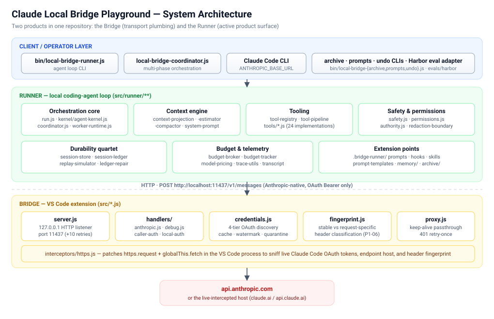
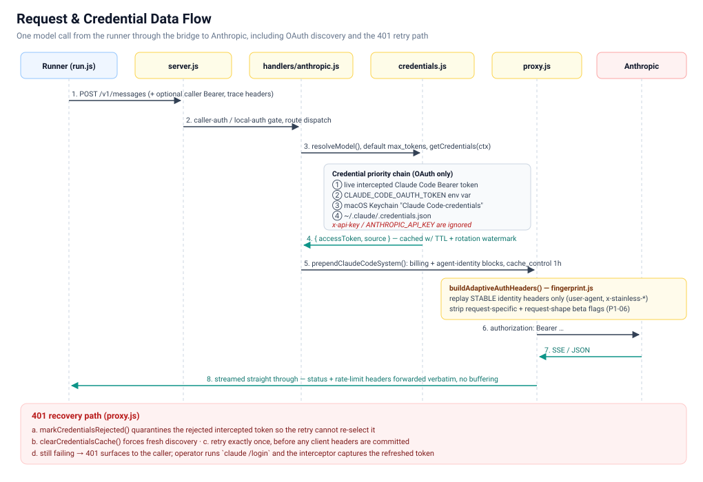
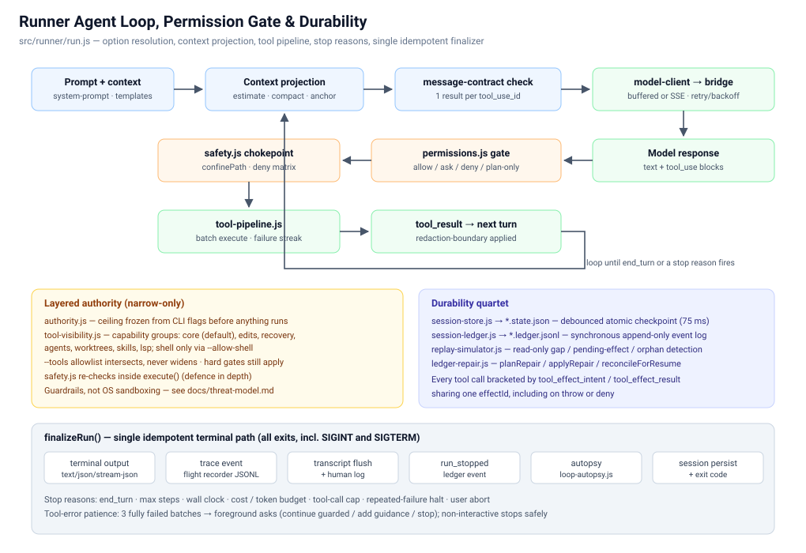
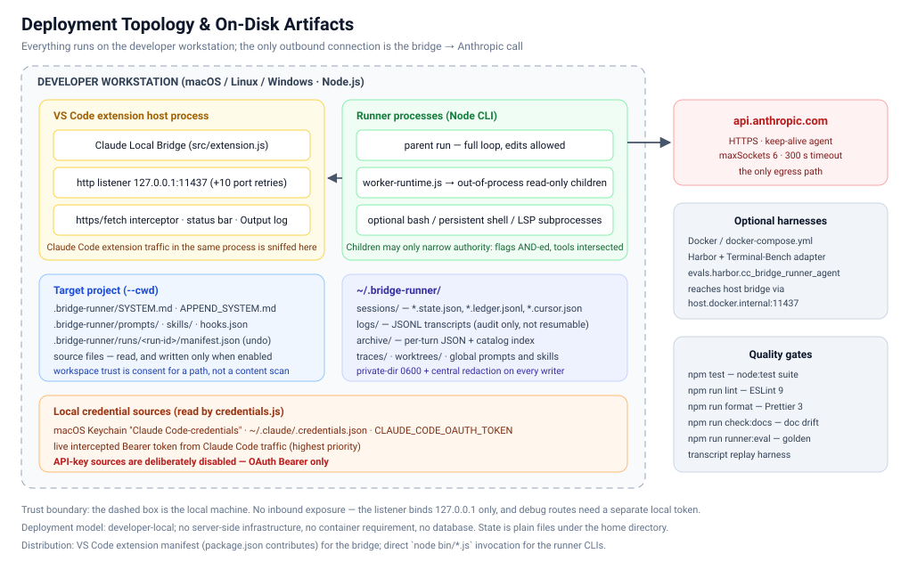

# Claude Local Bridge Playground — Project Summary

**Document type:** generated project summary (Confluence-ready)
**Source of truth:** repository code read directly (`src/**`, `bin/**`, `package.json`, `README.md`, `docs/ARCHITECTURE.md`)
**Companion HTML:** [`project-summary.html`](./project-summary.html) — self-contained, diagrams embedded

---

## 1. Executive summary

This repository hosts **two cooperating products** that together form a fully local coding-agent stack:

| # | Product | What it is | Entry point |
|---|---------|------------|-------------|
| 1 | **Bridge** | A VS Code extension that exposes Claude Code OAuth credentials as a local Anthropic Messages API on `http://localhost:11437` | `src/extension.js` → `src/server.js` |
| 2 | **Runner** | An experimental, minimalist local coding-agent loop that uses the bridge as its model transport | `bin/local-bridge-runner.js` → `src/runner/run.js` |

The bridge is explicitly treated as **transport plumbing**: native Anthropic Messages route only, OAuth Bearer only, no OpenAI-compatible routes, no API-key fallbacks. The **runner is the active product surface** — the place where prompts, tools, permissions, transcripts, budgets, durability and CLI ergonomics are developed.

The stated design philosophy is *minimal-but-extensible*: a small default prompt, minimal startup context, a tool surface grouped into understandable capability groups, and small extension points (`.bridge-runner/` prompts, templates, hooks, skills, archives) instead of a large core.

---

## 2. Technology stack (discovered)

| Layer | Technology | Evidence |
|-------|-----------|----------|
| Language | JavaScript (CommonJS, `'use strict'`) | every `src/**/*.js` uses `require`/`module.exports` |
| Runtime | Node.js | `bin/*.js` shebangs, `node:test`, `util.parseArgs` |
| Host platform | VS Code Extension API `^1.85.0` | `package.json` `engines.vscode`, `activationEvents: onStartupFinished` |
| HTTP server | Node core `http` | `src/server.js` |
| Upstream client | Node core `https` + keep-alive `https.Agent` | `src/proxy.js` |
| CLI parsing | `util.parseArgs` (no dependency) | `bin/local-bridge-runner.js` |
| Crypto/identity | Node core `crypto` (SHA-256 token fingerprints) | `src/interceptors/https.js` |
| Credential store | macOS Keychain via `security` CLI, JSON file fallback | `src/credentials.js` |
| Test framework | `node:test` (plus Jest configured for coverage runs) | `package.json` `scripts.test`, `scripts.test:keploy` |
| Lint / format | ESLint 9, Prettier 3 | `eslint.config.cjs`, `.prettierrc` |
| Containers (optional) | Dockerfile, docker-compose, Harbor eval adapter | `Dockerfile`, `docker-compose.yml`, `evals/harbor` |

**Runtime dependencies: none.** `package.json` declares only `devDependencies`. The entire product runs on Node core plus the VS Code API — a deliberate supply-chain posture for something that handles OAuth credentials.

---

## 3. Repository layout

```
.
├── bin/                        5 CLI entry points
│   ├── local-bridge-runner.js       agent loop CLI (824 lines of arg surface + dispatch)
│   ├── local-bridge-coordinator.js  multi-phase orchestration CLI
│   ├── local-bridge-archive.js      browse / ingest per-turn archives
│   ├── local-bridge-prompts.js      list / show / validate prompt templates
│   └── local-bridge-undo.js         whole-run rollback from manifests
├── src/                        BRIDGE (VS Code extension)
│   ├── extension.js            activation, commands, status bar
│   ├── server.js               127.0.0.1 HTTP listener, routing, port retry
│   ├── handlers/               anthropic.js (messages, count_tokens), debug.js
│   ├── credentials.js          4-tier OAuth discovery, cache, rotation, quarantine
│   ├── fingerprint.js          live Claude Code header capture + replay classification
│   ├── proxy.js                streaming passthrough to Anthropic, 401 retry-once
│   ├── interceptors/https.js   patches https.request + globalThis.fetch
│   ├── caller-auth.js          optional local Bearer gate
│   ├── local-auth.js           separate debug-endpoint token
│   ├── models.js               model alias resolution
│   └── bridge-trace.js, trace-utils.js, utils.js, context.js, capture-proxy.js
└── src/runner/                 RUNNER (~70 modules + 24 tool implementations)
    ├── run.js                  the loop (~1,765 lines) + finalizeRun()
    ├── kernel/agent-kernel.js  thin KernelResult wrapper
    ├── coordinator.js          research → synthesize → execute → verify
    ├── worker-runtime.js       out-of-process read-only child runners
    ├── tool-registry.js / tool-pipeline.js / tool-visibility.js
    ├── tools/                  24 tool implementations
    ├── permissions.js / safety.js / authority.js / redaction-boundary.js
    ├── session-store.js / session-ledger.js / replay-simulator.js / ledger-repair.js
    ├── context-*.js            projection, estimation, compaction, policy
    ├── budget-broker.js / budget-tracker.js / model-pricing.js
    └── memory/, hooks/, archive/, recovery/, lsp/, prompts/, skills/
```

---

## 4. Architecture

### 4.1 Layered view



Four layers, top to bottom:

1. **Client / operator layer** — the runner CLI, the coordinator CLI, the Claude Code CLI (pointed at the bridge with `ANTHROPIC_BASE_URL`), plus support CLIs and the Harbor eval adapter.
2. **Runner layer** — orchestration core, context engine, tooling, safety/permissions, durability, budgeting, and extension points.
3. **Bridge layer** — HTTP listener, request handlers, credential discovery, fingerprint construction, and the upstream proxy, with a process-wide HTTPS/fetch interceptor underneath.
4. **Upstream** — `api.anthropic.com`, or whichever host the interceptor observed Claude Code actually calling.

The layers meet at exactly one contract: `POST http://localhost:11437/v1/messages`, Anthropic-native format, OAuth Bearer only.

### 4.2 Bridge internals

| Module | Responsibility | Notable design detail |
|--------|---------------|----------------------|
| `server.js` | Binds `127.0.0.1:11437`, retries up to 10 sequential ports on `EADDRINUSE`, disables server timeouts for long streams | Never binds a public interface |
| `handlers/anthropic.js` | `POST /v1/messages`, `POST /v1/messages/count_tokens` | Only transformations are model alias resolution, `max_tokens` defaulting, and auth/system injection |
| `handlers/debug.js` | `GET /v1/debug` | Gated by a **separate** local debug token header, distinct from caller auth |
| `credentials.js` | Four-tier OAuth discovery with TTL caching | Adds an *intercepted-token watermark* so a mid-TTL token rotation invalidates the cache immediately |
| `fingerprint.js` | Classifies captured Claude Code headers | Splits **stable identity** vs **request-specific** headers; only stable ones are replayed |
| `proxy.js` | Streams upstream → client with no buffering | Defers writing client headers until upstream status is known, so a 401 retry can't double-commit a response |
| `interceptors/https.js` | Patches `https.request` **and** `globalThis.fetch` | Both are needed because the Anthropic SDK uses `fetch`; all capture is wrapped in `try/catch` so it can never break the original call |

### 4.3 Runner internals

- **`run.js`** owns option resolution, context projection/compaction, the tool pipeline, every stop reason, and a **single idempotent terminal finalizer** (`finalizeRun`) that every exit funnels through — including SIGINT and SIGTERM.
- **`tool-pipeline.js`** brackets each tool call with `tool_effect_intent` / `tool_effect_result` ledger events sharing one `effectId`, emitted even on throw or deny.
- **`permissions.js`** is an allow / ask / deny / plan-only decision engine layering the authority ceiling, path checks, shell policy and per-tool policy.
- **`safety.js`** is the chokepoint: path confinement, a two-tier deny matrix (directory segments such as `.ssh`/`.aws`/`.claude` plus sensitive basenames such as `.env` and key files), and `resolveFileTarget` which combines lexical resolution, realpath and containment so an innocently-named symlink to a denied target is still caught.
- **`redaction-boundary.js`** funnels every sink — tool results, transcripts, stream/JSON output, human logs, ledger payloads, session checkpoints — through one central redaction pass.

---

## 5. Data flow



### 5.1 Credential discovery (OAuth-only priority order)

| # | Source | Notes |
|---|--------|-------|
| 1 | Live intercepted Claude Code Bearer token | Captured from Claude Code traffic in the same VS Code process, or via the capture proxy |
| 2 | `CLAUDE_CODE_OAUTH_TOKEN` env var | Long-lived token from `claude setup-token` |
| 3 | macOS Keychain `Claude Code-credentials` | Set automatically by `claude /login`; the default path on macOS |
| 4 | `~/.claude/.credentials.json` | Linux/Windows fallback, and macOS fallback when the keychain is locked |

API-key sources are **deliberately ignored** at every level: the bridge ignores `ANTHROPIC_API_KEY`, ignores the legacy `claudeLocalBridge.apiKey` setting, and ignores intercepted `x-api-key` values. `buildAdaptiveAuthHeaders()` short-circuits and emits no upstream auth if it is handed API-key credentials. A local placeholder API key is only ever for client-side env checks and is never forwarded.

### 5.2 Request path

1. Runner (or Claude Code CLI) posts `/v1/messages` to the bridge, optionally with a caller Bearer token and trace-correlation headers.
2. `server.js` applies the caller-auth / debug-token gates and routes.
3. `handlers/anthropic.js` resolves the model alias, defaults `max_tokens`, and requests credentials.
4. `credentials.js` returns `{ accessToken, source }` from cache or fresh discovery.
5. `prependClaudeCodeSystem()` reshapes `system` into Claude Code's array form: a billing block, an agent-identity block with `cache_control: ephemeral, ttl 1h`, then the caller's own blocks.
6. `buildAdaptiveAuthHeaders()` composes upstream headers from the live fingerprint when one exists, otherwise from a verified fallback set.
7. `proxy.js` posts upstream over a shared keep-alive agent and pipes the response straight back, forwarding status, `content-type`, `x-request-id` and all `anthropic-ratelimit-*` headers verbatim.

### 5.3 Token rotation and 401 recovery

On a `401`, the bridge quarantines the rejected intercepted token (`markCredentialsRejected`), clears the credential cache, and retries exactly once with freshly discovered credentials — before any headers have been committed to the client stream. If the retry also fails, the `401` reaches the caller and the operator refreshes with `claude /login`, at which point the interceptor captures the new token and clears the quarantine.

### 5.4 Fingerprint containment (P1-06)

Captured Claude Code headers are split into two classes:

- **Stable identity** (`user-agent`, `anthropic-version`, `x-app`, `accept`, `content-type`, the six `x-stainless-*` headers) — safe to replay globally, because they describe *which client* is talking.
- **Request-specific** (`x-claude-code-session-id`, `x-anthropic-billing-header`, `x-stainless-retry-count`, `-timeout`, `-variant`, `-stream-helper`) — captured for diagnostics but **never replayed**, because replaying them made every bridge caller inherit another session's state.

`anthropic-beta` is mixed, so request-*shape* flags (`context-1m-*`, `fallback-credit-*`, `structured-outputs-*`) are stripped by prefix before replay — prefix matching survives Anthropic rotating the date suffix.

---

## 6. The runner agent loop



```
prompt → POST /v1/messages → model response
       → tool_use blocks → permission gate → local tool execution → tool_result
       → repeat until end_turn or a stop reason fires
```

### 6.1 The multi-tool contract

Multi-tool responses are matched by `tool_use_id`, **not** by completion order. Parallel results may finish out of order, but the next user message must contain exactly one result for every requested ID. `message-contract.js` validates that invariant immediately before every bridge request and stops locally if compaction or resumed state is malformed.

### 6.2 Tool-error patience

Deliberately more forgiving than the contract check: one fully failed multi-tool batch counts as one failure, any successful sibling resets the streak, and a declined approval is not counted as a broken tool. After three fully failed batches a foreground run asks whether to continue with guarded recovery, add guidance, or stop safely; a non-interactive run stops safely rather than guessing.

### 6.3 Capability groups

| Group | Gate | Tools |
|-------|------|-------|
| `core` | always on | `list_files`, `read_file` (text + image/PDF), `search_text`, `glob`, `git_status`, `manage_tasks`, `ask_user_question` |
| `edits` | `--capabilities edits` | `edit_file`, `write_file` (still confirm unless `--accept-edits`) |
| `recovery` | `--capabilities recovery` | `undo`, `undo_edit` |
| `agents` | `--capabilities agents` | `spawn_agent` (top-level only, asks by default) |
| `worktrees` | `--capabilities worktrees` | `enter_worktree`, `exit_worktree`, `list_worktrees` |
| `skills` | `--capabilities skills` | `run_skill` (read-only document loader) |
| `lsp` | `--capabilities lsp` / `--enable-lsp` | `lsp_query` |
| `shell` | **`--allow-shell` only** | `bash`, `manage_shell_jobs` — unsandboxed local-account authority |
| hidden | `--tools apply_patch` | `apply_patch` — pure-JS unified diff, full hunk validation, atomic write, rollback |

Authority is **narrow-only**: `authority.js` freezes a ceiling from CLI flags before anything runs, `--tools` intersects rather than widens, hard gates such as `--allow-shell` still apply even when a tool is named in `--tools`, and the system prompt's capability prose is generated from the same visibility function as the offered tool definitions so the prompt cannot advertise an unavailable tool.

### 6.4 Context management

Context shaping is **request-local**. Session checkpoints retain raw canonical messages, while a model-aware projection protects the newest eight semantic exchanges, reserves the requested response output, and may replace only *old* evidence with stable re-fetch markers or a deterministic checkpoint. Rendered anchors and projections are never stored as canonical messages. Unknown models fall back to a visible conservative 200,000-token estimate; known limits come from the versioned model catalog (`model-catalog.js`, shared with the bridge so the two layers cannot drift).

---

## 7. Durability, recovery and observability

### 7.1 Durability quartet

| Piece | Role | Measured crash behaviour |
|-------|------|--------------------------|
| `session-store.js` (`*.state.json`) | Debounced (75 ms) atomic-write checkpoint of API messages + runner metadata; what `--resume-session` actually loads | Work inside the debounce window is lost on signal death; flushed synchronously on `process.exit` and via the finalizer on SIGINT/SIGTERM |
| `session-ledger.js` (`*.ledger.jsonl`) | Append-only, sequence-numbered synchronous event log (10 event types incl. intent/result effect pairing) with a `*.cursor.json` sidecar | Survived byte-perfect across 74 kill trials; zero corrupt tails across a 141-ledger corpus |
| `replay-simulator.js` | Read-only consistency check: sequence gaps, unresolved effect intents, orphaned tool uses | Correctly classified every induced crash |
| `ledger-repair.js` | `planRepair` proposes, `applyRepair` mutates, `reconcileForResume` auto-applies the safe subset on resume | Closes stale-checkpoint double-execution and dangling `tool_use` strands |

Net position: the checkpoint is reconciled against the ledger before a resumed run continues. `SIGKILL` can still interrupt an in-flight effect (at-least-once for that single step), but completed effects are reconstructed rather than silently re-run.

### 7.2 Run-level rollback

Every run writes a manifest to `<cwd>/.bridge-runner/runs/<run-id>/manifest.json` listing each edit and the backup taken before it. `bin/local-bridge-undo.js` turns those manifests into a one-command rollback, restoring files in reverse order. A file changed *after* the run being reverted is marked `diverged` and skipped unless `--force`, so newer work is never clobbered. In a non-interactive shell the command **fails closed** — without `--yes` or `--dry-run` it refuses rather than silently rewriting files.

### 7.3 Flight recorder and archives

- `--trace-level summary | redacted | full` writes correlated runner and bridge JSONL traces (`~/.bridge-runner/traces/*.runner.jsonl`, `~/.claude-local-bridge/traces/*.bridge.jsonl`). `summary` records boundaries, header *names*, usage counters and status metadata without prompt bodies; `redacted` and `full` add payloads and must be treated as sensitive source-code logs.
- Every run writes a searchable per-turn archive under `~/.bridge-runner/archive/` alongside the JSONL transcript in `~/.bridge-runner/logs/`.
- Each run prints a one-line usage/cost summary to **stderr** (stdout stays clean for piping), pricing input, output, cache reads and cache writes separately from a local price table.

### 7.4 Budget broker

`budget-broker.js` holds per-run input/output token caps and issues **leases**. The field-verified invariant is that on every capped dimension `sum(active leases) + totalUsage ≤ cap`, and every child's usage is either reconciled into `totalUsage` or recorded as `incomplete[]` — never silently lost or double-counted. Null caps make leasing a no-op. Known telemetry limits: the broker meters uncached tokens only, and the in-process execute phase is not leased.

---

## 8. Orchestration

```
bin/local-bridge-coordinator.js       (objective, phases, ceilings, --research-plan)
  └─ src/runner/coordinator.js        research → synthesize → execute → verify
       ├─ research / verify : WorkerRuntime.spawnWorker — out-of-process child runners,
       │                      read-only tool set, leased budgets, results parsed from stdout JSON
       ├─ synthesize        : coordinator-spec-compiler.compileSpec — local, zero tokens
       └─ execute           : runKernel — in-process, full loop, edits allowed
```

`--research-plan` accepts a JSON array of `{ id, deps[], prompt, allowedTools?, maxSteps? }` nodes; `groupPhasePlanByDeps` topologically batches them so dependency-free nodes run concurrently. A measured 4-way fan-out delivered a **4.13× wall-clock speedup at identical token cost** versus the dependency-chained sequential baseline. Workers are spawned as separate `local-bridge-runner.js` processes that may only *narrow* the parent's authority (flags AND-ed, tools intersected), and are never passed `--trust-workspace` — only `--inherit-workspace-trust`.

---

## 9. Deployment and operations



**Model: developer-local.** There is no server-side infrastructure, no database and no container requirement. State is plain files under the home directory and the target project.

- **Bridge deployment** — installed as a VS Code extension (`activationEvents: onStartupFinished`, `main: ./src/extension.js`). Four commands are contributed (Start Server, Stop Server, Show Status, Show Credential Source) plus a status-bar item showing port and credential source.
- **Runner deployment** — invoked directly as `node bin/local-bridge-runner.js …` from the repo folder; other projects are targeted with `--cwd` rather than by copying the runner.
- **Network posture** — the listener binds `127.0.0.1` only. The single egress path is the bridge's HTTPS call to Anthropic over a shared keep-alive agent (`maxSockets: 6`, 300 s timeout).
- **Optional harnesses** — `Dockerfile` / `docker-compose.yml`, and a Harbor installed-agent adapter (`evals.harbor.cc_bridge_runner_agent:CcBridgeRunnerAgent`) that runs the runner inside a task container while calling the host bridge through `host.docker.internal:11437`.

### 9.1 Configuration defaults

| Setting | Default | Purpose |
|---------|---------|---------|
| `claudeLocalBridge.port` | `11437` | Local HTTP listener port |
| `claudeLocalBridge.anthropicBaseUrl` | `https://api.anthropic.com` | Upstream endpoint (override for staging) |
| `claudeLocalBridge.defaultModel` | `claude-sonnet-5` | Used when a request omits `model` |
| `claudeLocalBridge.logRequests` | `false` | Verbose request/response logging |
| `claudeLocalBridge.logTimeZone` | `local` | `local`, `utc`, or an IANA zone |
| `claudeLocalBridge.traceLevel` | `off` | `off` / `summary` / `redacted` / `full` |
| `claudeLocalBridge.requireCallerAuth` | `false` | Optional local Bearer gate on API routes |
| `claudeLocalBridge.callerAuthToken` | `""` | Static caller token |

### 9.2 Supported endpoints

| Endpoint | Format | Notes |
|----------|--------|-------|
| `POST /v1/messages` | Anthropic native | Proxied verbatim upstream |
| `POST /v1/messages/count_tokens` | Anthropic | Mock response (returns 0) for Claude CLI preflight |
| `GET /v1/debug` | JSON | Requires the separate local debug token header |

### 9.3 Quick start

```bash
# 1. Bridge: install/run the extension, confirm the status bar shows :11437
# 2. Runner, read-only first pass
node bin/local-bridge-runner.js "List the files in this repo and summarize what it does."

# 3. Point at another project without copying the runner
node bin/local-bridge-runner.js --cwd /path/to/project --verbose \
  "List the top-level files, summarize the project, then stop. Do not edit files."

# 4. Claude Code CLI through the bridge
export ANTHROPIC_BASE_URL=http://localhost:11437
claude
```

---

## 10. Security posture

**Strengths**

- OAuth-only by construction, enforced at multiple independent layers rather than by a single check.
- Zero runtime dependencies — a meaningful supply-chain reduction for credential-handling code.
- Strict header capture whitelist; no auth tokens, cookies or internal headers can enter the fingerprint.
- Token values never logged — only SHA-256 prefixes (`sha256:<16 hex>`), enough to say "same token or new token".
- One central redaction boundary for all sinks; artifact writers use a private-dir / `0600` path.
- Two-tier deny matrix with realpath containment, re-checked inside tool `execute()` as defence in depth.
- Loopback-only binding; debug routes behind a token distinct from caller auth.

**Documented limitations (explicitly stated by the project, not hidden)**

- Workspace trust is consent for a folder **path**, not a scan or certification of its **contents** — files added after trusting are still covered by that consent.
- `--no-network` is a best-effort proxy-environment guard, not hard network isolation.
- Shell command scanning is regex-based, not an OS sandbox; `--allow-shell` grants unsandboxed local-account authority starting in `--cwd` (not a cwd jail).
- `redacted` and `full` traces are local files that can contain prompts and source code.
- Known residual `N1`: the permission gate inspects a tool argument literally named `path`.
- Prompt-template parameters are treated as attacker-influenced text and are refused when they resemble prompt injection or control tokens.

Full detail lives in `docs/threat-model.md`.

---

## 11. Quality gates

| Command | Purpose |
|---------|---------|
| `npm test` | `node:test` suite across `test/*.test.js` and `test/runner/*.test.js` |
| `npm run lint` / `lint:fix` | ESLint 9 over `src/` and `test/` |
| `npm run format` / `format:check` | Prettier 3 |
| `npm run check:docs` | Doc-default drift check + runner manifest check |
| `npm run runner:eval` | Golden-transcript replay harness — canned model transcripts through a fake client, no live OAuth, asserting tool dispatch order, permission decisions and trace event types |

Golden cases live in `test/runner/golden/*.json`; each pins a `model_script` and an `expect` snapshot with paths, timestamps and secrets normalized before diffing. Intentional behaviour changes are re-recorded with `--update` and the refreshed `expect` blocks are committed alongside the code change, making regression approval explicit to reviewers.

---

## 12. Governance notes

- This playground repository is the **active** lane (`main`); the canonical `claude-local-bridge` repo is archived at `archive-2026-05-*` tags and is reference-only.
- Dated documents under `docs/` are the memory of the repo — durable references such as `docs/ARCHITECTURE.md` carry verified facts, while perishable status lives in dated experiment docs.
- Agent and capability *profiles* were retired in July 2026 because they obscured the relationship between granular flags and effective authority; the historical implementation is preserved under `docs/archive/runner-profiles/`. Do not reintroduce them.
- Treat runs as personal research and local tooling.

---

*Generated by the documentation agent from direct source inspection. Figures such as line counts and module counts reflect the repository state at generation time.*
