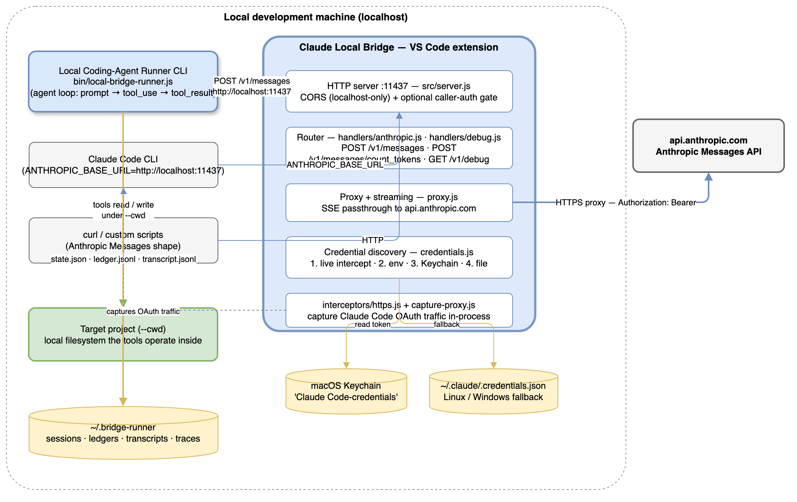
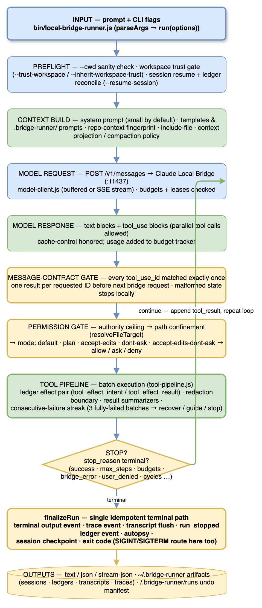
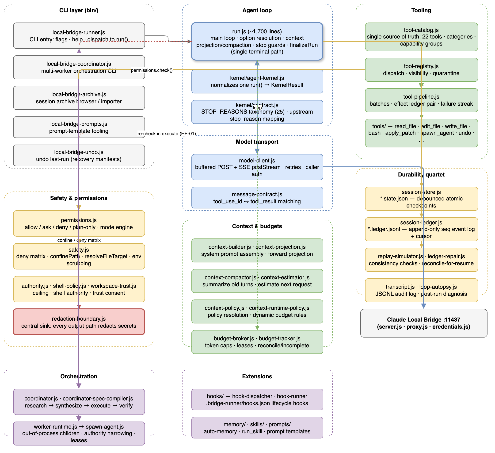
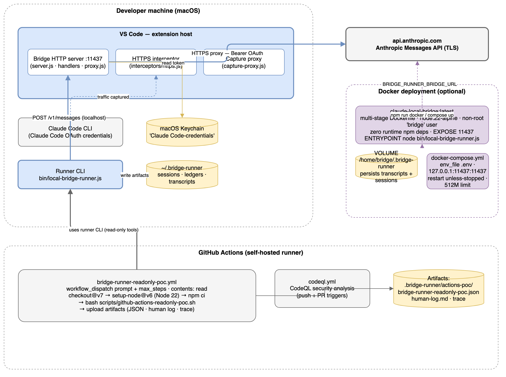

# Claude Local Bridge Playground — Project Summary

## 1. Executive Summary

Claude Local Bridge Playground is a two-layer personal research project: a **VS Code extension** ("Claude Local
Bridge") that exposes Claude Code OAuth credentials as a local Anthropic Messages API on `http://localhost:11437`,
and an experimental **local coding-agent runner** ("cc bridge runner") that uses that bridge as its model transport.
The runner implements a complete agent loop — prompt → model → `tool_use` → permission gate → local tool execution
→ `tool_result` → repeat — with conservative safety defaults, durable session artifacts, and a command-line UX. The
project ships with **zero runtime dependencies** (~24,500 lines of JavaScript across `src/` and `bin/`), **117 test
files (~480 tests)**, a multi-stage Dockerfile, and a self-hosted GitHub Actions proof-of-concept workflow. It is
active at `alankatanoisi/claude-local-bridge-playground` on branch `main`; the canonical
`claude-local-bridge` repo is archived and reference-only.

## 2. Architecture Overview



The repository contains **two products** that must not be confused:

| Layer | What it is | Where it lives |
| --- | --- | --- |
| **Bridge** | VS Code extension exposing Claude Code OAuth credentials as a local Anthropic Messages endpoint | `src/server.js`, `src/proxy.js`, `src/credentials.js`, `src/interceptors/**`, `src/handlers/**` |
| **Runner** | Experimental local coding-agent loop on top of that endpoint (the active product surface) | `src/runner/**`, `bin/local-bridge-runner.js` |

### 2.1 Transport flow

```text
local runner / Claude CLI
  └──> Claude Local Bridge (http://localhost:11437)
        ↓ credential discovery (OAuth only)
        ↓ Anthropic Messages request passthrough
        └──> api.anthropic.com
```

Transport policy guardrails (invariants, not suggestions):

- Keep `/v1/messages` as the **native Anthropic Messages surface**. No OpenAI-compatible endpoints
  (`/v1/chat/completions`, `/v1/models`) exist or may be added.
- Upstream auth is **only** `Authorization: Bearer <Claude Code OAuth token>`.
- The bridge **ignores** `ANTHROPIC_API_KEY`, the old `claudeLocalBridge.apiKey` setting, and intercepted
  `x-api-key` credentials. A local placeholder like `ANTHROPIC_API_KEY=local` is for client-side env checks only
  and is never forwarded upstream.
- Debug, trace, transcript, and log surfaces are **redacted**: OAuth tokens and fingerprints are sensitive local
  account state.

### 2.2 Credential discovery (OAuth-only priority order)

| # | Source | Notes |
| --- | --- | --- |
| 1 | Live intercepted Claude Code Bearer token | Captured from Claude Code traffic inside the VS Code process or the capture proxy |
| 2 | `CLAUDE_CODE_OAUTH_TOKEN` env var | Long-lived OAuth token from `claude setup-token` |
| 3 | macOS Keychain `Claude Code-credentials` | Automatically set by `claude /login`; used automatically on macOS |
| 4 | `~/.claude/.credentials.json` | Linux / Windows fallback; also macOS if the keychain is locked |

### 2.3 Bridge endpoints

| Endpoint | Format | Notes |
| --- | --- | --- |
| `POST /v1/messages` | Anthropic native | Proxied verbatim to `api.anthropic.com`, SSE streamed back |
| `POST /v1/messages/count_tokens` | Anthropic | Mock response (returns 0) for Claude CLI preflight |
| `GET /v1/debug` | JSON | Locked diagnostic endpoint; requires the local debug token printed in the bridge Output log |

## 3. Processing Pipeline



The runner loop, end to end:

1. **Input** — `bin/local-bridge-runner.js` parses flags and calls `run(options)` in `src/runner/run.js`.
   Retired `--agent` / `--profile` / `--list-agents` / `--list-profiles` options are rejected loudly.
2. **Preflight** — `--cwd` sanity check, workspace-trust gate (`--trust-workspace` / `--inherit-workspace-trust`),
   and — for `--resume-session` — checkpoint loading plus **ledger reconciliation** (the checkpoint is reconciled
   against the ledger before the run continues, closing the stale-checkpoint double-execution gap).
3. **Context build** — a small default system prompt, optionally extended by `.bridge-runner/` prompts, prompt
   templates (`--prompt-template review|cleanup|explore|…`), repo-context fingerprint, `--include-file`, and
   context projection/compaction policy.
4. **Model request** — `model-client.js` POSTs to the bridge (buffered or SSE streaming), honoring cache-control
   budgeting and token budgets/leases.
5. **Model response** — text blocks plus `tool_use` blocks. Parallel tool calls are allowed.
6. **Message-contract gate** — every `tool_use_id` must be matched by exactly one `tool_result` before the next
   bridge request. Malformed state stops locally.
7. **Permission gate** — authority ceiling → path confinement (`resolveFileTarget`) → mode decision
   (`default` · `plan` · `accept-edits` · `dont-ask` · `accept-edits-dont-ask`) → allow / ask / deny.
8. **Tool pipeline** — batch execution with a ledger **effect pair** (`tool_effect_intent` before,
   `tool_effect_result` after, same `effectId`, even on throw/deny), redaction boundary, result summarizers, and a
   consecutive-failure streak (3 fully failed batches → ask to recover/guide/stop; non-interactive runs stop safely).
9. **Stop decision** — 25 machine-readable stop reasons (see §5.2). If not terminal, append `tool_result` and
   repeat from step 4.
10. **finalizeRun** — a single idempotent terminal path all exits funnel through: terminal output event, trace
    event, transcript flush, `run_stopped` ledger event, autopsy, session persistence, exit code. SIGINT and
    SIGTERM route through the same finalizer.
11. **Outputs** — text / JSON / stream-json on stdout; `~/.bridge-runner` artifacts (sessions, ledgers,
    transcripts, traces); `<cwd>/.bridge-runner/runs/` recovery manifests for `undo last-run`.

## 4. Core Components



### 4.1 Agent loop

| Component | File | Responsibility |
| --- | --- | --- |
| Run loop | `src/runner/run.js` (~1,700 lines) | Option resolution, context projection/compaction, tool pipeline, every stop reason, single `finalizeRun` terminal path |
| Kernel | `src/runner/kernel/agent-kernel.js` | Thin wrapper normalizing one `run()` invocation into a stable `KernelResult` contract; no orchestration logic |
| Contract | `src/runner/kernel/contract.js` | `STOP_REASONS` taxonomy + upstream `stop_reason` mapping |
| Model client | `src/runner/model-client.js` | Buffered `post` + SSE `postStream` clients, retries with `Retry-After`, caller-auth header injection |
| Message contract | `src/runner/message-contract.js` | `tool_use_id` ↔ `tool_result` matching validation |

### 4.2 Tools, permissions, safety

The **default surface is core read/session tools only**. Write tools arrive via `--capabilities edits`, shell only
via `--allow-shell`, advanced patch mode stays hidden unless an exact `--tools apply_patch` allowlist exposes it.

| Component | File | Responsibility |
| --- | --- | --- |
| Tool catalog | `src/runner/tool-catalog.js` | Single source of truth: 20 tools, categories, capability groups; fails loudly on misregistration |
| Tool registry | `src/runner/tool-registry.js` | Dispatch, visibility, quarantine |
| Tool pipeline | `src/runner/tool-pipeline.js` | Batch execution, effect ledger pair, consecutive-failure streak |
| Permissions | `src/runner/permissions.js` | Allow/ask/deny/plan-only engine; authority ceiling + path checks + per-tool policy |
| Safety | `src/runner/safety.js` | The chokepoint: `confinePath`, two-tier deny matrix (directory segments like `.ssh`/`.aws`/`.claude`; sensitive basenames like `.env`, keys, tokens), `resolveFileTarget` (lexical + realpath + containment, so an innocently-named symlink to a denied target is caught), env scrubbing, secret redaction. File tools re-check in `execute` (HE-01 defense-in-depth) |
| Redaction boundary | `src/runner/redaction-boundary.js` | Every sink (tool results, transcripts, stream/JSON output, human logs, ledger payloads, session checkpoints) passes through one central redaction boundary |

### 4.3 Tool catalog (20 tools, 8 capability groups)

| Capability group | Tools | How to enable |
| --- | --- | --- |
| `core` (always on) | `list_files`, `read_file`, `search_text`, `glob`, `git_status`, `manage_tasks`, `ask_user_question` | Default |
| `edits` | `edit_file`, `write_file`, `apply_patch` (hidden by default) | `--capabilities edits` |
| `recovery` | `undo`, `undo_edit` | `--capabilities recovery` |
| `agents` | `spawn_agent` (in-run read-only child delegation) | `--capabilities agents` |
| `worktrees` | `enter_worktree`, `exit_worktree`, `list_worktrees` | `--capabilities worktrees` |
| `skills` | `run_skill` | `--capabilities skills` |
| `lsp` | `lsp_query` | `--capabilities lsp` (or `--enable-lsp`) |
| `shell` | `bash`, `manage_shell_jobs` | `--allow-shell` **only** (never via `--capabilities`) |

### 4.4 Durability quartet

Measured end-to-end by the A1 crash bake-off (`docs/durability-crash-bakeoff-2026-07-31.md`): all 74 kill trials
showed byte-perfect ledger survival and zero corrupt tails across the 141-ledger C3 corpus.

| Piece | File pattern | Role | Crash behaviour (measured) |
| --- | --- | --- | --- |
| Session store | `*.state.json` | Debounced (75 ms) atomic-write checkpoint; what `--resume-session` loads | Whatever entered the debounce window before signal death is lost; flushed synchronously on `process.exit` and via the finalizer on SIGINT/SIGTERM |
| Session ledger | `*.ledger.jsonl` | Append-only, sequence-numbered event log written synchronously; cursor sidecar (`*.cursor.json`) for fast resume | Survived byte-perfect in all 74 A1 kill trials; zero corrupt tails across 141 ledgers |
| Replay simulator | read-only | Consistency check: sequence gaps, pending effect intents, orphaned tool uses | Correctly classified every induced crash |
| Ledger repair | `planRepair` / `applyRepair` | Proposes/mutates repairs; `reconcileForResume` auto-applies the safe subset on resume | Closes stale-checkpoint double-execution and dangling `tool_use` strands; `report_gap` stays manual-only |

### 4.5 Budget broker and child leasing

- `src/runner/budget-broker.js` holds per-run input/output token caps and issues **leases**. Invariant (field-verified
  2026-07-31): on every capped dimension, `sum(active leases) + totalUsage ≤ cap`; every child's usage is either
  reconciled into `totalUsage` or recorded as `incomplete[]` — never silently lost or double-counted. Null caps make
  leasing a no-op.
- `src/runner/tools/spawn-agent.js` delegates to one read-only child using the acquire → spawn → release/reconcile
  pattern. The coordinator splits the unleased remainder across each concurrent batch so fan-out siblings cannot each
  claim the whole ceiling.

### 4.6 Orchestration stack

```text
bin/local-bridge-coordinator.js          (CLI: objective, phases, ceilings, --research-plan)
  └─ src/runner/coordinator.js           research → synthesize → execute → verify
       ├─ research/verify: WorkerRuntime.spawnWorker — out-of-process child runners,
       │    read-only tool set, leased budgets, results parsed from stdout JSON
       ├─ synthesize: coordinator-spec-compiler.compileSpec — local, no tokens
       └─ execute: runKernel — in-process, full loop, edits allowed
```

- `--research-plan` takes a JSON array of `{ id, deps[], prompt, allowedTools?, maxSteps? }` nodes; dependency-free
  nodes run concurrently. Field-measured: 4-way fan-out gave a **4.13× wall-clock speedup at identical token cost**
  versus the dep-chained sequential baseline.
- `src/runner/worker-runtime.js` spawns each worker as a separate `local-bridge-runner.js` process, **narrowing**
  authority against the parent ceiling (children may only narrow: flags AND-ed, tools intersected), passing lease +
  inherit values via argv/env, and never passing `--trust-workspace` (only `--inherit-workspace-trust`).

## 5. API Contracts / Message Schemas

### 5.1 Bridge request (Anthropic native Messages shape)

The runner sends the native Anthropic Messages request body; the bridge proxies it verbatim:

| Property | Type | Notes |
| --- | --- | --- |
| `model` | string | Default `claude-sonnet-5` (shared via the versioned model catalog, `src/runner/model-catalog.js`) |
| `max_tokens` | number | Runner default 2,000 output tokens per request |
| `system` | string | Small default system prompt, optionally extended |
| `messages` | array | `user` / `assistant` turns; `assistant` turns contain `tool_use` content blocks |
| `tools` | array | JSON-schema tool definitions from `tool-catalog.js` |
| `stream` | boolean | Runner may buffer full JSON or consume SSE |
| `cache_control` | object | Runner marks stable prefix with `{ type: 'ephemeral', ttl: '1h' }` with a 1-breakpoint OAuth cache reserve |

Response: `content` blocks (`text` | `tool_use`), `stop_reason`, `usage`. Upstream `max_tokens` and `refusal`
reasons are mapped to terminal taxonomy and never masquerade as success.

### 5.2 Runner stop-reason taxonomy (`kernel/contract.js`, 25 reasons)

| Category | Reasons |
| --- | --- |
| Normal | `success`, `max_steps`, `max_tool_calls_per_turn`, `model_max_tokens`, `model_refusal` |
| Context/budget | `context_budget_exceeded`, `initial_prompt_too_large`, `context_ceiling_unrecoverable`, `predictive_context_budget_exceeded`, `predictive_input_token_budget_exceeded`, `predictive_output_token_budget_exceeded`, `wall_clock_budget_exceeded`, `cost_budget_exceeded`, `input_token_budget_exceeded`, `output_token_budget_exceeded`, `retry_budget_exceeded` |
| Errors | `bridge_error`, `message_contract_error`, `cwd_invalid`, `resume_failed`, `tool_failure_escalation`, `cancelled`, `workspace_not_trusted`, `semantic_cycle_detected`, `user_denied` |

### 5.3 Tool-result contract

- Multi-tool responses are matched by `tool_use_id`, **not** completion order. Parallel results may finish out of
  order, but the next user message must contain exactly one result for every requested ID.
- Tool-error recovery is deliberately more patient than the contract check: one fully failed multi-tool batch counts
  as one failure; any successful sibling resets the streak; declining an approval is not counted as a broken tool.

### 5.4 Bridge auth

| Mechanism | Header | Notes |
| --- | --- | --- |
| Caller auth (optional) | `Authorization: Bearer <caller-token>` | `claudeLocalBridge.requireCallerAuth` + `callerAuthToken`; debug endpoints use a separate token |
| Debug endpoint | `x-claude-local-bridge-debug-token` | Printed in the bridge Output log; local diagnostic door code only |
| Upstream | `Authorization: Bearer <Claude Code OAuth token>` | Discovered per priority order in §2.2; never from an API key |
| CORS | — | Non-localhost `Origin` headers get HTTP 403 |

## 6. Infrastructure & Deployment



### 6.1 VS Code extension (the bridge)

- Activation: `onStartupFinished`; entry `src/extension.js`.
- Listens on `127.0.0.1` starting at port 11437 (walks up to 10 ports on `EADDRINUSE`).
- Settings (`claudeLocalBridge.*`): `port` (11437), `anthropicBaseUrl`
  (`https://api.anthropic.com`), `defaultModel` (`claude-sonnet-5`), `logRequests` (false),
  `logTimeZone` (`local`), `traceLevel` (`off`/`summary`/`redacted`/`full`),
  `requireCallerAuth` (false), `callerAuthToken` ("").

### 6.2 Docker

- Multi-stage `Dockerfile`: `node:22-alpine`; deps stage installs devDeps only (optional tests); final image ships
  **no `node_modules`** (zero runtime deps), runs as a non-root `bridge` user, `EXPOSE 11437`,
  `ENTRYPOINT ["node", "bin/local-bridge-runner.js"]`, `VOLUME /home/bridge/.bridge-runner`.
- `docker-compose.yml`: `127.0.0.1:11437:11437`, named volume `bridge-data` for persistence, `restart: unless-stopped`,
  512 MB memory limit, optional `.env` (`BRIDGE_RUNNER_BRIDGE_URL`, `BRIDGE_CALLER_TOKEN`).
- Secrets are passed at runtime via env; never baked into the image or committed.

### 6.3 CI/CD

| Workflow | Triggers | Purpose |
| --- | --- | --- |
| `bridge-runner-readonly-poc.yml` | `workflow_dispatch` (prompt + `max_steps` inputs) | Self-hosted runner: checkout → Node 22 → `npm ci` → `bash scripts/github-actions-readonly-poc.sh` → upload JSON / human-log / trace artifacts |
| `codeql.yml` | push / PR | CodeQL security analysis |

### 6.4 Local checks

```bash
npm test          # node --test, bridge + runner suites
npm run lint      # ESLint 9 flat config
npm run check:docs  # doc-defaults + runner-manifest consistency
npm run format:check # Prettier
```

Runner-only: `node --require ./test/setup.js --test test/runner/*.test.js`

## 7. Extension Patterns

The design philosophy is a **small core with explicit opt-ins**. Everything below is an extension point.

### 7.1 Add a new tool

1. Create `src/runner/tools/<name>.js` exporting `{ definition, execute, meta: { name, category, hidden?, quarantined? } }`.
   Categories: `read-only` | `write` | `shell` | `recovery` | `orchestration` | `worktree`.
2. Add the module to `TOOL_MODULES` in `src/runner/tool-catalog.js`.
3. Assign it to exactly one capability group in `CAPABILITY_GROUPS` (or extend the group list) — the self-check
   fails loudly if you miss either step, so a half-registered tool breaks the build instead of silently widening
   the default surface.
4. If the tool targets filesystem paths, declare `meta.pathArgs` if the argument name is not one of the canonical
   keys (`path`, `file_path`, `filepath`, `target_path`) so the permission gate inspects it.
5. Test with a `test/runner/<name>.test.js`; the tool catalog's `buildCatalog` self-check is itself testable.

### 7.2 Customize the prompt

- `--prompt-template review|cleanup|explore|…` (or a Markdown path) prepends a template from
  `src/runner/prompts/`; `--prompt-arg k=v` fills `{{k}}` placeholders.
- `--append-system-prompt <s>` / `--append-system-prompt-file <p>` extend the default prompt;
  `--system-prompt-file <p>` replaces it.
- `.bridge-runner/` project files (e.g. `prompts/`, `hooks.json`) customize per-project behavior.

### 7.3 Hooks, memory, skills

- Hooks: `.bridge-runner/hooks.json` lifecycle hooks, executed via `src/runner/hooks/hook-dispatcher.js`;
  exec hooks additionally require `"trusted": true` in that file and `--trusted-workspace`.
- Memory: `--auto-memory` opts into runner auto-memory; `--session-extract` queues a run-summary memory proposal
  after a successful trusted persisted session; `--review-memory` lists pending promotions.
- Skills: `--capabilities skills` exposes `run_skill`; skills run from `.bridge-runner/`-style skill folders.

### 7.4 Orchestrate multiple workers

Use `bin/local-bridge-coordinator.js` with `--research-plan` (JSON nodes with `deps`) to fan out read-only
research workers in parallel, synthesize locally, then execute edits in-process.

### 7.5 Presets and UX

`docs/command-builder.html` is the primary day-to-day runner UX (a lean HTML UI with hover/glossary explanations for
flags). When CLI flags or capability groups change, update it in the same turn.

## 8. Rules & Anti-Patterns

### 8.1 Do

- **Keep the native surface**: `/v1/messages` only; no OpenAI-compatible routes; no upstream API-key fallback.
- **Keep safety defaults conservative**: shell hidden unless `--allow-shell`; `--dont-ask` must never enable shell
  by itself; write tools guarded by confirmation unless `--accept-edits`; `.env`, private keys, credential JSON,
  token files, `.ssh`, `.aws`, `.claude`, and path escapes stay blocked.
- **Keep the small core**: default system prompt short and repo-agnostic; startup context minimal; tools as
  capability groups; customization through `.bridge-runner/` files, templates, hooks, and explicit flags.
- **Route every exit through `finalizeRun`**; funnel every sink through the redaction boundary; write artifacts
  through the private-dir/0600 + redaction path.
- **Treat the bridge as plumbing** and the runner as the product surface; most new work lands in `src/runner/**`,
  `bin/**`, `test/runner/**`, and `docs/`.

### 8.2 Don't

- **Don't restore retired concepts**: agent/capability profiles (`--agent`, `--profile`, `--list-agents`,
  `--list-profiles`) are retired; keep shell and advanced patch mode hidden unless explicitly enabled.
- **Don't add credentials fallbacks**: no `ANTHROPIC_API_KEY` handling, no `claudeLocalBridge.apiKey` upstream
  source, no replay of intercepted `x-api-key` credentials.
- **Don't leak secrets**: OAuth tokens and fingerprints must stay redacted in tool output, transcripts, traces,
  JSON output, and human logs; `--cwd` is the target project, not necessarily the runner's folder.
- **Don't silently widen the tool surface**: adding a tool without a category/group assignment breaks the build by
  design; shell cannot be enabled via `--capabilities`.
- **Don't treat the transcript as a resume source**: transcript resume is rejected at the CLI; only
  `--resume-session` against the session store is valid.
- **Don't open PRs against the canonical repo** for playground experiments; this repo works directly on `main`.

## 9. Dependencies

**Runtime dependencies: none.** This is deliberate — the final Docker image ships without `node_modules`.

| Package | Type | Version | Purpose |
| --- | --- | --- | --- |
| `eslint` | dev | ^9.0.0 | Linting (flat config `eslint.config.cjs`) |
| `@eslint/js` | dev | ^9.0.0 | ESLint shared config |
| `globals` | dev | ^15.0.0 | ESLint global definitions |
| `jest` | dev | ^30.4.2 | Keploy coverage reporting (`npm run test:keploy`) |
| `prettier` | dev | ^3.0.0 | Formatting (`npm run format`, `format:check`) |

Runtime platform: Node.js 22 (per `Dockerfile` and CI), VS Code engine `^1.85.0` for the extension host.

## 10. Code Structure

```text
claude-local-bridge-playground/
├── bin/                              # CLI entry points
│   ├── local-bridge-runner.js        #   runner CLI (flags, help, dispatch to run())
│   ├── local-bridge-coordinator.js   #   multi-worker orchestration CLI
│   ├── local-bridge-archive.js       #   session archive browser / importer
│   ├── local-bridge-prompts.js       #   prompt-template tooling
│   └── local-bridge-undo.js          #   undo last-run (recovery manifests)
├── src/                              # extension + runner source (zero runtime deps)
│   ├── extension.js                  #   VS Code activation, commands, interceptor install
│   ├── server.js                     #   bridge HTTP server (:11437), routing, CORS, auth gate
│   ├── proxy.js                      #   Anthropic request forwarding / streaming
│   ├── credentials.js                #   OAuth discovery priority chain
│   ├── capture-proxy.js              #   auth capture proxy (Claude Code HTTPS_PROXY)
│   ├── caller-auth.js / local-auth.js / fingerprint.js / models.js / context.js / utils.js / bridge-trace.js / trace-utils.js
│   ├── handlers/                     #   anthropic.js (messages + count_tokens), debug.js
│   ├── interceptors/                 #   https.js (traffic capture)
│   └── runner/                       #   the agent loop (64 modules)
│       ├── run.js                    #   main loop + finalizeRun (~1,700 lines)
│       ├── model-client.js           #   buffered + SSE bridge clients
│       ├── tool-catalog.js           #   20 tools · categories · capability groups
│       ├── tool-registry.js / tool-pipeline.js / tool-envelope.js / tool-result-content.js / tool-result-summarizers.js / tool-prefetch.js / repeat-tool-detector.js / tool-visibility.js
│       ├── tools/                    #   read (list-files, read-file, search-text, glob, git-status) · write (edit-file, write-file, apply-patch) · shell (bash, manage-shell-jobs) · recovery (undo, undo-edit) · agents (spawn-agent) · worktrees · skills · lsp · tasks
│       ├── permissions.js / safety.js / authority.js / shell-policy.js / workspace-trust.js / redaction-boundary.js / permission-mode.js / private-fs.js
│       ├── context-builder.js / context-projection.js / context-compactor.js / context-estimator.js / context-policy.js / context-runtime-policy.js / context-budget.js
│       ├── session-store.js / session-ledger.js / replay-simulator.js / ledger-repair.js / session-health.js / session-anchor.js / transcript.js / loop-autopsy.js / archive/
│       ├── budget-broker.js / budget-tracker.js / model-capabilities.js / model-catalog.js / model-pricing.js
│       ├── coordinator.js / coordinator-spec-compiler.js / worker-runtime.js / subprocess-pool.js
│       ├── kernel/                  #   agent-kernel.js, contract.js (STOP_REASONS)
│       ├── hooks/                   #   hook-dispatcher.js, hook-runner.js
│       ├── memory/ · skills/ · prompts/ · lsp/ · recovery/   # extension subsystems
│       └── system-prompt.js / prompt-templates.js / bootstrap.js / confirmation.js / user-question.js / event-bus.js / golden-eval.js / replay-simulator.js / session-store.js / human-log.js / message-contract.js / streaming-write.js / media-read.js / test-watcher.js / workspace-fingerprint.js / worktree-utils.js / repo-map.js / instruction-delta.js / beginner-hints.js / background-shell.js / child-inherit.js / plan-proposals.js
├── test/                             # 117 test files (~480 tests, node --test)
│   ├── runner/                       #   agent-loop, tool-pipeline, permissions, safety, ledger, coordinator, budgets, …
│   ├── bridge.test.js / caller-auth.test.js / anthropic.integration.test.js / …
│   └── __mocks__/ harbor/ golden/ bench/
├── evals/                            # Python evaluation scaffolding (harbor/)
├── scripts/                          # check-doc-defaults.js · check-runner-manifest.js · github-actions-readonly-poc.sh · create-runner-throwaway-lab.js
├── docs/                             # dated experiment record + user docs (command-builder.html, runner-quickstart.html, ARCHITECTURE.md, threat-model.md, …)
├── .github/workflows/                # bridge-runner-readonly-poc.yml, codeql.yml
├── Dockerfile / docker-compose.yml   # containerized runner deployment
├── package.json                      # extension metadata, scripts, VS Code settings schema
└── AGENTS.md / CLAUDE.md / CONTEXT.md  # agent working agreements and repo context
```

## 11. Where the Experiment Record Lives

Dated docs under `docs/` are the memory of this repo. Key entry points:

| Topic | Document |
| --- | --- |
| Architecture (durable reference) | `docs/ARCHITECTURE.md` |
| 62 verified runner claims | `docs/runner-claims-validation-2026-07-31.md` |
| Crash durability (A1) | `docs/durability-crash-bakeoff-2026-07-31.md` |
| Ledger forensics (C3) | `docs/ledger-forensics-sweep-2026-07-31.md` |
| Coordinator fan-out (A3) | `docs/coordinator-fanout-field-test-2026-07-31.md` |
| Threat model | `docs/threat-model.md` |
| Runtime concordance tracker | `docs/runner-runtime-concordance-assessment-2026-07-17.html` |

> **Note on risk posture**: this is personal research and local tooling, not a product. Transport/auth behavior
> (OAuth capture, local proxy) is experimental exploration, not proof of Anthropic approval. Treat runs as
> personal research.
