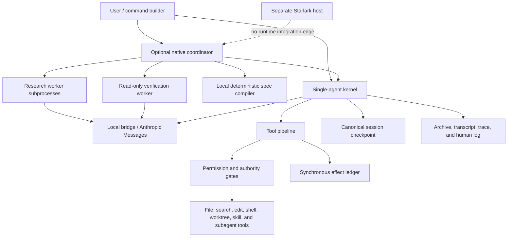
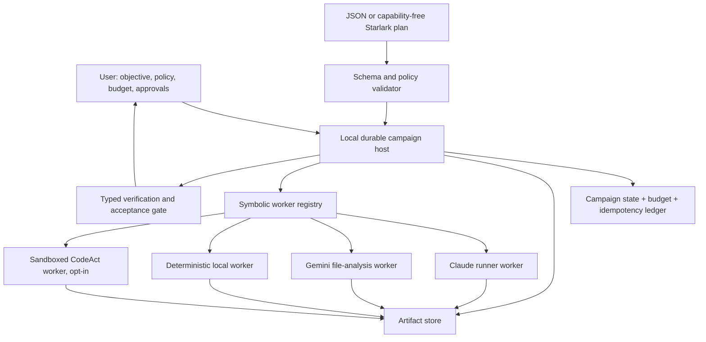

# Claude Local Bridge Runner Architecture Progress Review

**Date:** 2026-08-10 (Pacific time)

**Comparison baseline:** 2026-07-29, commit `e822aec` (the last repository commit before the orchestration study began)

**Current revision reviewed:** `39ec363` on local and remote `main`

**Repository:** `/Users/alanman/Developer/claude-local-bridge-playground`

**Review mode:** read-only architecture and runtime review; this report and its HTML companion are the only new files

## 1. Executive conclusion

The runner has moved a meaningful distance toward the architecture discussed in the July 29 conversation, but it has not yet crossed the boundary into a durable, provider-neutral, user-owned orchestration control plane.

The current system is best described as three adjacent layers:

1. A comparatively mature **single-agent execution kernel** with a disciplined tool pipeline, authority ceilings, session persistence, effect journaling, redaction, and recovery.
2. A useful but still prototype-grade **native coordinator** that can fan out bounded read-only Claude runner subprocesses, synthesize their text, run one execute agent, and optionally run one verification agent.
3. A separate, out-of-repository **Starlark orchestration prototype** that better expresses the user-owned control-plane thesis: generated code produces inert job descriptions, while a local host validates and dispatches them through symbolic workers.

The first layer is real and increasingly strong. The second layer demonstrates fan-out, dependency batches, budget leasing, and authority narrowing, but it is not durable as a campaign and currently has false-success paths. The third layer demonstrates the more general architecture we discussed, but it is not integrated with the runner, is not under this repository's version control, and has only one live model adapter.

The key answer to "where do we stand?" is therefore:

> We can now call multiple bounded subagents and we can generate safe programmatic plans, but we do not yet have one durable local host that owns the entire job graph, state, budgets, artifacts, retries, cancellation, verification, and provider routing.

That host is what should be built next. It should extend the existing coordinator and durability primitives rather than create a third control plane.

## 2. Scope and evidence

This review examined:

- the 32 commits after the July 29 baseline;
- the source diff from `e822aec` through `39ec363`;
- runner, coordinator, worker, tool, permission, session, ledger, recovery, worktree, budget, and command-builder paths;
- the July 29-30 orchestration study and deep-review annotations;
- the July 31 CodeAct, worker-contract, fan-out, and crash-recovery results;
- the August 6 Starlark prototype and architecture review;
- the August 7-10 false-green suites, security policy, and five-run runtime audit;
- direct, no-model probes of coordinator failure handling, synthesis filtering, worktree safety composition, and repository credential history;
- the complete current test suite plus lint, documentation consistency, and formatting checks.

### Change volume

Since the selected baseline, the repository has accumulated:

| Measure                                |                  Result |
| -------------------------------------- | ----------------------: |
| Commits                                |                      32 |
| Files changed                          |                     155 |
| Insertions                             |                  32,127 |
| Deletions                              |                   1,048 |
| Source/test/security/architecture diff | 44 files, +6,870 / -187 |
| Current runner tools                   |                      20 |
| Current runner CLI flags               |                      78 |
| Current full test count                |                     975 |

The raw insertion count is not a good measure of runtime maturity because it includes reports, diagrams, captured experiment evidence, and large structural test suites. The source changes that matter most are concentrated in `coordinator.js`, `ledger-repair.js`, `permissions.js`, `run.js`, `shell-policy.js`, the tool catalog, and the new false-green and crash-recovery tests.

## 3. Ontology: what the runner has and does not have

The distinctions from our earlier conversation remain important.

| Term                             | Meaning in this review                                                                                     | Current runner status                                                               |
| -------------------------------- | ---------------------------------------------------------------------------------------------------------- | ----------------------------------------------------------------------------------- |
| Shell or Bash tool               | The model requests one command; the host approves and executes it                                          | Present, explicit `--allow-shell`, unsandboxed local-account authority              |
| Tool calling                     | The model emits structured `tool_use`; the host dispatches one tool call and returns one result            | Present and mature                                                                  |
| Agent as tool                    | A parent calls a child agent and receives its result                                                       | Present as `spawn_agent`; read-only, depth one, maximum eight spawns                |
| Coordinator fan-out              | A host schedules multiple workers concurrently from an explicit dependency graph                           | Present for research nodes via `--research-plan`                                    |
| Programmatic orchestration       | Executable logic owns a sequence or graph of tool/worker calls and intermediate values                     | Not present in the native runner; demonstrated separately by the Starlark prototype |
| Code as plan                     | Generated code emits inert job descriptors; a host validates and executes them                             | Demonstrated by the separate Starlark prototype; not integrated                     |
| Code as action / CodeAct         | Generated Python/JavaScript directly performs work or calls tools                                          | Demonstrated in a bounded July 31 experiment; not a native runtime mode             |
| Durable campaign engine          | A host persists job graph, cursor, attempts, outputs, budgets, cancellation, and resume                    | Not present                                                                         |
| Provider-neutral worker registry | Symbolic worker names route to Claude, Gemini, deterministic code, or another provider behind one contract | Demonstrated structurally in the separate prototype; absent from native runtime     |

The existence of Bash means the model can write and run a bespoke Python or Node script, just as the OpenCode model did in the user's translation example. That is **code execution through a shell tool**, not by itself programmatic tool calling. The script cannot invoke the runner's typed tools as local function calls unless the host deliberately provides a tool broker or worker API to it.

## 4. Current architecture



### 4.1 Single-agent kernel

`src/runner/kernel/agent-kernel.js` provides a stable wrapper, but the actual loop still lives in the 1,794-line `src/runner/run.js`. The wrapper improves the calling contract; it does not yet make the kernel internally small.

The loop's strongest architectural properties are:

- exact tool definitions are snapshotted per turn, so a model cannot invoke an unoffered tool;
- optional capabilities keep the default surface to seven read-only/core tools;
- shell remains behind its own explicit flag and cannot be enabled by capability groups;
- the immutable authority ceiling prevents mid-run context mutation from widening permissions;
- the tool pipeline centralizes permission, confirmation, plan-mode behavior, execution, redaction, event emission, and ledger pairing;
- each tool effect receives an intent before execution and one result afterward, including denials and failures;
- canonical raw session history is preserved while outgoing model requests may use lossy projections;
- finalization is centralized enough to produce stable stop reasons, health, usage, and archives.

This is the clearest place where "the user owns the loop" is already true: the local runner decides which tools exist, which are offered, which require confirmation, what state is retained, and when execution stops.

### 4.2 Durability and recovery

The inner runner now has a serious durability stack:

- `session-store.js` stores canonical messages and runner metadata with atomic private writes;
- `session-ledger.js` synchronously appends effect events;
- `ledger-repair.js` detects and applies repairs;
- `reconcileForResume` runs before a resumed session appends new work;
- SIGTERM handling and process-kill experiments exposed and then reduced silent double execution;
- the July 31 bake-off exercised 74 kill trials rather than relying only on unit mocks.

The guarantee remains intentionally **at least once** for an in-flight side effect. Completed effect pairs can be reconstructed; an effect interrupted between intent and durable result may require reconciliation or repeat. This is honest and appropriate.

The important boundary is that this durability applies to the **inner agent session**, not to the coordinator's complete research/synthesis/execute/verify campaign.

### 4.3 Tool and safety layer

The tool architecture has improved materially:

- one catalog derives tool names, categories, capability groups, hidden status, and path-argument contracts;
- every tool belongs to exactly one capability group;
- file tools call `resolveFileTarget` inside their implementations, not only at the outer permission gate;
- symlink aliases and realpath escapes are checked;
- disjoint write parallelism now canonicalizes symlink targets;
- the central redaction boundary covers text, diffs, structured sinks, streaming output, stable identifiers, and archives;
- git history-changing commands retain a dedicated confirmation boundary;
- plan mode records proposed effects while preserving the authority ceiling.

The August false-green suites are valuable because they test catalog registration, permission matrices, redaction sinks, egress surfaces, model-catalog drift, ledger durability, mutation sensitivity, and test discovery. They are guards, not proof, and the August 9 field runs correctly exposed cross-subsystem defects the isolated guards missed.

### 4.4 Native subagents and workers

`spawn_agent` is a genuine agent-as-tool implementation:

- the parent model can delegate a focused prompt;
- the child runs in a separate process and context window;
- the runner binary is pinned to this package rather than selected by the target repository;
- the child receives a fixed read-only tool set intersected with the parent's authority ceiling;
- children cannot recurse;
- usage is reconciled into a parent budget lease;
- a child manifest records inherited controls and usage.

This answers part of the user's July question: yes, the runtime can call subagents as tools and return their outputs. The limitations are equally important:

- one `spawn_agent` tool call launches one child; the parent model still owns the decision to make each call;
- the tool itself does not accept a batch or map operation;
- maximum depth is one and maximum count is eight per run;
- all native children are the same local runner/provider path;
- the contract is mostly free-form final text, not a typed domain result;
- child processes are not durable jobs across parent-process death.

### 4.5 Native coordinator

The coordinator is the largest step toward host-owned scheduling. It supports:

- explicit phases: research, synthesize, execute, verify;
- a JSON research DAG with `id`, `deps`, prompt, step, token, and tool settings;
- Kahn-style dependency batching;
- concurrent execution of dependency-free nodes through `Promise.all`;
- per-batch token-lease division, reconciliation, and refusal when no budget remains;
- narrowed read-only workers for research and verification;
- shared model, effort, bridge, network, trace, cost, token, and wall-clock controls;
- a stable session identifier passed to the execute kernel;
- phase and worker events plus coordinator archive output.

This is real harness-owned concurrency. The July 31 field test observed four-way fan-out and a 4.13x wall-clock speedup with byte-identical aggregate input tokens.

However, the coordinator is not yet the durable loop owner:

- research results and phase cursor live in memory until final archive time;
- only a truncated synthesis string is stored in the session checkpoint;
- reusing `--session-id` does not resume completed research nodes or a phase cursor;
- there is no durable attempt record, cancellation state, idempotency key, or artifact reference per node;
- dependency edges control scheduling order but do not pass predecessor outputs into dependent prompts;
- the compiler emits a generic three-step plan rather than a task-specific executable job graph;
- all workers route through the same Claude runner path;
- the CLI has no general typed worker registry or non-agentic job adapter.

### 4.6 Starlark and CodeAct experiments

The July 31 CodeAct experiment proved a narrow but useful point: for a bounded count-and-write task, one model request produced a Node program that matched the classic loop's correctness with one model round trip instead of three or four. The experiment also showed the cost: safety moved from the runner's typed permission pipeline to the generated program's sandbox boundary.

The August 6 Starlark prototype made the more important architectural move. It used generated code only to construct inert job descriptors. The Starlark program had no filesystem, network, shell, model, or module authority; the local host retained validation and dispatch. It also introduced a symbolic worker registry and tested repo fan-out, test triage, retries, and evidence ledgers.

That is closer to our desired definition of programmatic tool calling, but today it remains a separate scratch control plane under `~/Developer/orchestration-prototypes/`. It is documented in this repository but has no callable integration edge to the native coordinator. Its provider-neutrality is structural rather than proven: the local Claude bridge is the only live adapter tested so far.

## 5. Progress against the July discussion

| July 29 objective                                  | Current status                                                    | Assessment                                                                                                                   |
| -------------------------------------------------- | ----------------------------------------------------------------- | ---------------------------------------------------------------------------------------------------------------------------- |
| User owns outer loop                               | Strong for one runner session; partial for multi-worker campaigns | The runner owns tools, permissions, state, and stopping. Coordinator campaign state is still process-local.                  |
| Agents can be called as tools                      | Implemented                                                       | `spawn_agent` is real, bounded, read-only, and usage-accounted.                                                              |
| Host can fan out many workers                      | Implemented for explicit research plans                           | Dependency-free research nodes run concurrently; this is not yet a general job engine.                                       |
| Workers need not be agentic                        | Demonstrated only outside native runtime                          | Starlark prototype has deterministic worker ideas; native coordinator always launches runner subprocesses.                   |
| Workers can use different providers                | Not implemented natively                                          | Symbolic registry exists only in the separate prototype and has one live adapter.                                            |
| Program generated on the fly can orchestrate calls | Demonstrated, not integrated                                      | CodeAct and Starlark experiments exist; native runtime consumes static JSON research plans.                                  |
| Program layer has no ambient authority             | Demonstrated by Starlark                                          | This is the correct direction for plans. Raw shell/CodeAct remains a separate higher-risk capability.                        |
| Durable resume without redoing completed work      | Strong inside one tool loop; absent across campaign nodes         | Session/ledger recovery does not persist coordinator phase/node state.                                                       |
| User owns budgets                                  | Partial                                                           | Token ceilings and leases are local and explicit, but process-local, not durable, and exclude cache tokens from enforcement. |
| User owns artifacts/evidence                       | Strong for runner; partial for coordinator                        | Runner has ledgers, traces, transcripts, archives. Coordinator worker artifacts are not incrementally durable.               |
| Typed worker contracts                             | Early                                                             | Worker manifests exist, but results are extracted heuristically from free-form text.                                         |
| Verification controls success                      | Not reliable yet                                                  | Failed verification is currently emitted as `completed`; failed research text can enter synthesis.                           |
| Provider or server does not hide inner loop        | Strong locally                                                    | Native tools and subprocesses are visible. Server-side PTC would still cede timing/intermediate visibility.                  |

Overall maturity against the architecture we discussed is roughly:

- **Single-agent local harness:** late prototype / usable laboratory.
- **Native multi-agent orchestration:** early prototype with real concurrency.
- **Durable user-owned campaign control plane:** design and component proof, not yet assembled.
- **Provider-neutral agent/worker platform:** structural experiment only.
- **Programmatic plan generation:** successful experiment, not a productized runner capability.

## 6. Current findings

### P0 -- A removed credential remains in Git history

The current `paste-block-3.txt` no longer contains the credential. Commit `39ec363` removed one line while renaming the evidence file. A no-output probe confirmed that the parent revision contains one value changed by the central secret redactor and that both the vulnerable parent and cleanup commit are ancestors of `origin/main`.

This means current-tree cleanup happened, but remote history exposure remains. Rotation/revocation is the first action; history cleanup and a repository secret-scanning gate follow. The secret is intentionally not reproduced or tested.

### P1 -- Runner-created worktrees are rejected by native file tools

`worktreeRoot()` creates worktrees under `~/.bridge-runner/worktrees`. The deny matrix blocks every path containing `/.bridge-runner/`. `read_file`, `list_files`, search, and write tools call `resolveFileTarget`, so they reject ordinary project files inside the worktree.

This was reproduced during the August five-run experiment and is still directly implied by current source. The practical result is exactly the wrong architecture: a safety feature forces agents away from typed tools and toward large Bash, Python, or Node commands.

The fix should not weaken the global deny matrix. The host should mark the exact active runner-created worktree root as an authorized project root while continuing to deny sibling session, trace, archive, and credential paths.

### P1 -- Resume does not preserve worktree identity

In `run.js`, startup worktree creation happens before session path resolution and resume loading. `enter_worktree` generates a fresh timestamped branch/path, and worktree identity is not stored in the canonical session metadata.

Therefore `--resume-session --worktree` silently enters a new worktree before restoring the old model history. The session may remember work performed against a different filesystem state. The August field runs observed exactly this drift.

Resume must either re-enter the same validated worktree or stop and ask the user to choose. A fresh worktree must never masquerade as continuation.

### P1 -- Coordinator verification has a false-success path

A direct injected probe returned a failed verification worker with exit code 1 and `bridge_error`. The coordinator still emitted:

```text
verify: started
verify: completed
result.error: null
```

The code unconditionally emits `status: 'completed'` after the verification spawn. Verification is therefore advisory text, not a success gate.

### P1 -- Failed research worker text can become implementation evidence

`WorkerRuntime` extracts claims and evidence paths from `finalText` regardless of exit code or worker state. `compileSpec` then consumes claims from all worker results without filtering for `state === 'completed'` or a valid terminal stop reason.

A direct probe confirmed that a failed worker's claim and invented evidence path are accepted into `researchFindings` and `allowedFiles`. This can turn a bridge error, partial output, or failure explanation into an implementation specification.

### P1 -- Transport retry attempts consume task steps

The model loop retries transient 429, 5xx, and network failures only when `step < max_steps`, then uses `continue` on the outer step loop. A controlled 500 recovered with three available steps and did not retry with one. Infrastructure retries therefore consume the task's semantic model/tool-turn allowance.

Retry attempts need their own bounded counter and backoff policy. They should retain request/attempt identity and should not advance the semantic task step until a model response is received.

### P2 -- Coordinator state is not a durable campaign record

The coordinator loads a session store and saves synthesis, but it does not persist the research plan digest, node states, attempt counts, worker outputs, artifact references, phase cursor, verification state, or cancellation state after each transition. A crash during research or verification loses coordinator progress even though individual child runs may have their own archives.

### P2 -- Dependencies are ordering edges, not data-flow edges

Research `deps` determine which batch can run, but a dependent node receives only its own prompt plus the overall objective. It does not receive structured predecessor outputs or artifact references. This is a scheduler DAG, not yet a workflow data graph.

### P2 -- Budget ownership is incomplete

Token leases prevent concurrent children from each copying the full parent ceiling. That is a substantial improvement. Remaining gaps:

- cache-read and cache-creation usage is returned but not added to enforced totals;
- dollar cost is reported elsewhere but not the coordinator's durable reservation unit;
- reservations live only inside one process;
- there is no campaign budget ledger spanning resume or multiple commands;
- failed or killed process reconciliation cannot be completed by a later host.

### P2 -- Full suite has one non-hermetic failure and five known gaps

The complete suite currently reports `975` tests, `969` pass, `1` fail, and `5` todo. The real failure is the parallel-slot worktree test using the fixed global `~/.bridge-runner/worktrees/slot-a` path. That path already exists, so the test's first `enter_worktree` returns false.

The registered known gaps are:

- HS-01: case-variant sensitive filenames on case-insensitive filesystems;
- HS-02: first append after a torn ledger tail;
- HS-03: deterministic newest-backup selection when modification times tie;
- HS-05: cycle-safe deep structured redaction;
- HS-06: removal of `OTEL_*` credential variables from child environments.

These are not equivalent in severity, but all remain deliberately open in `SECURITY.md` and the test register.

### P2 -- Two orchestration control planes are drifting

The native coordinator and the Starlark host both contain concepts for scheduling, budgets, retry, ledgers, workers, and artifacts. There is no integration edge and no explicit declaration that one is authoritative. Continuing to develop both independently would make "who owns the loop?" ambiguous in the implementation even if the design prose remains clear.

## 7. What should be retained

The following decisions are sound and should remain stable:

1. **The local host owns authority.** A generated program or worker may request work; it must not grant itself filesystem, shell, provider, budget, or recursion authority.
2. **Tool visibility and permission are separate.** Hidden capability groups prevent prompt bloat and accidental authority widening; the permission gate remains authoritative.
3. **Generated orchestration code should be code as plan.** Starlark may create inert descriptors; the host validates and dispatches them. This is a better default than sandboxed Python for campaign planning.
4. **Raw CodeAct is a separate opt-in worker class.** It can be useful for bounded transformations, but it needs a real sandbox and must not become the control plane.
5. **The effect ledger is critical.** Side effects without a durable intent/result record should fail closed.
6. **Workers inherit a narrowing authority ceiling.** Child processes must never widen beyond the parent's explicit grant.
7. **Canonical history and model projection are different things.** Preserve raw evidence; compact only what is sent back to the model.
8. **Provider neutrality belongs at a typed worker registry.** It should not be implemented by making the native Anthropic bridge pretend to be an OpenAI-compatible endpoint.
9. **JSON remains the cheap path.** Fixed job lists do not need a programming language. Starlark pays for itself only when the plan needs loops, matrices, or dynamic expansion.

## 8. Recommended target architecture



The durable campaign host should own:

- campaign ID and immutable plan digest;
- validated job DAG and explicit input/output references;
- pending, leased, running, retryable, completed, failed, cancelled, and blocked states;
- atomic budget reserve/settle records;
- per-job idempotency keys and attempt records;
- cancellation and process ownership;
- artifact hashes and provenance;
- output-schema validation and bounded repair;
- retry policy separated from semantic job attempts;
- terminal acceptance rules;
- resume without rerunning completed jobs.

The model should own none of those mechanics. It may propose a plan, choose among explicitly offered symbolic workers, or interpret results. The host disposes.

## 9. Recommended sequence

### Step 0 -- Contain the credential-history issue

Do this before more publishing or external collaboration:

- revoke or rotate the exposed OAuth credential;
- verify the replacement without placing it in repository evidence;
- decide on coordinated Git history cleanup for the playground remote;
- add a secret scanner to the commit/push path, including tracked terminal captures and documentation;
- retain a synthetic redacted fixture for redaction tests.

### Step 1 -- Repair the substrate composition cluster

This should be one coherent work slice because the bugs interact:

- authorize the exact active managed worktree root for native project tools without opening sibling `.bridge-runner` data;
- persist original repo root, worktree path, branch, slot, and HEAD in session metadata;
- make resume re-enter and validate that identity or stop explicitly;
- make worktree tests use per-test temporary roots and unique names;
- split transport attempts from semantic steps and add concurrent outage/backoff tests.

Exit criterion: a real `--worktree` run can use native file tools, fail mid-run, resume into the same worktree, and recover transient transport errors without spending task turns.

### Step 2 -- Make coordinator outcomes honest

- filter synthesis inputs to accepted worker terminal states only;
- persist failure/refusal/truncation as structured states rather than claims;
- attach evidence paths to the specific claim and worker that produced them;
- make verification success conditional on worker success plus a typed verdict;
- represent execute failure, verify failure, partial success, and budget refusal distinctly;
- add adversarial tests for failed-worker claims, partial JSON, empty output, fabricated paths, and verification bridge failure.

Exit criterion: no failed, refused, killed, or truncated worker can make a phase or campaign appear completed.

### Step 3 -- Choose and document one control plane

Recommended decision:

> The native coordinator becomes the authoritative durable campaign host. Starlark remains a capability-free plan compiler feeding validated descriptors into that host.

Do not port runner permissions, ledgers, or budgets into the Starlark host. Bring the prototype under version control, expose one validator/descriptor contract, and give the runner a capability-gated `run_workflow` or equivalent host entry point.

### Step 4 -- Add durable campaign state

Build the smallest useful campaign ledger before adding more worker types:

- immutable campaign definition and plan digest;
- job-state transition log;
- atomic lease/attempt records;
- incremental artifact persistence;
- phase cursor and resume;
- cancellation propagation;
- synthesis-only retry;
- kill-mid-worker tests proving completed jobs are not rerun.

Reuse `session-ledger.js`, `ledger-repair.js`, private atomic writes, and archive conventions. Do not introduce a parallel persistence vocabulary without a demonstrated need.

### Step 5 -- Introduce a typed worker registry

A worker manifest should declare:

- symbolic name and version;
- input and output JSON Schemas;
- adapter type and host-owned route;
- required authority class;
- timeout and retry class;
- cost/budget policy;
- artifact policy;
- validation and repair policy.

The first three implementations should deliberately span the ontology:

1. a deterministic local worker, such as regex/static analysis;
2. the existing Claude read-only runner worker;
3. a Gemini-backed file-analysis worker modeled after the user's Shortcut and filename-analysis pipeline.

The dispatcher should contain no provider-specific branch in workflow code. Provider/model selection belongs only in the host-owned registry.

### Step 6 -- Integrate programmatic planning conservatively

- accept plain validated JSON for fixed job sets;
- use Starlark only for bounded dynamic expansion;
- hash plan source plus inputs and store the expanded descriptor set;
- add deterministic linting for common Python-shaped Starlark mistakes;
- enforce descriptor count, string size, evaluation step, and wall-clock ceilings;
- keep raw Python/Node CodeAct behind a separate sandboxed worker capability.

### Step 7 -- Prove the architecture with one real workflow

Use the file-renaming example because it already has a valuable real-world shape:

- 100-file batch input;
- deterministic local pre-processing;
- Gemini analysis worker;
- optional Claude review worker for low-confidence cases;
- typed filename suggestion output;
- user-owned concurrency and cost ceiling;
- durable per-file artifacts and idempotent rename step;
- kill/resume test;
- cancellation test;
- repeated trials with an objective scoring rubric.

This would demonstrate more than an SDK bake-off. It would prove that the user's local control plane can route agentic and non-agentic workers across providers while retaining the loop, state, artifacts, and authority.

## 10. What not to work on next

Avoid these until the earlier steps are complete:

- another broad framework survey;
- a second native coordinator implementation;
- unrestricted Python as the generated plan language;
- adding many provider adapters before one typed contract survives crash/resume and validation tests;
- merging the five August experiment branches because their focused tests pass;
- more isolated false-green inventories without composed runtime scenarios;
- presenting the separate Starlark prototype as already provider-neutral;
- treating shell access as a substitute for a worker registry or durable scheduler.

## 11. Validation results

| Check                           | Result                                                                                                                   |
| ------------------------------- | ------------------------------------------------------------------------------------------------------------------------ |
| Repository/root/branch/remote   | Correct playground repository, `main`, expected origin                                                                   |
| Local vs `origin/main`          | Synchronized, 0 ahead / 0 behind at review start                                                                         |
| `npm test`                      | **Failed:** 975 tests; 969 pass; 1 fail; 5 todo; 46.5 seconds                                                            |
| Real failing test               | `worktree tools -- enter/exit lifecycle > supports parallel slots in one run`; fixed global `slot-a` path already exists |
| `npm run lint`                  | Passed                                                                                                                   |
| `npm run check:docs`            | Passed; 20 tools, 78 flags, 12 models, 6 templates                                                                       |
| `npm run format:check`          | Passed                                                                                                                   |
| Coordinator failed-verify probe | Confirmed false completion event and `error: null`                                                                       |
| Failed-worker synthesis probe   | Confirmed failed claim and evidence path are accepted                                                                    |
| Worktree/deny-matrix probe      | Confirmed managed root matches global `.bridge-runner` deny rule                                                         |
| Credential current-tree probe   | Current file clean under the central redactor                                                                            |
| Credential-history probe        | Parent revision contains one redacted secret value and is on `origin/main` history                                       |
| Live authenticated model call   | Not repeated in this review; the August 10 runtime audit records a successful bounded live call                          |

## 12. Final assessment

The last twelve days did not merely add tools. They established several hard prerequisites for trustworthy orchestration: authority ceilings, catalog concordance, effect pairing, process-death testing, ledger repair, real fan-out, lease accounting, and a capability-free programmatic planning experiment.

The architecture is now at a productive decision point. The question is no longer whether the runner can spawn agents or whether generated code can help. Both have been demonstrated. The question is whether those demonstrations will be assembled under one durable local control plane or allowed to remain two drifting prototypes.

The recommended direction is clear:

> Stabilize worktree/resume/retry composition, make coordinator results honest, then turn the native coordinator into the durable campaign host and feed it validated JSON/Starlark descriptors through a typed, provider-neutral worker registry.

That sequence preserves the principle from the original conversation: the user owns the loop at every layer where ownership is technically possible.

## 13. Handoff

- **Folder:** `/Users/alanman/Developer/claude-local-bridge-playground`
- **Branch:** `main`
- **Files added:** `docs/runner-architecture-progress-review-2026-08-10.md` and `docs/runner-architecture-progress-review-2026-08-10.html`
- **Source files changed:** none
- **Existing unrelated file preserved:** untracked `docs/datadog-observability-setup-guide-2026-08-10.html`
- **Checks run:** full test suite, lint, documentation consistency, formatting, targeted architecture probes, Git history/current-tree secret checks
- **Checks skipped:** no new paid/live model request; no destructive credential, history, worktree, branch, or session cleanup
- **Primary risk:** the credential is removed from the current tree but remains in reachable remote history until containment and cleanup are completed
