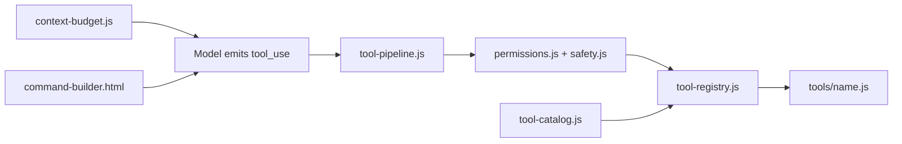

# Runner Capability Expansion Roadmap

Exploration map for growing the **cc bridge runner** toward more of the Claude Code harness — without abandoning the
playground's minimal-core, OAuth-only, local-first direction.

**Scope of this document:** categorization and phased recommendations only. No implementation commitments. Network tools
(WebFetch, WebSearch, MCP) are explicitly deferred until egress guardrails are designed.

**Related docs:**

- [Runner quick start](./runner-quickstart.html) — how to run the runner today
- [Command builder](./command-builder.html) — form UI that assembles CLI flags
- [Threat model](./threat-model.md) — safety invariants new tools must respect

**Official Claude Code references (primary sources):**

- [Tools reference](https://code.claude.com/docs/en/tools) — canonical tool names and behavior
- [Settings](https://code.claude.com/docs/en/settings) — permissions, hooks, skills, MCP, sandbox
- [Power user tips](https://support.claude.com/en/articles/14554000-claude-code-power-user-tips) — workflow patterns from the Claude Code team (verification, parallel work, hooks, memory)

---

## 1. Where we are today (honest baseline)

### Command builder coverage

The [command builder](./command-builder.html) is already a **near-complete mirror** of the runner CLI. It surfaces
essentially every flag that `bin/local-bridge-runner.js` accepts:

- Permission styles (look-only, plan-first, edit-ask, edit-auto, edit-shell)
- `--agent` profiles, `--tools` capability groups, model and budget limits
- Session store, resume/fork, ledger utilities (`--replay`, `--repair`)
- Context opt-ins (`--bare`, instruction docs, repo map, skills)
- Output formats, tracing, human log, bridge URL, caller token

**Implication:** "Expand via the command builder" means **add a runner capability first**, then wire a small control
into the builder. The HTML is not the bottleneck today.

### Model-callable tools (11 today)

| Tool          | Category         | Default visible | Gating                               |
| ------------- | ---------------- | --------------- | ------------------------------------ |
| `list_files`  | read-only        | yes             | —                                    |
| `read_file`   | read-only        | yes             | —                                    |
| `search_text` | read-only        | yes             | —                                    |
| `glob`        | read-only        | yes             | —                                    |
| `git_status`  | read-only        | yes             | —                                    |
| `edit_file`   | write            | yes             | confirmation unless `--accept-edits` |
| `write_file`  | write            | yes             | confirmation unless `--accept-edits` |
| `apply_patch` | write (advanced) | **hidden**      | opt in via `--tools apply_patch`     |
| `undo`        | recovery         | yes             | auto-approved                        |
| `undo_edit`   | recovery         | yes             | auto-approved                        |
| `bash`        | shell            | **hidden**      | `--allow-shell` required             |

Source: `src/runner/tool-catalog.js`, `docs/threat-model.md`.

### Harness infrastructure (already exists, not always exposed as tools)

Much of what feels like "missing harness" is already runner plumbing:

| Capability                       | How it exists today                                                                 |
| -------------------------------- | ----------------------------------------------------------------------------------- |
| Plan mode                        | `--plan` / `--permission-mode plan`                                                 |
| Permission modes                 | `--accept-edits`, `--dont-ask`, `--permission-mode`, `--chaos-ok` combo guard       |
| Agent profiles                   | `--agent` (`explore`, `plan`, `implement`, `verify`, `test`, …)                     |
| Coordinator / workers            | `bin/local-bridge-coordinator.js`, `src/runner/coordinator.js`, `worker-runtime.js` |
| Hooks                            | `.bridge-runner/hooks.json` when `--trusted-workspace` + workspace trust            |
| Skills listing                   | `--include-skills` (discovery in system prompt)                                     |
| Auto-memory                      | `--auto-memory`                                                                     |
| Repo map / instruction hierarchy | `--include-repo-map`, `--include-instruction-docs`, etc.                            |
| Session ledger + replay/repair   | `--replay`, `--repair`, `session-ledger.js`                                         |
| Archives + transcripts           | `--transcript`, `--human-log`, `--no-archive`                                       |
| Cost / wall-clock budgets        | `--max-cost-usd`, `--max-wall-clock-ms`                                             |
| Flight recorder                  | `--trace-level`, `--trace-path`                                                     |

The runner is **smaller in tool count** but **not empty** in harness depth.

---

## 2. How any new tool plugs in

Every new model-callable tool should touch the same five integration points:

1. **Implement** — `src/runner/tools/<name>.js`
2. **Register** — `TOOL_MODULES`, category, write/hidden sets in `src/runner/tool-catalog.js`
3. **Permission category** — read-only / write / shell / recovery in `src/runner/permissions.js`
4. **Capability-group summary** — progressive disclosure line in `src/runner/context-budget.js`
5. **Tests + builder** — `test/runner/<name>.test.js`, then a checkbox in `#toolChoices` and a branch in
   `buildCommandParts()` in `docs/command-builder.html`



**Default posture for new tools:** read-only and visible by default; write/shell/network tools hidden and opt-in,
consistent with `docs/threat-model.md`.

---

## 3. Gap vs Claude Code harness

Claude Code documents ~40 built-in tools ([tools reference](https://code.claude.com/docs/en/tools)). Many are
**hosted-product or claude.ai-only** and irrelevant to a local OAuth lab. The table below maps **local-relevant**
gaps only.

| Claude Code tool                                                                  | Runner today                | Gap                                                         |
| --------------------------------------------------------------------------------- | --------------------------- | ----------------------------------------------------------- |
| `Read`                                                                            | `read_file`                 | Partial — no images/PDF multimodal, paging differs          |
| `Glob`                                                                            | `glob`                      | **Shipped**                                                 |
| `Grep`                                                                            | `search_text`               | Rough parity (ripgrep-backed)                               |
| `Edit` / `Write`                                                                  | `edit_file` / `write_file`  | Parity; read-before-edit semantics differ                   |
| `Bash`                                                                            | `bash`                      | Partial — no persistent cwd carry-over, no background tasks |
| `Agent`                                                                           | coordinator (CLI only)      | **Missing** as in-loop tool                                 |
| `TaskCreate` / `TaskList` / `TodoWrite`                                           | —                           | **Missing** in-session task checklist                       |
| `AskUserQuestion`                                                                 | confirmation (writes/shell) | **Missing** structured multi-choice                         |
| `EnterWorktree` / `ExitWorktree`                                                  | —                           | **Missing** git worktree isolation                          |
| `Monitor`                                                                         | —                           | **Missing** background command polling                      |
| `Skill`                                                                           | skills listed in prompt     | **Missing** execution tool                                  |
| `LSP`                                                                             | —                           | **Missing**                                                 |
| `NotebookEdit`                                                                    | —                           | N/A for this lab                                            |
| `WebFetch` / `WebSearch`                                                          | —                           | **Deferred** (network)                                      |
| MCP tools                                                                         | —                           | **Deferred** (network + trust)                              |
| `Artifact`, `Cron*`, `RemoteTrigger`, `PushNotification`, `Workflow`, agent teams | —                           | **Out of scope** (hosted)                                   |

---

## 4. Phase 1 — Prudent now (local, low-risk, small)

These are the best first builds: they improve the agent loop without new egress, and each is a clean vertical slice
through catalog → permissions → tests → command builder.

### 4.1 `glob` — find files by name pattern (shipped)

**Status:** Implemented in `src/runner/tools/glob.js` (read-only, default visible).

**Why:** Complements `search_text` (content) and `list_files` (single directory). Models often need `**/*.test.js` style
discovery.

**Attainability:** Low effort. Read-only category. Mirror Claude Code Glob semantics where practical: `**` recursion,
modtime sort, cap at ~100 paths, respect `.gitignore` optionally.

**Risk:** Low — same path confinement and deny matrix as other read tools.

### 4.2 In-session task checklist (TodoWrite / Task\* analog) — shipped

**Status:** Implemented as `manage_tasks` in `src/runner/tools/manage-tasks.js` (read-only category, default visible).
Persisted in session `runner.tasks`; summarized in context budget.

**Why:** Long multi-step runs benefit from structured progress the model can update. Claude Code moved from `TodoWrite`
to `TaskCreate`/`TaskList`/`TaskUpdate`; a minimal checklist tool is enough for v1.

**Attainability:** Low–medium. No filesystem side effects. Persist in session state; mirror to transcript/human-log.

**Risk:** Low — no new permission surface beyond allowing the tool.

### 4.3 `ask_user_question` — structured clarification

**Why:** Reduces wrong assumptions before writes. Claude Code's `AskUserQuestion` is permission-free but interactive.

**Attainability:** Medium. Reuse the confirm-port pattern from `confirmation.js`. In non-interactive, `--dont-ask`, or
coordinator-worker contexts: return a safe no-op or auto-deny message (workers already use deny-all confirm port).

**Risk:** Low if TTY-gated; medium if mis-wired in CI (must fail closed).

### 4.4 `read_file` paging polish

**Why:** Large files need PARTIAL-view ergonomics like Claude Code Read (offset/limit, clear "read more" hints).

**Attainability:** Small. Extends existing tool; read-only.

**Risk:** Low.

### Recommended Phase 1 order

1. **`glob`** — shipped
2. **Task checklist** — shipped (`manage_tasks`)
3. **Verification presets** — shipped (`--test-watch`, `verify`/`grill`/`simplify` templates, command-builder preset)
4. **`read_file` paging** — small polish (next)
5. **`ask_user_question`** — needs careful TTY/non-TTY matrix testing

---

## 5. Phase 2 — Attainable, bigger (pick one flagship)

These are worth doing but need explicit scoping and safety design.

### 5.0 File-based agent loader — shipped (slice 1)

**Status:** Implemented in `src/runner/agents/agent-loader.js` + registry wiring. Load Markdown+frontmatter agents via
`--agent <name|path>`. Curated examples in `.bridge-runner/agents/`. Compatible with the
`awesome-claude-code-subagents` format (tool/model mapping + safety gating).

**Not yet:** git worktrees (slice 3).

### 5.1 Model-callable subagents (`spawn_agent` tool) — shipped (slice 2)

**Status:** Implemented in `src/runner/tools/spawn-agent.js`. Top-level model can call `spawn_agent` to delegate via
`WorkerRuntime`. Hidden when `spawnDepth > 0`. Permission category `orchestration` (ask by default).

**Not yet:** git worktrees (slice 3).

### 5.2 Future orchestration polish

Parallel/batch `spawn_agent`, background workers, and richer child result schemas. Core single-child delegation is
shipped in §5.1.

### 5.3 Git worktree isolation (`enter_worktree` / `exit_worktree`) — shipped (slice 3)

**Status:** Implemented in `src/runner/tools/enter-worktree.js` and `exit-worktree.js`. Creates an isolated
git worktree on a fresh `bridge-runner/` branch under `~/.bridge-runner/worktrees/`. Switches ctx.cwd so
all tools operate inside the worktree until exit. Permission category `worktree` (ask by default).
`cleanup=false` by default to preserve work.

**Not yet:** parallel worktree orchestration (multiple worktrees at once), automatic cleanup on session end.

**Why:** Real safety win — risky edits in an isolated worktree/branch without touching main checkout.

**Effort:** Medium. Requires git presence, cleanup on session end, clear UX when worktree already active.

### 5.4 Background bash + output polling

**Why:** Dev servers, watch builds, long tests. Claude Code uses `run_in_background` + task list.

**Build on:** `persistent-shell.js`, `subprocess-pool.js`.

**Gating:** Still `--allow-shell`. Add kill/list tools or extend `bash` schema.

**Effort:** Medium.

### 5.5 `skill` execution tool

**Why:** Runner already lists skills (`--include-skills`); execution closes the loop.

**Effort:** Medium — resolve skill paths, respect workspace trust, cap output size.

### 5.6 `LSP` code intelligence

**Why:** Jump-to-def, references, diagnostics after edits.

**Effort:** High; needs language-server lifecycle management. Defer unless a concrete language need appears.

### 5.6 Richer `Read` (images, PDF)

**Why:** Multimodal debugging, screenshot review.

**Effort:** Medium–high — depends on whether bridge `/v1/messages` accepts image/PDF content blocks with OAuth route.
Investigate before building.

---

## 6. Deferred — network surface (explicitly out of scope for now)

Per playground direction and `docs/threat-model.md` § Known limitations, outbound network is **not hard-restricted**
today (`--no-network` is a best-effort proxy guard for shell only).

| Capability  | Notes                                                                 | Revisit when                                                                   |
| ----------- | --------------------------------------------------------------------- | ------------------------------------------------------------------------------ |
| `WebFetch`  | Local HTTP fetch + extract; domain prompts in Claude Code             | Egress allowlists, opt-in flag (e.g. `--allow-web-fetch`), threat-model update |
| `WebSearch` | Anthropic server-side search tool; may not work on OAuth bridge route | Bridge capability audit + billing/policy clarity                               |
| MCP client  | `.mcp.json`, plugin ecosystem                                         | Trust model, `allowedMcpServers` analog, sandbox                               |

**Do not add these silently.** Each needs an explicit opt-in flag, documentation in `threat-model.md`, and command-builder
controls marked as advanced/risky.

---

## 7. Superfluous / out of scope for this lab

These Claude Code tools or settings areas conflict with minimal, single-user, OAuth-only runner goals:

| Item                                        | Reason                                                    |
| ------------------------------------------- | --------------------------------------------------------- |
| `NotebookEdit`                              | No Jupyter workflow in this runner                        |
| `PowerShell`                                | macOS-focused lab; bash covers shell                      |
| `Artifact`                                  | claude.ai hosted pages                                    |
| `CronCreate` / `CronDelete` / `CronList`    | Session scheduling on claude.ai                           |
| `RemoteTrigger` / Routines                  | claude.ai cloud                                           |
| `PushNotification`                          | Remote Control / phone push                               |
| `Workflow` / ultracode workflows            | Hosted orchestration                                      |
| Agent teams / `SendMessage`                 | Multi-agent product surface                               |
| `ShareOnboardingGuide`                      | claude.ai share links                                     |
| `ToolSearch` / deferred tool loading        | Large flat tool menus — we use capability groups instead  |
| Plugins / marketplaces / managed settings   | Enterprise distribution; use `.bridge-runner/` primitives |
| OpenAI-compatible routes / API-key fallback | Transport invariants — never restore                      |

---

## 8. Invariants any future build must preserve

From `CLAUDE.md`, `AGENTS.md`, and `docs/threat-model.md`:

| Invariant         | Rule                                                                                       |
| ----------------- | ------------------------------------------------------------------------------------------ |
| Transport         | Native `POST /v1/messages` only; OAuth Bearer upstream; no Console API-key fallback        |
| Shell             | Hidden unless `--allow-shell`; `--dont-ask` must not enable shell                          |
| Hard deny         | `.env`, `.ssh`, `.aws`, `.claude`, keys, credentials JSON, path escapes — never bypassable |
| Writes            | Confirmation unless `--accept-edits`                                                       |
| Secrets           | Scrub in tool results, transcripts, stream-json, human logs, traces                        |
| Workspace trust   | No tools until `--trust-workspace` (or interactive consent)                                |
| Default context   | Minimal (`--bare` posture); explicit opt-ins for skills, repo map, instruction docs        |
| Capability groups | Progressive disclosure in system prompt, not an ever-growing flat tool menu                |

---

## 9. Command builder — what to add when tools land

Today the builder's **Capability groups** panel (`#toolChoices`) lists all 10 tools. When Phase 1+ tools ship:

1. Add a checkbox under the appropriate group (Read / Write / Recovery / Shell / new group if needed).
2. Extend `DEFAULT_TOOL_NAMES` and `getSelectedTools()` logic.
3. Emit `--tools` only when selection differs from default (existing pattern).
4. Add one line of `<small>` help per tool (existing pattern at lines ~965–1006).

No large UI rewrite required until network or subagent tools need **risk panels** (similar to chaos-ok / shell warnings).

---

## 10. Claude Code power user patterns — adoption map

Anthropic's [Claude Code power user tips](https://support.claude.com/en/articles/14554000-claude-code-power-user-tips)
collects workflow patterns from the Claude Code team. The article's headline advice: **verification is the single most
impactful practice** — give the agent a way to check its own output and close the feedback loop.

This section maps each major pattern from that guide to the bridge runner: what we already support, what is prudent to
build, and what belongs to the hosted Claude Code product (not this OAuth lab).

**Verdict key:**

| Verdict          | Meaning                                                              |
| ---------------- | -------------------------------------------------------------------- |
| **Have**         | Runner supports this today (flag, profile, or primitive)             |
| **Docs/presets** | No new runner code; document or add command-builder presets          |
| **Phase 1**      | Small local build aligned with §4                                    |
| **Phase 2**      | Bigger build aligned with §5                                         |
| **Defer**        | Network, sandbox, or policy work not ready                           |
| **Out of scope** | Hosted product, TUI polish, or conflicts with minimal-core direction |

### Summary table (by article section)

| Article section             | Representative patterns                          | Verdict                           | Runner path                                                        |
| --------------------------- | ------------------------------------------------ | --------------------------------- | ------------------------------------------------------------------ |
| **Verification** (#1 tip)   | Tests after edits, `/simplify`, browser check    | **Phase 1–2**                     | Expand test-watcher; verification presets; hooks that run commands |
| Working in parallel         | `--worktree`, subagent isolation, `/batch`       | **Phase 2** / Out                 | Worktree tools + Agent tool; `/batch` is hosted-scale              |
| Planning                    | Plan mode, effort, model choice                  | **Have**                          | `--plan`, `--effort`, `--model`, `--agent plan`                    |
| Prompting                   | “Grill me”, “prove it works”, detailed specs     | **Docs/presets**                  | `.bridge-runner/prompts/`, built-in templates                      |
| Learning                    | Explanatory/Learning output styles               | **Docs/presets**                  | `--append-system-prompt`, custom templates                         |
| CLAUDE.md & memory          | Team `CLAUDE.md`, auto-memory, notes dirs        | **Have** / Docs                   | `--include-instruction-docs`, `--auto-memory`                      |
| Commands, skills, subagents | Skills, `.claude/agents/`, code-review agents    | **Partial** → **Phase 2**         | `--agent`, coordinator; skill _execution_ missing                  |
| Hooks                       | PostToolUse format, Stop checks, PostCompact     | **Partial** → **Phase 2**         | Events exist; dispatcher is log-only today                         |
| Permissions & safety        | `Bash(npm run *)` allowlists, auto mode, sandbox | **Partial** → **Phase 2** / Defer | Category permissions; no OS sandbox                                |
| Scheduled tasks             | `/loop`, `/schedule`                             | **Out of scope**                  | Cloud/local scheduling is Claude Code product                      |
| Mobile & remote             | Teleport, remote control, iMessage               | **Out of scope**                  | claude.ai / mobile app                                             |
| MCP & plugins               | Slack, BigQuery, plugin marketplace              | **Defer**                         | §6 network + trust                                                 |
| Customizing UI              | `/statusline`, `/voice`, `/color`                | **Out of scope**                  | Terminal TUI product surface                                       |
| SDK & multi-repo            | `--bare`, `--add-dir`, session fork              | **Have** / **Phase 2**            | `--bare`, `--fork-from`; no `--add-dir` yet                        |

### Verification — adopt first (article's #1 tip)

The team stresses **domain-specific verification**: tests, linters, diff checks, browser iteration for frontend. For this
runner, that translates to concrete adoption paths:

| Pattern from article                    | Runner today                                                                                    | Recommended adoption                                                                                                                                                                     |
| --------------------------------------- | ----------------------------------------------------------------------------------------------- | ---------------------------------------------------------------------------------------------------------------------------------------------------------------------------------------- |
| Run test suite after changes            | `--test-watch` (or `BRIDGE_RUNNER_TEST_WATCH=1`) + `--allow-shell` runs tests post-write (`test-watcher.js`); command-builder “Verify after edits” preset | **Shipped** — Phase 2: executable PostToolUse hooks |
| “Prove to me this works” (diff vs main) | `git_status` + `bash` when shell enabled                                                        | **Docs/presets:** `explore`/`verify` agent profiles + prompt template; no new tool                                                                                                       |
| `/simplify` (parallel review agents)    | Coordinator `verify` phase + `--agent verify`                                                   | **Phase 2:** prompt template or skill named `simplify` that invokes coordinator verify pass; optional subagent tool                                                                      |
| Chrome extension / Desktop browser      | None                                                                                            | **Out of scope** for CLI runner; revisit only if a local browser MCP lane is explicitly scoped                                                                                           |
| Stop-hook deterministic checks          | `post_tool` hook event exists; **log-only**                                                     | **Phase 2:** trusted hooks that execute allowlisted commands (e.g. `npm test`, `npm run lint`) after writes                                                                              |

**Principle to encode in presets:** every “implement” or “edit-auto” command-builder preset should nudge toward a
verification step (tests, lint, or explicit “show diff”) — matching the article even when we cannot ship a browser.

### Working in parallel

| Pattern                                                  | Adoption                                                                                                       |
| -------------------------------------------------------- | -------------------------------------------------------------------------------------------------------------- |
| Multiple sessions in git worktrees (`claude --worktree`) | **Phase 2** — `enter_worktree` / `exit_worktree` tools (§5.2). Highest leverage for safe parallel experiments. |
| Subagents with `isolation: worktree`                     | **Phase 2** — combines Agent tool + worktree isolation.                                                        |
| `/batch` (fan-out dozens of worktree agents)             | **Out of scope** — hosted orchestration at scale; coordinator is the lab's lighter analog.                     |
| Name/color-code sessions                                 | **Docs/presets** — use `--session-id`, `--human-log`, `--transcript`; terminal tab color is user-side.         |

### Planning and model control

| Pattern                                  | Runner today                                                                                      |
| ---------------------------------------- | ------------------------------------------------------------------------------------------------- |
| Start complex work in plan mode          | **Have** — `--plan`, “plan-first” command-builder preset, `--agent plan`                          |
| Re-plan when things go sideways          | **Docs** — workflow guidance; runner supports mid-session `--plan` on next run via session resume |
| Effort levels (`/effort` high/xhigh/max) | **Have** — `--effort`                                                                             |
| Opus + extended thinking                 | **Have** — `--model`; thinking depends on bridge/model policy                                     |
| Auto-name session after plan             | **Partial** — archive/transcript metadata; no auto-title UX (acceptable for CLI lab)              |

### Prompting and learning (mostly zero-code)

These patterns need **prompt templates and command-builder presets**, not new tools:

- **“Grill me on these changes…”** → add `.bridge-runner/prompts/grill.md` or extend built-in `review` template.
- **“Knowing everything you know now, scrap and implement elegantly”** → cleanup/refactor template.
- **Detailed specs before handoff** → document in quickstart; user writes spec in command-builder prompt field.
- **Explanatory / Learning output styles** → `--append-system-prompt "Explain the why behind each change"` or a dedicated template.

`/btw` (side questions without interrupting work) is a **hosted TUI feature** — out of scope unless we build an interactive runner REPL.

### CLAUDE.md, memory, compounding engineering

| Pattern                                             | Runner today                                                                                  | Adoption |
| --------------------------------------------------- | --------------------------------------------------------------------------------------------- | -------- |
| Team `CLAUDE.md` checked into git                   | **Have** — `--include-instruction-docs`, `--include-claude-md`                                |
| “Update CLAUDE.md so you don’t repeat that mistake” | **Docs** — user prompt pattern; runner can write via `edit_file` when edits allowed           |
| `@claude` in GitHub PR comments                     | **Out of scope** — GitHub Action / claude.ai integration                                      |
| Auto-memory (`/memory`)                             | **Have** — `--auto-memory`                                                                    |
| Per-task notes directory                            | **Docs** — point `CLAUDE.md` at `.bridge-runner/notes/`; optional auto-memory extension later |

### Commands, skills, and subagents

| Pattern                                         | Runner today                                                        | Adoption                                                                                           |
| ----------------------------------------------- | ------------------------------------------------------------------- | -------------------------------------------------------------------------------------------------- |
| Repeated workflows → skills (`.claude/skills/`) | Skills **listed** with `--include-skills`; not executable           | **Phase 2** — `skill` execution tool (§5.4); lab uses `.bridge-runner/` or `.cursor/skills/` paths |
| Custom subagents (`.claude/agents/`)            | Built-in `--agent` profiles; **file loader shipped** (`.bridge-runner/agents/`); coordinator workers | **Phase 2 slice 2** — model-callable `Agent` tool; load external `.md` on demand today via `--agent <path>` |
| Read-only agent (`tools: Read`)                 | **Have** — `--agent explore`, look-only preset, read-only `--tools` |                                                                                                    |
| Code-review agent team on PR open               | **Partial** — `verify` agent + coordinator                          | **Phase 2** — document coordinator recipe; no GitHub webhook in lab                                |
| Inline bash in slash commands                   | N/A (no slash UI)                                                   | **Out of scope** — use hooks or prompt templates with `--include-file` instead                     |

### Hooks — largest gap vs power-user guide

Claude Code hooks run **shell commands** at lifecycle points (e.g. PostToolUse auto-format). The runner dispatches hook
**events** but `hook-dispatcher.js` currently records matches with `action: 'log'` only — it does not execute commands.

| Hook event (article)                          | Runner event                         | Adoption                                                 |
| --------------------------------------------- | ------------------------------------ | -------------------------------------------------------- |
| SessionStart — load dynamic context           | `session_start`                      | **Phase 2** — execute trusted hook commands              |
| PreToolUse — audit bash                       | `pre_tool`                           | **Phase 2**                                              |
| PostToolUse — auto-format after Write/Edit    | `post_tool`                          | **Phase 2** — high value for verification loop           |
| Stop — deterministic long-task checks         | `session_end` (closest)              | **Phase 2** — add `stop` / turn-complete event if needed |
| PostCompact — re-inject critical instructions | Compaction in `context-compactor.js` | **Phase 2** — hook after compaction ladder               |
| PermissionRequest → Slack/Opus                | None                                 | **Defer** — enterprise routing                           |

**Safety requirement for executable hooks:** same bar as shell — trusted workspace, allowlisted commands, no bypass of
hard-deny matrix, documented in `threat-model.md`.

### Permissions and safety

| Pattern                                         | Runner today                                                  | Adoption                                                                  |
| ----------------------------------------------- | ------------------------------------------------------------- | ------------------------------------------------------------------------- |
| Pre-approve `Bash(npm run *)`, `Edit(/docs/**)` | Category-level allow/ask/deny only                            | **Phase 2** — granular permission rules in `.bridge-runner/settings.json` |
| Auto mode (classifier auto-approves safe ops)   | `--permission-mode auto` maps to `dontAsk` without classifier | **Defer** — real auto mode needs static analysis; don't fake it           |
| Sandboxing (`/sandbox`)                         | Shell-policy scanner + deny matrix; no OS sandbox             | **Defer** — large lift; document `--no-network` as weak guard             |
| Long-running uninterrupted work                 | `--max-wall-clock-ms`, `--dont-ask`, coordinator              | **Have** with caveats; **Phase 2** Stop hooks                             |
| `--dangerously-skip-permissions`                | No equivalent; `--chaos-ok` guards risky combo                | **Intentionally absent** — lab keeps explicit chaos gate                  |

### Out of scope (hosted / product UI)

Do not plan runner work for: `/loop`, `/schedule`, teleport, remote control, mobile/iMessage, plugin marketplace,
`/statusline`, `/color`, `/voice`, `/keybindings`, `/btw`, GitHub `@claude` Action, `/batch` at hundreds of agents,
Artifact, or claude.ai web sessions.

### SDK and multi-repo patterns

| Pattern                                   | Runner today                                          | Adoption                                                          |
| ----------------------------------------- | ----------------------------------------------------- | ----------------------------------------------------------------- |
| `--bare` for fast non-interactive startup | **Have** — `--bare`, command-builder “minimal” preset |                                                                   |
| `--add-dir` / `additionalDirectories`     | Single `--cwd` only                                   | **Phase 2** — optional secondary read roots with same deny matrix |
| Session fork (`--fork-session`)           | **Have** — `--fork-from`, `--resume-session`          |                                                                   |
| Cloud setup scripts                       | N/A                                                   | **Out of scope**                                                  |

### How this changes phase priority

The power user guide reinforces three priorities already in this roadmap and elevates one:

1. **Verification loop** (article #1) — **shipped** for v1: `--test-watch` flag, test-watcher appendix after writes, `verify`/`grill`/`simplify` prompt templates, command-builder “Verify after edits” preset. Phase 2: executable PostToolUse hooks.
2. **Parallel safe edits** — worktrees + subagents stay Phase 2 flagships.
3. **Skills/subagents execution** — close the gap between listing and doing.
4. **Zero-code wins** — prompt templates (`grill`, `simplify`, explanatory) and command-builder presets cost little and
   match team practices immediately.

---

## 11. Recommended next step

1. **Phase 2 follow-ups:** parallel worktree orchestration, background bash + polling, executable hooks, `skill` execution.
2. **Keep network tools off the table** until egress policy is designed and documented.

**Shipped:** file-based agent loader (slice 1); model-callable `spawn_agent` tool (slice 2); git worktree isolation (slice 3).

When implementation starts, update `README.md`, `docs/threat-model.md` (if safety surface changes), and
`docs/command-builder.html` in the same change set as the runner code.

---

## Appendix A — Runner flags not worth duplicating as tools

These are CLI/session concerns, not model tools:

- `--bare`, context opt-ins, `--agent`, permission modes
- `--session-id`, `--resume-session`, `--fork-from`
- `--trace-level`, `--human-log`, `--output-format`
- `--max-cost-usd`, `--max-wall-clock-ms`, `--effort`
- `--replay`, `--repair`, `--review-memory`

The command builder already covers them; the roadmap focus is **model-callable capabilities** and **harness parity**
where it improves the agent loop.

## Appendix B — Test coverage expectation

New tools should follow existing runner test patterns in `test/runner/`:

- Unit tests for the tool module (happy path, path denial, size limits)
- Permission matrix assertions in `permissions.test.js` or dedicated file
- Optional integration through `tool-pipeline.test.js` for confirmation/plan-mode interaction

Run before handoff:

```bash
node --require ./test/setup.js --test test/runner/*.test.js
npm run lint
npm run check:docs
```
