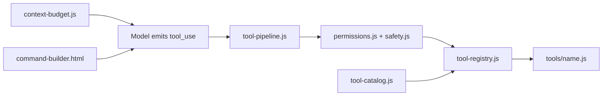

# Runner Capability Expansion Roadmap

Exploration map for growing the **cc bridge runner** toward more of the Claude Code harness — without abandoning the
playground's minimal-core, OAuth-only, local-first direction.

**Scope of this document:** categorization and phased recommendations only. No implementation commitments. Network tools
(WebFetch, WebSearch, MCP) are explicitly deferred until egress guardrails are designed.

**Current-state refresh:** verified against the local tree on 2026-08-30. Runtime truth comes from
`src/runner/tool-catalog.js`, `bin/local-bridge-runner.js`, and their tests; older “missing” labels below have been
converted to shipped or retired status where those sources now disagree with the original roadmap.

**Related docs:**

- [Runner quick start](./runner-quickstart.html) — how to run the runner today
- [Command builder](./command-builder.html) — form UI that assembles CLI flags
- [Threat model](./threat-model.md) — safety invariants new tools must respect
- [Roadmap extensions (critical assessment)](./runner-expansion-roadmap-extensions.html) — companion critique and five future directions
- [Bridge runner Actions POC](./bridge-runner-actions-poc.md) — read-only GitHub Actions invocation on self-hosted runner
- [Agent assignment blocks](./runner-expansion-agent-assignments.md) — copy-paste prompts for cloud/local coding agents (§13 sequencing)

**Official Claude Code references (primary sources):**

- [Tools reference](https://code.claude.com/docs/en/tools) — canonical tool names and behavior
- [Settings](https://code.claude.com/docs/en/settings) — permissions, hooks, skills, MCP, sandbox
- [Power user tips](https://support.claude.com/en/articles/14554000-claude-code-power-user-tips) — workflow patterns from the Claude Code team (verification, parallel work, hooks, memory)

---

## 1. Where we are today (honest baseline)

### Command builder coverage

The [command builder](./command-builder.html) is already a **near-complete mirror** of the runner CLI. It surfaces
the 78 flags that `bin/local-bridge-runner.js` accepts:

- Permission styles (look-only, plan-first, edit-ask, edit-auto, edit-shell)
- Explicit `--capabilities` groups, exact `--tools` allowlists, model controls, and budget limits
- Session store, resume/fork, ledger utilities (`--replay`, `--repair`)
- Context opt-ins (`--bare`, instruction docs, repo map, skills)
- Output formats, tracing, human log, bridge URL, caller token

**Implication:** "Expand via the command builder" means **add a runner capability first**, then wire a small control
into the builder. The HTML is not the bottleneck today.

### Model-callable tools (20 today)

| Capability group | Tools                                                                 | Default visible | Gating                                                                |
| ---------------- | --------------------------------------------------------------------- | --------------- | --------------------------------------------------------------------- |
| `core`           | `list_files`, `read_file`, `search_text`, `glob`, `git_status`        | yes             | workspace trust                                                       |
| `core`           | `manage_tasks`, `ask_user_question`                                   | yes             | question tool additionally requires an interactive human              |
| `edits`          | `edit_file`, `write_file`                                              | no              | `--capabilities edits`; confirmation unless `--accept-edits`           |
| advanced patch   | `apply_patch`                                                         | **hidden**      | exact opt-in via `--tools apply_patch`                                 |
| `recovery`       | `undo`, `undo_edit`                                                   | no              | `--capabilities recovery`; auto-approved within their recovery scope   |
| `agents`         | `spawn_agent`                                                        | no              | `--capabilities agents`; generic read-only child, depth/budget bounded |
| `worktrees`      | `enter_worktree`, `list_worktrees`, `exit_worktree`                  | no              | `--capabilities worktrees` or startup `--worktree`                     |
| `skills`         | `run_skill`                                                          | no              | `--capabilities skills`                                                |
| `lsp`            | `lsp_query`                                                          | no              | `--capabilities lsp` or `--enable-lsp`; server required on `PATH`      |
| shell            | `bash`, `manage_shell_jobs`                                           | **hidden**      | `--allow-shell` only                                                   |

Source: `src/runner/tool-catalog.js`, `docs/threat-model.md`.

### Harness infrastructure (already exists, not always exposed as tools)

Much of what feels like "missing harness" is already runner plumbing:

| Capability                       | How it exists today                                                                 |
| -------------------------------- | ----------------------------------------------------------------------------------- |
| Plan mode                        | `--plan` / `--permission-mode plan`                                                 |
| Permission modes                 | `--accept-edits`, `--dont-ask`, `--permission-mode`, `--chaos-ok` combo guard       |
| Capability groups                | `--capabilities` enables explicit optional groups; `--tools` is an exact allowlist  |
| Agent/profile runtime concepts   | **Retired**; legacy `--agent` / `--profile` flags are rejected                     |
| Coordinator / workers            | `bin/local-bridge-coordinator.js`, `src/runner/coordinator.js`, `worker-runtime.js` |
| Hooks                            | `.bridge-runner/hooks.json` when `--trusted-workspace` + workspace trust            |
| Skills                           | `--include-skills` lists metadata; `run_skill` loads a selected skill body           |
| Auto-memory                      | `--auto-memory`                                                                     |
| Repo map / instruction hierarchy | `--include-repo-map`, `--include-instruction-docs`, etc.                            |
| Session ledger + replay/repair   | `--replay`, `--repair`, `session-ledger.js`                                         |
| Archives + transcripts           | `--transcript`, `--human-log`, `--no-archive`                                       |
| Cost / wall-clock budgets        | `--max-cost-usd`, `--max-wall-clock-ms`                                             |
| Flight recorder                  | `--trace-level`, `--trace-path`                                                     |

The runner is **smaller in tool count** but **not empty** in harness depth.

### Operability gap (honest note)

This roadmap is **feature-shaped more than failure-shaped**. We have a strong threat model (`docs/threat-model.md`) but
originally lacked an **operability model**: how to detect subtle runner regressions, observe cost and spawn budgets live,
and recover from a bad `--accept-edits` run without grep-ing transcripts. Those foundations are now present: last-run
recovery, a prompt registry, golden transcript evaluation, structured budget telemetry/caps, and explicit capability
groups. Remaining work should deepen those primitives rather than revive retired profile layers.

---

## 2. How any new tool plugs in

Every new model-callable tool should touch the same five integration points:

1. **Implement** — `src/runner/tools/<name>.js`
2. **Register** — `TOOL_MODULES`, category, write/hidden sets in `src/runner/tool-catalog.js`
3. **Permission category** — read-only / write / shell / recovery in `src/runner/permissions.js`
4. **Capability-group summary** — progressive disclosure line in `src/runner/context-budget.js`
5. **Tests + builder** — `test/runner/<name>.test.js`, then a checkbox in `#toolChoices` and a branch in
   `buildCommandParts()` in `docs/command-builder.html`


```mermaid
flowchart LR
  model["Model emits tool_use"] --> pipeline["tool-pipeline.js"]
  pipeline --> perms["permissions.js + safety.js"]
  perms --> registry["tool-registry.js"]
  registry --> toolfile["tools/name.js"]
  catalog["tool-catalog.js"] --> registry
  budget["context-budget.js"] --> model
  builder["command-builder.html"] --> model
```

**Default posture for new tools:** read-only and visible by default; write/shell/network tools hidden and opt-in,
consistent with `docs/threat-model.md`.

---

## 3. Gap vs Claude Code harness

Claude Code documents ~40 built-in tools ([tools reference](https://code.claude.com/docs/en/tools)). Many are
**hosted-product or claude.ai-only** and irrelevant to a local OAuth lab. The table below maps **local-relevant**
gaps only.

| Claude Code tool                                                                  | Runner today                | Gap                                                         |
| --------------------------------------------------------------------------------- | --------------------------- | ----------------------------------------------------------- |
| `Read`                                                                            | `read_file`                 | **Shipped** — text paging plus image/PDF multimodal blocks  |
| `Glob`                                                                            | `glob`                      | **Shipped**                                                 |
| `Grep`                                                                            | `search_text`               | Rough parity (ripgrep-backed)                               |
| `Edit` / `Write`                                                                  | `edit_file` / `write_file`  | Parity; read-before-edit semantics differ                   |
| `Bash`                                                                            | `bash` + `manage_shell_jobs` | **Shipped** foreground and background start/list/poll/kill |
| `Agent`                                                                           | `spawn_agent`               | **Shipped** generic read-only, depth/budget bounded         |
| `TaskCreate` / `TaskList` / `TodoWrite`                                           | `manage_tasks`              | **Shipped** minimal in-session checklist                    |
| `AskUserQuestion`                                                                 | `ask_user_question`         | **Shipped** structured multi-choice; interactive/fail-closed |
| `EnterWorktree` / `ExitWorktree`                                                  | worktree tool group         | **Shipped** enter/list/exit and startup `--worktree`        |
| `Monitor`                                                                         | `manage_shell_jobs`         | **Shipped** background job polling                          |
| `Skill`                                                                           | `run_skill`                 | **Shipped** read-only skill-body loading                    |
| `LSP`                                                                             | `lsp_query`                 | **Shipped** opt-in; local language server required          |
| `NotebookEdit`                                                                    | —                           | N/A for this lab                                            |
| `WebFetch` / `WebSearch`                                                          | —                           | **Deferred** (network)                                      |
| MCP tools                                                                         | —                           | **Deferred** (network + trust)                              |
| `Artifact`, `Cron*`, `RemoteTrigger`, `PushNotification`, `Workflow`, agent teams | —                           | **Out of scope** (hosted)                                   |

---

## 4. Phase 1 — Prudent now (local, low-risk, small)

These are the best first builds: they improve the agent loop without new egress, and each is a clean vertical slice
through catalog → permissions → tests → command builder.

### 4.1 `glob` — find files by name pattern (shipped)

**Status:** Implemented in `src/runner/tools/glob.js` (read-only, default visible).

**Why:** Complements `search_text` (content) and `list_files` (single directory). Models often need `**/*.test.js` style
discovery.

**Attainability:** Low effort. Read-only category. Mirror Claude Code Glob semantics where practical: `**` recursion,
modtime sort, cap at ~100 paths, respect `.gitignore` optionally.

**Risk:** Low — same path confinement and deny matrix as other read tools.

### 4.2 In-session task checklist (TodoWrite / Task\* analog) — shipped

**Status:** Implemented as `manage_tasks` in `src/runner/tools/manage-tasks.js` (read-only category, default visible).
Persisted in session `runner.tasks`; summarized in context budget.

**Why:** Long multi-step runs benefit from structured progress the model can update. Claude Code moved from `TodoWrite`
to `TaskCreate`/`TaskList`/`TaskUpdate`; a minimal checklist tool is enough for v1.

**Attainability:** Low–medium. No filesystem side effects. Persist in session state; mirror to transcript/human-log.

**Risk:** Low — no new permission surface beyond allowing the tool.

### 4.3 `ask_user_question` — structured clarification (shipped)

**Status:** Implemented in `src/runner/tools/ask-user-question.js` as a default-core read-only tool. It requires an
interactive human and fails closed in workers, `--dont-ask`, plan mode, and non-interactive environments.

**Why:** Reduces wrong assumptions before writes. Claude Code's `AskUserQuestion` is permission-free but interactive.

**Attainability:** Medium. Reuse the confirm-port pattern from `confirmation.js`. In non-interactive, `--dont-ask`, or
coordinator-worker contexts: return a safe no-op or auto-deny message (workers already use deny-all confirm port).

**Risk:** Low if TTY-gated; medium if mis-wired in CI (must fail closed).

### 4.4 `read_file` paging and multimodal reads — shipped

**Status:** `offset` / `limit` line paging, numbered partial views, and explicit “read more” offsets are implemented in
`src/runner/tools/read-file.js`. Images and PDFs are returned as model content blocks through `src/runner/media-read.js`.

**Why:** Large files need PARTIAL-view ergonomics like Claude Code Read (offset/limit, clear "read more" hints).

**Attainability:** Small. Extends existing tool; read-only.

**Risk:** Low.

### 4.5 `cc undo last-run` — recovery workflow — shipped

**Status:** Implemented. Per-run manifests at `.bridge-runner/runs/<run-id>/manifest.json` (written from the undo log at
every run-exit) plus the operator CLI `bin/local-bridge-undo.js` (`list-runs`, `show`, `last-run`, `run <id|session>`).
Reverts restore each file's pre-run backup; a file changed after the run is `diverged` and skipped unless `--force`;
non-interactive runs fail closed without `--yes`. The directory is keyed by run id (always unique); the session id is
stored inside so `undo run <session-id>` resolves to the most recent run of that session.

**Category:** Safety · **Effort:** Small · **Source:** [extensions §2](./runner-expansion-roadmap-extensions.html#dir-2)

**Why:** Backups and per-file `undo` / `undo_edit` already exist (`.bridge-runner/backups/` via
`src/runner/tools/file-write-utils.js`). The gap is **workflow**: after a botched `--accept-edits` run touching many
files, users must manually find backups. The runner already records edits for backup purposes — expose that as a unit.

**Minimum-viable shape:**

- Per-run manifest: `.bridge-runner/runs/<session-id>/manifest.json` listing edits and backup paths
- `cc undo last-run` — revert the most recent run's manifest (reverse edit order, diff preview, confirmation)
- `cc undo run <session-id>` and `cc undo list-runs` for older sessions
- Command-builder **recovery** tab pointing at these commands (discoverability)

**Decisions to make:** partial reverts when a later run touched the same file; inverse-diff vs full backup storage;
garbage-collection for old manifests.

**Risk:** Low — composes existing primitives; no new model-callable tools required.

### 4.6 Prompt-template registry — `.bridge-runner/prompts/` — shipped

**Status:** Implemented in `src/runner/prompts/registry.js` with built-ins under `src/runner/prompts/*.md`. Frontmatter
(`title`, `summary`, `parameters`, `recommended-tools`, `recommended-permissions`, `tags`); override order
project > global > built-in; `cc prompts list|show|validate` via `bin/local-bridge-prompts.js`; `--prompt-arg key=value`
substitution with refusal-by-default of injection-looking values. Command-builder reads a shipped registry snapshot to
suggest permissions/tools for the chosen template.

**Category:** DX · **Effort:** Small–medium · **Source:** [extensions §5](./runner-expansion-roadmap-extensions.html#dir-5)

**Why:** Patterns like `grill`, `simplify`, and `verify` are scattered as "write a markdown file" folklore (§10). At
medium scale we need listing, parameter validation, and provenance — the same treatment tools and agents already get.

**Minimum-viable shape:**

- `.bridge-runner/prompts/<name>.md` with YAML frontmatter: `title`, `summary`, `parameters`, `recommended-tools`,
  `recommended-permissions`, `tags`
- CLI: `cc prompts list`, `cc prompts show <name>`, `cc prompts validate`
- Extend `--prompt-template` with `--prompt-arg key=value` for runtime substitution
- Built-ins in `src/runner/prompts/`; user templates override by name
- Command-builder reads registry (or shipped JSON) and auto-suggests permissions/tools for the chosen template

**Decisions to make:** prompt-injection from user-supplied parameter values; flat vs composable templates; trust story
for imported templates.

**Risk:** Low — files + CLI; `--prompt-template` already exists.

### Recommended Phase 1 order

1. **`glob`** — shipped
2. **Task checklist** — shipped (`manage_tasks`)
3. **Verification presets** — shipped (`--test-watch`, `verify`/`grill`/`simplify` templates, command-builder preset)
4. **`cc undo last-run` recovery workflow** — shipped
5. **Prompt-template registry** — shipped
6. **`read_file` paging + image/PDF reads** — shipped
7. **`ask_user_question`** — shipped with interactive/non-interactive gate tests

---

## 5. Phase 2 — Attainable, bigger (pick one flagship)

These are worth doing but need explicit scoping and safety design.

### 5.0 File-based agent/profile loader — retired (do not restore)

The earlier `--agent <name|path>` loader and capability-profile design were removed in July 2026. The runtime now uses
explicit flags, capability groups, and exact tool allowlists so authority is visible at the command line. Tests in
`test/runner/profiles-retired.test.js` require `--agent`, `--profile`, `--list-agents`, and `--list-profiles` to remain
unknown options. Historical material lives under `docs/archive/runner-profiles/`; it is reference evidence, not backlog.

### 5.1 Model-callable subagents (`spawn_agent` tool) — shipped (slice 2)

**Status:** Implemented in `src/runner/tools/spawn-agent.js`. Top-level model can call `spawn_agent` to delegate via
`WorkerRuntime`. Hidden when `spawnDepth > 0`. Permission category `orchestration` (ask by default). Capped at
8 spawns per run (`MAX_SPAWNS_PER_RUN`).

### 5.2 Future orchestration polish

Generic child delegation, concurrent child budget leasing, and coordinator fan-out are shipped. Remaining candidates
are richer child-result schemas and explicit worktree-isolated children; these should stay bounded by the existing
depth, spawn, wall-clock, and token ceilings.

### 5.3 Git worktree isolation (`enter_worktree` / `exit_worktree`) — shipped (slice 3)

**Status:** Implemented in `src/runner/tools/enter-worktree.js` and `exit-worktree.js`. Creates an isolated
git worktree on a fresh `bridge-runner/` branch under `~/.bridge-runner/worktrees/`. Switches ctx.cwd so
all tools operate inside the worktree until exit. Permission category `worktree` (ask by default).
`cleanup=false` by default to preserve work.

**Also shipped:** `list_worktrees`, multiple named slots in one run, and startup `--worktree` isolation. Automatic
cleanup is deliberately not the default because preserving a worktree makes recovery and inspection possible.

**Why:** Real safety win — risky edits in an isolated worktree/branch without touching main checkout.

**Effort:** Medium. Requires git presence, cleanup on session end, clear UX when worktree already active.

### 5.4 Background bash + output polling — shipped

**Status:** `manage_shell_jobs` starts, lists, polls, and kills long-running commands through `background-shell.js`. It
is exposed only with `--allow-shell` and uses the same shell policy and authority warning as foreground `bash`.

**Why:** Dev servers, watch builds, long tests. Claude Code uses `run_in_background` + task list.

**Build on:** `persistent-shell.js`, `subprocess-pool.js`.

**Gating:** Still `--allow-shell`. Add kill/list tools or extend `bash` schema.

**Effort:** Medium.

### 5.5 `run_skill` execution tool — shipped

**Status:** `src/runner/tools/run-skill.js` resolves named skill documents from `.bridge-runner/skills/` or
`.cursor/skills/`, confines resolution to the workspace, and returns the selected Markdown body read-only. Enable it
with `--capabilities skills`; `--include-skills` remains the separate discovery/context opt-in.

**Why:** Runner already lists skills (`--include-skills`); execution closes the loop.

**Effort:** Medium — resolve skill paths, respect workspace trust, cap output size.

### 5.6 `LSP` code intelligence — shipped

**Status:** `lsp_query` supports definition, references, hover, and diagnostics through a local Language Server Protocol
(LSP) process. It remains opt-in through `--capabilities lsp` or `--enable-lsp` and reports a clear failure when the
required language-server executable is not installed on `PATH`.

**Why:** Jump-to-def, references, diagnostics after edits.

**Effort:** High; needs language-server lifecycle management. Defer unless a concrete language need appears.

### 5.7 Richer `Read` (images, PDF) — shipped

**Status:** `read_file` detects PNG, JPEG, GIF, WebP, and PDF files and returns Anthropic-compatible image/document
content blocks. Media size limits and deny-matrix confinement are implemented in `src/runner/media-read.js`.

**Why:** Multimodal debugging, screenshot review.

**Effort:** Medium–high — depends on whether bridge `/v1/messages` accepts image/PDF content blocks with OAuth route.
Investigate before building.

### 5.8 Golden-transcript replay harness — shipped

**Status:** `src/runner/golden-eval.js` replays canned model scripts without live OAuth/model calls, normalizes portable
fields, and diffs runner-side behavior. Run it with `npm run runner:eval` or
`node bin/local-bridge-runner.js runner eval`; shipped cases live in `test/runner/golden/`.

**Category:** Evals · **Effort:** Medium · **Source:** [extensions §1](./runner-expansion-roadmap-extensions.html#dir-1)

**Why:** Refactors to `tool-catalog.js`, `permissions.js`, or `worker-runtime.js` can change tool-call shape, permission
order, or trace bytes with no automated signal — only an angry user later. Treat the runner like a compiler: replay
known-good sessions and assert equivalent runner-side behavior.

**Minimum-viable shape:**

- `test/runner/golden/` — canned transcripts: pinned model output stream + expected runner side (tools dispatched,
  permissions, files touched, trace bytes)
- `cc runner eval` — replay through a fake model client, diff actual vs expected
- CI gate: PRs touching `src/runner/` must not regress goldens without explicit approval

**Sequencing note:** this landed before the current budget telemetry. Capability profiles were later retired rather than
built; the golden harness remains the safety net for future permission/runtime refactors.

**Decisions to make:** what counts as "behavior" (exit code vs full sequence vs trace bytes); path/timestamp portability;
secret redaction in goldens.

### 5.9 Budget telemetry and token caps

**Category:** Operations · **Effort:** Medium · **Source:** [extensions §3](./runner-expansion-roadmap-extensions.html#dir-3)

**Status:** Shipped. `--max-wall-clock-ms` and `--max-cost-usd` enforce loop-boundary stops;
`--budget-input-tokens` / `--budget-output-tokens` emit structured soft warnings and clean hard stops; budget events
include token, wall-time, spawn, and depth data; child/coordinator leases inherit remaining ceilings; and the command
builder exposes the token controls. Future work may add explicit per-child carve-outs, but the original foundation is
complete.

**Decisions to make:** authoritative token count (API vs local estimate); how to surface soft-cap warnings to the model;
whether hard-cap termination unwinds in-flight edits.

---

## 6. Phase 3 — Fine-grained control (later)

These need the eval harness (§5.8) in place first.

### 6.1 Explicit capability groups and tool allowlists — shipped; profiles retired

The simpler replacement is live: `--capabilities` opts into named groups (`edits`, `recovery`, `agents`, `worktrees`,
`skills`, `lsp`), while `--tools` provides an exact allowlist and `--allow-shell` remains a separate authority gate.
Hidden `apply_patch` still requires exact tool opt-in. Hard denies and the `--chaos-ok` interlock stay above these
choices. Do not add `.bridge-runner/profiles/` or restore `--profile`; future fine-grained constraints should extend the
explicit permission/tool surfaces only when a concrete use case justifies them.

---

## 7. Deferred — network surface (explicitly out of scope for now)

Per playground direction and `docs/threat-model.md` § Known limitations, outbound network is **not hard-restricted**
today (`--no-network` is a best-effort proxy guard for shell only).

| Capability  | Notes                                                                 | Revisit when                                                                   |
| ----------- | --------------------------------------------------------------------- | ------------------------------------------------------------------------------ |
| `WebFetch`  | Local HTTP fetch + extract; domain prompts in Claude Code             | Egress allowlists, opt-in flag (e.g. `--allow-web-fetch`), threat-model update |
| `WebSearch` | Anthropic server-side search tool; may not work on OAuth bridge route | Bridge capability audit + billing/policy clarity                               |
| MCP client  | `.mcp.json`, plugin ecosystem                                         | Trust model, `allowedMcpServers` analog, sandbox                               |

**Do not add these silently.** Each needs an explicit opt-in flag, documentation in `threat-model.md`, and command-builder
controls marked as advanced/risky.

---

## 8. Superfluous / out of scope for this lab

These Claude Code tools or settings areas conflict with minimal, single-user, OAuth-only runner goals:

| Item                                        | Reason                                                    |
| ------------------------------------------- | --------------------------------------------------------- |
| `NotebookEdit`                              | No Jupyter workflow in this runner                        |
| `PowerShell`                                | macOS-focused lab; bash covers shell                      |
| `Artifact`                                  | claude.ai hosted pages                                    |
| `CronCreate` / `CronDelete` / `CronList`    | Session scheduling on claude.ai                           |
| `RemoteTrigger` / Routines                  | claude.ai cloud                                           |
| `PushNotification`                          | Remote Control / phone push                               |
| `Workflow` / ultracode workflows            | Hosted orchestration                                      |
| Agent teams / `SendMessage`                 | Multi-agent product surface                               |
| `ShareOnboardingGuide`                      | claude.ai share links                                     |
| `ToolSearch` / deferred tool loading        | Large flat tool menus — we use capability groups instead  |
| Plugins / marketplaces / managed settings   | Enterprise distribution; use `.bridge-runner/` primitives |
| OpenAI-compatible routes / API-key fallback | Transport invariants — never restore                      |

### Explicit non-goals (decisions to say no)

From the [extensions companion](./runner-expansion-roadmap-extensions.html#nongoals) — a roadmap that says no is more
useful than one that says maybe:

| Decision | Rationale |
| -------- | --------- |
| Remove `spawn_depth = 1` cap | Threat model relies on a finite tree; solve queueing and budgets (§5.9) first |
| Remote web UI that runs the runner | Diverges from local-bridge identity; command-builder is the right UI level |
| Plugin marketplace for tools | Tools are the most security-sensitive surface; stay curated |
| Auto-apply model-suggested permission escalations | If the model asks for shell mid-run, user re-runs with broader flags; runner does not negotiate |

---

## 9. Invariants any future build must preserve

From `CLAUDE.md`, `AGENTS.md`, and `docs/threat-model.md`:

| Invariant         | Rule                                                                                       |
| ----------------- | ------------------------------------------------------------------------------------------ |
| Transport         | Native `POST /v1/messages` only; OAuth Bearer upstream; no Console API-key fallback        |
| Shell             | Hidden unless `--allow-shell`; `--dont-ask` must not enable shell                          |
| Hard deny         | `.env`, `.ssh`, `.aws`, `.claude`, keys, credentials JSON, path escapes — never bypassable |
| Writes            | Confirmation unless `--accept-edits`                                                       |
| Secrets           | Scrub in tool results, transcripts, stream-json, human logs, traces                        |
| Workspace trust   | No tools until `--trust-workspace` (or interactive consent)                                |
| Default context   | Minimal (`--bare` posture); explicit opt-ins for skills, repo map, instruction docs        |
| Capability groups | Progressive disclosure in system prompt, not an ever-growing flat tool menu                |

---

## 10. Command builder — what to add when tools land

Today the builder's **Capability groups** panel (`#toolChoices`) lists all 20 catalogued tools. When another tool ships:

1. Add a checkbox under the appropriate group (Read / Write / Recovery / Shell / new group if needed).
2. Extend `DEFAULT_TOOL_NAMES` and `getSelectedTools()` logic.
3. Emit `--tools` only when selection differs from default (existing pattern).
4. Add one line of `<small>` help per tool (existing pattern at lines ~965–1006).

No large UI rewrite required until network or subagent tools need **risk panels** (similar to chaos-ok / shell warnings).

Recovery commands, token/wall budget controls, prompt-registry recommendations, optional capability groups, and all
current tool checkboxes are shipped. There is intentionally no profile dropdown (§6.1). Keep the rule that builder UI
lands with—not ahead of—the underlying runner capability.

---

## 11. Claude Code power user patterns — adoption map

Anthropic's [Claude Code power user tips](https://support.claude.com/en/articles/14554000-claude-code-power-user-tips)
collects workflow patterns from the Claude Code team. The article's headline advice: **verification is the single most
impactful practice** — give the agent a way to check its own output and close the feedback loop.

This section maps each major pattern from that guide to the bridge runner: what we already support, what is prudent to
build, and what belongs to the hosted Claude Code product (not this OAuth lab).

**Verdict key:**

| Verdict          | Meaning                                                              |
| ---------------- | -------------------------------------------------------------------- |
| **Have**         | Runner supports this today (flag, profile, or primitive)             |
| **Docs/presets** | No new runner code; document or add command-builder presets          |
| **Phase 1**      | Small local build aligned with §4                                    |
| **Phase 2**      | Bigger build aligned with §5                                         |
| **Phase 3**      | Fine-grained control aligned with §6                                 |
| **Defer**        | Network, sandbox, or policy work not ready                           |
| **Out of scope** | Hosted product, TUI polish, or conflicts with minimal-core direction |

### Summary table (by article section)

| Article section             | Representative patterns                          | Verdict                           | Runner path                                                        |
| --------------------------- | ------------------------------------------------ | --------------------------------- | ------------------------------------------------------------------ |
| **Verification** (#1 tip)   | Tests after edits, `/simplify`, browser check    | **Have** / follow-up              | Test watcher, templates, golden eval, trusted exec hooks            |
| Working in parallel         | `--worktree`, subagent isolation, `/batch`       | **Have** / follow-up / Out        | Worktree slots + generic child tool; `/batch` is hosted-scale       |
| Planning                    | Plan mode, effort, model choice                  | **Have**                          | `--plan`, `--effort`, `--model`, plan-first builder preset         |
| Prompting                   | “Grill me”, “prove it works”, detailed specs     | **Have** / presets                | `.bridge-runner/prompts/` registry, built-in templates              |
| Learning                    | Explanatory/Learning output styles               | **Docs/presets**                  | `--append-system-prompt`, custom templates                         |
| CLAUDE.md & memory          | Team `CLAUDE.md`, auto-memory, notes dirs        | **Have** / Docs                   | `--include-instruction-docs`, `--auto-memory`                      |
| Commands, skills, subagents | Skills and bounded child delegation              | **Have** / follow-up              | `run_skill`, `spawn_agent`, coordinator; richer isolation remains  |
| Hooks                       | PostToolUse format, Stop checks, PostCompact     | **Have** / follow-up              | Trusted exec/log hooks shipped; distinct stop/post-compact remain   |
| Permissions & safety        | `Bash(npm run *)` allowlists, auto mode, sandbox | **Partial** → **Phase 2** / Defer | Category permissions; no OS sandbox                                |
| Scheduled tasks             | `/loop`, `/schedule`                             | **Out of scope**                  | Cloud/local scheduling is Claude Code product                      |
| Mobile & remote             | Teleport, remote control, iMessage               | **Out of scope**                  | claude.ai / mobile app                                             |
| MCP & plugins               | Slack, BigQuery, plugin marketplace              | **Defer**                         | §6 network + trust                                                 |
| Customizing UI              | `/statusline`, `/voice`, `/color`                | **Out of scope**                  | Terminal TUI product surface                                       |
| SDK & multi-repo            | `--bare`, `--add-dir`, session fork              | **Have** / **Phase 2**            | `--bare`, `--fork-from`; no `--add-dir` yet                        |

### Verification — adopt first (article's #1 tip)

The team stresses **domain-specific verification**: tests, linters, diff checks, browser iteration for frontend. For this
runner, that translates to concrete adoption paths:

| Pattern from article                    | Runner today                                                                                    | Recommended adoption                                                                                                                                                                     |
| --------------------------------------- | ----------------------------------------------------------------------------------------------- | ---------------------------------------------------------------------------------------------------------------------------------------------------------------------------------------- |
| Run test suite after changes            | `--test-watch` (or `BRIDGE_RUNNER_TEST_WATCH=1`) + `--allow-shell` runs tests post-write (`test-watcher.js`); command-builder “Verify after edits” preset | **Shipped**, including trusted executable PostToolUse hooks |
| “Prove to me this works” (diff vs main) | `git_status` + `bash` when shell enabled                                                        | **Shipped preset/template path:** use `verify`/`grill`; no profile layer                                                                                                                  |
| `/simplify` (parallel review agents)    | Coordinator verify phase + `simplify` prompt template                                           | **Shipped foundation:** generic `spawn_agent`; richer child-result/isolation polish remains                                                                                              |
| Chrome extension / Desktop browser      | None                                                                                            | **Out of scope** for CLI runner; revisit only if a local browser MCP lane is explicitly scoped                                                                                           |
| Stop-hook deterministic checks          | Trusted `post_tool` exec hooks exist                                                           | **Shipped for after-write checks;** a distinct turn-complete/stop event remains optional follow-up                                                                                       |

**Principle to encode in presets:** every “implement” or “edit-auto” command-builder preset should nudge toward a
verification step (tests, lint, or explicit “show diff”) — matching the article even when we cannot ship a browser.

### Working in parallel

| Pattern                                                  | Adoption                                                                                                       |
| -------------------------------------------------------- | -------------------------------------------------------------------------------------------------------------- |
| Multiple sessions in git worktrees (`claude --worktree`) | **Shipped** — enter/list/exit tools, multiple slots, and startup `--worktree`; explicit child-to-slot assignment remains follow-up. |
| Subagents with `isolation: worktree`                     | **Phase 2** — combines Agent tool + worktree isolation.                                                        |
| `/batch` (fan-out dozens of worktree agents)             | **Out of scope** — hosted orchestration at scale; coordinator is the lab's lighter analog.                     |
| Name/color-code sessions                                 | **Docs/presets** — use `--session-id`, `--human-log`, `--transcript`; terminal tab color is user-side.         |

### Planning and model control

| Pattern                                  | Runner today                                                                                      |
| ---------------------------------------- | ------------------------------------------------------------------------------------------------- |
| Start complex work in plan mode          | **Have** — `--plan` and the “plan-first” command-builder preset                                  |
| Re-plan when things go sideways          | **Docs** — workflow guidance; runner supports mid-session `--plan` on next run via session resume |
| Effort levels (`/effort` high/xhigh/max) | **Have** — `--effort`                                                                             |
| Opus + extended thinking                 | **Have** — `--model`; thinking depends on bridge/model policy                                     |
| Auto-name session after plan             | **Partial** — archive/transcript metadata; no auto-title UX (acceptable for CLI lab)              |

### Prompting and learning (mostly zero-code)

These patterns need **prompt templates and command-builder presets**, not new tools:

- **“Grill me on these changes…”** → add `.bridge-runner/prompts/grill.md` or extend built-in `review` template.
- **“Knowing everything you know now, scrap and implement elegantly”** → cleanup/refactor template.
- **Detailed specs before handoff** → document in quickstart; user writes spec in command-builder prompt field.
- **Explanatory / Learning output styles** → `--append-system-prompt "Explain the why behind each change"` or a dedicated template.

`/btw` (side questions without interrupting work) is a **hosted TUI feature** — out of scope unless we build an interactive runner REPL.

### CLAUDE.md, memory, compounding engineering

| Pattern                                             | Runner today                                                                                  | Adoption |
| --------------------------------------------------- | --------------------------------------------------------------------------------------------- | -------- |
| Team `CLAUDE.md` checked into git                   | **Have** — `--include-instruction-docs`, `--include-claude-md`                                |
| “Update CLAUDE.md so you don’t repeat that mistake” | **Docs** — user prompt pattern; runner can write via `edit_file` when edits allowed           |
| `@claude` in GitHub PR comments (hosted bot)     | **Out of scope** — Anthropic's hosted GitHub Action / claude.ai integration; see §12 for the **local** read-only POC |
| Auto-memory (`/memory`)                             | **Have** — `--auto-memory`                                                                    |
| Per-task notes directory                            | **Docs** — point `CLAUDE.md` at `.bridge-runner/notes/`; optional auto-memory extension later |

### Commands, skills, and subagents

| Pattern                                         | Runner today                                                        | Adoption                                                                                           |
| ----------------------------------------------- | ------------------------------------------------------------------- | -------------------------------------------------------------------------------------------------- |
| Repeated workflows → skills (`.claude/skills/`) | **Shipped:** list with `--include-skills`; load with `run_skill`                                  | Lab resolves `.bridge-runner/skills/` and `.cursor/skills/`; no marketplace |
| Custom subagents (`.claude/agents/`)            | **Retired file/profile loader; generic `spawn_agent` shipped**                                   | Keep delegation generic and authority explicit; do not restore `--agent` |
| Read-only child agent                           | **Have** — generic `spawn_agent` child plus exact parent capability/tool controls                 |                                                                                                    |
| Code-review child/team on pull-request open     | **Partial** — generic child delegation + coordinator                | **Follow-up:** document a coordinator recipe; no GitHub webhook in lab                              |
| Inline bash in slash commands                   | N/A (no slash UI)                                                   | **Out of scope** — use hooks or prompt templates with `--include-file` instead                     |

### Hooks — trusted command execution shipped

Claude Code hooks run **shell commands** at lifecycle points (e.g. PostToolUse auto-format). The runner now supports
both log and exec actions. Exec hooks require workspace trust, the `--trusted-workspace` opt-in, and strict
`"trusted": true` in `.bridge-runner/hooks.json`; commands also pass through the shared shell-policy scan.

| Hook event (article)                          | Runner event                         | Adoption                                                 |
| --------------------------------------------- | ------------------------------------ | -------------------------------------------------------- |
| SessionStart — load dynamic context           | `session_start`                      | **Shipped** trusted exec/log actions                     |
| PreToolUse — audit bash                       | `pre_tool`                           | **Shipped** trusted exec/log actions                     |
| PostToolUse — auto-format after Write/Edit    | `post_tool`                          | **Shipped** trusted exec/log actions                     |
| Stop — deterministic long-task checks         | `session_end` (closest)              | **Phase 2** — add `stop` / turn-complete event if needed |
| PostCompact — re-inject critical instructions | Compaction in `context-compactor.js` | **Phase 2** — hook after compaction ladder               |
| PermissionRequest → Slack/Opus                | None                                 | **Defer** — enterprise routing                           |

**Safety requirement for executable hooks:** same bar as shell — trusted workspace, allowlisted commands, no bypass of
hard-deny matrix, documented in `threat-model.md`.

### Permissions and safety

| Pattern                                         | Runner today                                                  | Adoption                                                                  |
| ----------------------------------------------- | ------------------------------------------------------------- | ------------------------------------------------------------------------- |
| Pre-approve `Bash(npm run *)`, `Edit(/docs/**)` | Explicit groups/allowlist, but no argument-pattern grants     | **Possible future:** extend explicit policy surfaces; profiles stay retired |
| Auto mode (classifier auto-approves safe ops)   | `--permission-mode auto` maps to `dontAsk` without classifier | **Defer** — real auto mode needs static analysis; don't fake it           |
| Sandboxing (`/sandbox`)                         | Shell-policy scanner + deny matrix; no OS sandbox             | **Defer** — large lift; document `--no-network` as weak guard             |
| Long-running uninterrupted work                 | `--max-wall-clock-ms`, `--dont-ask`, coordinator              | **Have** with caveats; **Phase 2** Stop hooks                             |
| `--dangerously-skip-permissions`                | No equivalent; `--chaos-ok` guards risky combo                | **Intentionally absent** — lab keeps explicit chaos gate                  |

### Out of scope (hosted / product UI)

Do not plan runner work for: `/loop`, `/schedule`, teleport, remote control, mobile/iMessage, plugin marketplace,
`/statusline`, `/color`, `/voice`, `/keybindings`, `/btw`, hosted GitHub `@claude` Action (PR-comment bot), `/batch`
at hundreds of agents, Artifact, or claude.ai web sessions.

**Distinct from out of scope:** §12 documents an accepted **local** read-only Actions POC (`workflow_dispatch` on
self-hosted runner) — not the hosted `@claude` bot.

### SDK and multi-repo patterns

| Pattern                                   | Runner today                                          | Adoption                                                          |
| ----------------------------------------- | ----------------------------------------------------- | ----------------------------------------------------------------- |
| `--bare` for fast non-interactive startup | **Have** — `--bare`, command-builder “minimal” preset |                                                                   |
| `--add-dir` / `additionalDirectories`     | Single `--cwd` only                                   | **Phase 2** — optional secondary read roots with same deny matrix |
| Session fork (`--fork-session`)           | **Have** — `--fork-from`, `--resume-session`          |                                                                   |
| Cloud setup scripts                       | N/A                                                   | **Out of scope**                                                  |

### How this changes phase priority

The power user guide reinforces three priorities already in this roadmap and elevates one:

1. **Verification loop** (article #1) — **shipped** for v1: `--test-watch` flag, test-watcher appendix after writes, `verify`/`grill`/`simplify` prompt templates, command-builder “Verify after edits” preset. Phase 2: executable PostToolUse hooks.
2. **Parallel safe edits** — worktrees, multiple slots, coordinator fan-out, and generic subagents are shipped foundations.
3. **Skills/subagents execution** — listing plus read-only skill loading and generic delegation are shipped.
4. **Zero-code wins** — prompt-template registry (§4.6) and command-builder presets cost little and match team practices
   immediately.

---

## 12. Headless / CI invocation (accepted lane)

Personal research lane for invoking the runner outside an interactive terminal session. **Not** the hosted GitHub
`@claude` PR-comment bot (that remains out of scope in §8 and §11).

### Read-only Actions POC (shipped)

Documented in [bridge-runner-actions-poc.md](./bridge-runner-actions-poc.md). Workflow:
[`.github/workflows/bridge-runner-readonly-poc.yml`](../.github/workflows/bridge-runner-readonly-poc.yml).

| Property | Value |
| -------- | ----- |
| Trigger | `workflow_dispatch` only — no push, PR, or schedule |
| Runner | Self-hosted on operator's Mac |
| GitHub permissions | `contents: read` |
| Bridge | `http://127.0.0.1:11437/` must be up (VS Code + Claude Local Bridge) |
| Runner flags | `--plan` + read-only tools only; no `--allow-shell`, `--accept-edits`, or `--dont-ask` |
| Artifacts | JSON output, human log, trace uploaded on success |
| Ignored paths | `actions-runner/` gitignored; skipped by file traversal |

**Policy posture:** personal research infrastructure, not Anthropic-approved production CI. OAuth credentials stay on the
self-hosted machine; the workflow does not embed API keys.

### Future hardening (not commitments)

Before any non-read-only or non-self-hosted CI use:

- Secrets handling and credential scoping for GitHub-hosted runners
- Command and branch allowlists in the workflow
- `docs/threat-model.md` update for CI invocation boundaries
- Explicit opt-in for write/shell in CI (likely never on shared runners)

---

## 13. Recommended next step

**Sequencing** (from [extensions companion](./runner-expansion-roadmap-extensions.html#summary)):

1. **Deepen the golden suite:** add cases when permission, recovery, orchestration, or media contracts change; do not
   treat the current two canned cases as exhaustive.
2. **Orchestration follow-ups:** richer child result schemas and explicit worktree-isolated child execution, preserving
   the current depth/spawn/budget ceilings.
3. **Lifecycle follow-ups:** consider a distinct turn-complete/stop hook and a post-compaction hook only when a concrete
   workflow needs them.
4. **Optional secondary read roots:** scope an `--add-dir` analogue only with the same deny matrix and clear provenance.
5. **Keep network tools off the table** until egress policy is designed and documented (§7).

**Shipped foundation:** 20 model-callable tools; explicit capability groups; structured clarification; paged and
multimodal reads; generic subagents; multiple worktree slots; background shell jobs; skill loading; LSP queries;
trusted executable hooks; golden replay; token budgets/telemetry; read-only GitHub Actions POC; last-run recovery; and
the prompt-template registry. Agent/profile runtime concepts are retired.

When implementation starts, update `README.md`, `docs/threat-model.md` (if safety surface changes), and
`docs/command-builder.html` in the same change set as the runner code.

---

## Appendix A — Runner flags not worth duplicating as tools

These are CLI/session concerns, not model tools:

- `--bare`, context opt-ins, explicit capability/tool flags, permission modes
- `--session-id`, `--resume-session`, `--fork-from`
- `--trace-level`, `--human-log`, `--output-format`
- `--max-cost-usd`, `--max-wall-clock-ms`, `--effort`
- `--replay`, `--repair`, `--review-memory`

The command builder already covers them; the roadmap focus is **model-callable capabilities** and **harness parity**
where it improves the agent loop.

## Appendix B — Test coverage expectation

New tools should follow existing runner test patterns in `test/runner/`:

- Unit tests for the tool module (happy path, path denial, size limits)
- Permission matrix assertions in `permissions.test.js` or dedicated file
- Optional integration through `tool-pipeline.test.js` for confirmation/plan-mode interaction

Run before handoff:

```bash
node --require ./test/setup.js --test test/runner/*.test.js
npm run lint
npm run check:docs
```
