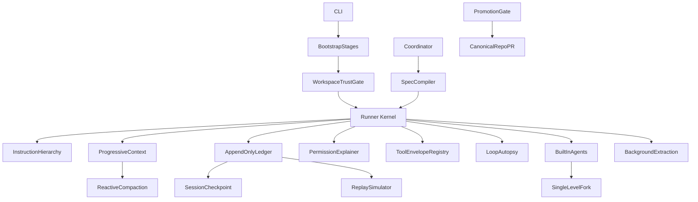

# Harness Hardening Roadmap

## Scope

This plan targets the playground repo at `/Users/alanman/Developer/claude-local-bridge-playground`. It upgrades the current Agent OS scaffold from “working layers” to “measurable runtime contracts.”

It includes:

- **P0 security**: workspace trust/consent gate before any tool executes.
- **Table-stakes memory**: instruction file hierarchy (org → user → project → local), four-type auto-memory, two-step save invariant, background session extraction.
- **Context engineering**: progressive disclosure for tools/skills, reactive mid-session compaction (not only predictive budgets).
- **Top 5 measurability builds**: ledger, replay simulator, tool envelopes, coordinator spec compiler, loop autopsy.
- **Delegation**: built-in agent profiles, single-level fork boundary, memoized bootstrap stages.
- **Promotion ritual** and closure of prior “mostly/partially/still missing” runner gaps.

It does not extend bridge fingerprint, `cch`, TLS, capture-proxy, or header-mimicry behavior. Those risks should be de-scoped or removed, not made more sophisticated.

## Implementation Priority

Ship in this order (each slice is independently testable):

1. **Workspace trust gate** — block tool loop until cwd is consented.
2. **Instruction hierarchy** — Claude Code parity for layered `AGENTS.md` / `CLAUDE.md`.
3. **Progressive disclosure + reactive compaction** — shrink every-turn system prompt; compress mid-session.
4. **Ledger + replay** — measurable continuity.
5. **Envelopes + permission explainer + aliases + cache invalidation**.
6. **Budgets + autopsy**.
7. **Parallel reads + shell honesty**.
8. **Coordinator spec compiler + built-in agents + fork/bootstrap**.
9. **Full memory taxonomy + background extraction + hooks**.
10. **Promotion ritual + docs**.

## Architecture Shape



## Phase 0: Workspace Trust Gate (P0)

**Problem today**: [`--trusted-workspace`](/Users/alanman/Developer/claude-local-bridge-playground/bin/local-bridge-runner.js) only gates hooks in [`hook-dispatcher.js`](/Users/alanman/Developer/claude-local-bridge-playground/src/runner/hooks/hook-dispatcher.js). Tools can run on an unreviewed cwd. This is the #1 security gap.

Create `[src/runner/workspace-trust.js](/Users/alanman/Developer/claude-local-bridge-playground/src/runner/workspace-trust.js)`.

Key changes:

- On startup (before first model call or tool dispatch in [`run.js`](/Users/alanman/Developer/claude-local-bridge-playground/src/runner/run.js)), resolve `cwd` realpath and check trust state.
- Trust store: `.bridge-runner/trust.json` under user config or per-workspace record with `{ cwdRealpath, trustedAt, fingerprint }`.
- Interactive first-run consent: show cwd, git root hint, and risk summary; require explicit `y` unless `--trust-workspace` or prior record exists.
- **Fail closed**: if not trusted, deny all tools (including read-only) and stop with `workspace_not_trusted` in [`kernel/contract.js`](/Users/alanman/Developer/claude-local-bridge-playground/src/runner/kernel/contract.js).
- `--trusted-workspace` becomes “this run is trusted” (hooks + auto-memory writes + session extraction); separate from one-time `--trust-workspace` consent recording.
- Non-interactive CI: require `--trust-workspace` flag; never auto-trust unknown paths.
- Ledger event: `workspace_trust_evaluated` with decision metadata.

Tests:

- `test/runner/workspace-trust.test.js`
- Extend permission/safety tests to assert no tool runs pre-trust.

## Phase 1: Instruction File Hierarchy

**Problem today**: [`instruction-memory.js`](/Users/alanman/Developer/claude-local-bridge-playground/src/runner/memory/instruction-memory.js) only loads project-local `AGENTS.md` / `CLAUDE.md` / `OPENCODE.md` from `cwd`. No org/user/local scopes. This is table-stakes for Claude Code parity.

Expand `[src/runner/memory/instruction-memory.js](/Users/alanman/Developer/claude-local-bridge-playground/src/runner/memory/instruction-memory.js)` and wire through [`context-builder.js`](/Users/alanman/Developer/claude-local-bridge-playground/src/runner/context-builder.js).

Discovery order (later overrides earlier):

1. **Org** (optional): `$BRIDGE_RUNNER_ORG_INSTRUCTIONS/` or documented org root.
2. **User**: `~/.bridge-runner/instructions/` and `~/.claude/`-style fallbacks if present (read-only, bounded).
3. **Project**: `cwd` root files (`AGENTS.md`, `CLAUDE.md`, `OPENCODE.md`).
4. **Local**: `cwd/.bridge-runner/instructions/` and nested `AGENTS.local.md` if adopted.

Key changes:

- Return structured blocks: `{ scope, path, priority, chars, hash }` plus concatenated `text` under global `MAX_INSTRUCTION_CHARS`.
- Inject at bootstrap only (memoized per run); emit `instruction_sources` on ledger/trace.
- Never load instruction files outside discovered roots; respect existing path deny matrix.
- Document precedence in [`lab-notes/AGENT_OS_ARCHITECTURE.md`](/Users/alanman/Developer/claude-local-bridge-playground/lab-notes/AGENT_OS_ARCHITECTURE.md) and runner docs.

Tests:

- `test/runner/instruction-hierarchy.test.js`

## Phase 2: Progressive Context Disclosure

**Problem today**: [`context-builder.js`](/Users/alanman/Developer/claude-local-bridge-playground/src/runner/context-builder.js) embeds **all** tool descriptions in every system prompt. [`tool-registry.getDefinitions`](/Users/alanman/Developer/claude-local-bridge-playground/src/runner/tool-registry.js) exists but is not used for lazy loading. Skills listing from [`skills-index.js`](/Users/alanman/Developer/claude-local-bridge-playground/src/runner/skills/skills-index.js) is appended in full when present.

Create `[src/runner/context-budget.js](/Users/alanman/Developer/claude-local-bridge-playground/src/runner/context-budget.js)`.

Key changes:

- **Tool defs**: default system prompt includes tool _names_ + one-line summaries only; full schemas/descriptions loaded on demand via `describe_tools` meta-tool or turn-scoped expansion when model requests a category (read / write / shell).
- **Skills**: keep lazy index metadata only; load full `SKILL.md` body when activation router matches (Phase 12).
- **Budget**: `--context-budget-chars` (or token estimate) caps instruction + tools + skills sections; truncate with explicit “[budget truncated]” markers.
- **Cache**: memoize built system prompt per `(cwd, allowShell, allowedTools, trust, compactionGeneration)` until invalidation (Phase 6).
- Anthropic API `tools` array still sends full JSON schemas required by the API; separation is **system prompt prose** vs **API tool definitions** (do not double-ship long prose).

Tests:

- `test/runner/context-budget.test.js`
- `test/runner/progressive-tools.test.js`

## Phase 3: Reactive Context Compaction

**Problem today**: [`context-compactor.js`](/Users/alanman/Developer/claude-local-bridge-playground/src/runner/context-compactor.js) runs clip/snip/ghost in [`run.js`](/Users/alanman/Developer/claude-local-bridge-playground/src/runner/run.js) but `summarize` is `summarize_pending` only — no mid-session summarization of older turns. Predictive budgets (Phase 8) are planned but reactive compression is not explicit.

Key changes:

- **Reactive trigger**: after each turn, if `estimateTokens(messages) >= warnTokens` OR post-tool burst, run compaction ladder automatically (not only at halt).
- **Summarize stage**: implement bounded summarization of oldest preserved turns into a single assistant/user neutral summary block; record `compaction_applied` on ledger with before/after token estimates.
- **Preserve invariants**: never drop orphaned `tool_use` / `tool_result` pairs; replay simulator validates pairs after compaction.
- Coordinate with session `compactionGeneration` in [`session-store.js`](/Users/alanman/Developer/claude-local-bridge-playground/src/runner/session-store.js).
- Optional `--compaction-model` for summarize-only mini calls (off by default in playground).

Tests:

- `test/runner/reactive-compaction.test.js`
- Extend compaction tests for summarize stage and pair integrity.

## Phase 4: Ledger First Continuity

Create `[src/runner/session-ledger.js](/Users/alanman/Developer/claude-local-bridge-playground/src/runner/session-ledger.js)` as the append-only source of truth. Keep `[src/runner/session-store.js](/Users/alanman/Developer/claude-local-bridge-playground/src/runner/session-store.js)` as a checkpoint/cache, not the primary history.

Key changes:

- Add versioned ledger events: `session_started`, `user_prompt`, `model_request`, `assistant_message`, `tool_effect_intent`, `tool_effect_result`, `tool_result_message`, `compaction_applied`, `run_stopped`.
- In `[src/runner/run.js](/Users/alanman/Developer/claude-local-bridge-playground/src/runner/run.js)`, record ledger events around each model/tool boundary.
- For writes/shell, append intent before effect and result after effect.
- Store file hashes, backup paths, undo entries, tool ids, turn numbers, and run ids.
- Make resume order: ledger → session checkpoint → transcript fallback.
- Preserve transcript as audit-only.

Tests:

- `test/runner/session-ledger.test.js`
- Extend `test/runner/resume.test.js`
- Add crash-window tests for pending write intents.

## Phase 2: Replay Simulator And Transcript Repair

Create `[src/runner/replay-simulator.js](/Users/alanman/Developer/claude-local-bridge-playground/src/runner/replay-simulator.js)` and optional CLI support in `[bin/local-bridge-runner.js](/Users/alanman/Developer/claude-local-bridge-playground/bin/local-bridge-runner.js)`.

Key changes:

- Rebuild Anthropic `messages` and runner metadata without calling the model or tools.
- Detect orphaned tool results, trailing assistant tool_use blocks, ledger sequence gaps, pending effects, and checkpoint drift.
- Harden transcript fallback parser so it tolerates truncated final lines, multiple user prompts, and missing optional fields.
- Keep transcript fallback compatibility-only.

Tests:

- `test/runner/replay-simulator.test.js`
- `test/runner/transcript.test.js`

## Phase 6: Tool Result Envelopes, Aliases, And Cache Invalidation

Normalize all tool execution through `[src/runner/tool-registry.js](/Users/alanman/Developer/claude-local-bridge-playground/src/runner/tool-registry.js)`.

Envelope shape:

```js
{
  (ok, text, summary, data, bytes, truncated, refreshHint, safetyTags, permission, effect, timing_ms);
}
```

Key changes:

- Anthropic-facing `tool_result.content` remains plain text for compatibility.
- Stream JSON, traces, transcript, ledger, human logs receive full envelopes.
- Update write tools under `[src/runner/tools/](/Users/alanman/Developer/claude-local-bridge-playground/src/runner/tools/)` to return before/after hashes and backup/effect metadata.
- Ensure `apply_patch` uses the same atomic write and undo pattern as `edit_file` and `write_file`.
- **Tool aliases**: in [`tool-registry.js`](/Users/alanman/Developer/claude-local-bridge-playground/src/runner/tool-registry.js), register backward-compatible names (e.g. `read` → `read_file`, `write` → `write_file`) with deprecation notes in envelopes; canonical name used in ledger.
- **Cache invalidation**: invalidate memoized system prompt, skills index, and instruction hash cache at mutation points (write tools, `apply_patch`, trusted hook mutations, compaction generation bump).

Tests:

- `test/runner/tool-envelope.test.js`
- `test/runner/tool-aliases.test.js`
- `test/runner/context-cache-invalidation.test.js`
- Extend write/undo/atomic tests.

## Phase 7: Permission Rule Explainer

Extend `[src/runner/permissions.js](/Users/alanman/Developer/claude-local-bridge-playground/src/runner/permissions.js)` so every decision explains itself.

Decision metadata:

- `decision`: allow, ask, deny, plan_only
- `category`: read-only, write, shell, recovery
- `mode`: default, plan, acceptEdits, dontAsk, acceptEditsAndDontAsk
- `ruleId`: path_guard, deny_matrix, allowed_tools, shell_disabled, mode_policy, session_grant
- `matchedGuards`: path confinement, secret pattern, shell scanner, previous denial
- `explanation`: beginner-readable reason

Key changes:

- Emit `permission_decision` for both allow and deny, not only approval-required paths.
- Add denial history into session runner state so stateful permission behavior is inspectable.
- Show explanations in stream JSON, trace, ledger, and human log.

Tests:

- `test/runner/permission-explainer.test.js`
- Extend permission and safety tests.

## Phase 8: Loop Autopsy And Run Budgets

Add a loop health module such as `[src/runner/loop-autopsy.js](/Users/alanman/Developer/claude-local-bridge-playground/src/runner/loop-autopsy.js)` and budget helpers.

Key changes:

- Add stop reasons in `[src/runner/kernel/contract.js](/Users/alanman/Developer/claude-local-bridge-playground/src/runner/kernel/contract.js)`: `semantic_cycle_detected`, `wall_clock_budget_exceeded`, `cost_budget_exceeded`, `predictive_context_budget_exceeded`, `retry_budget_exceeded`.
- Detect repeated normalized tool calls and repeated result classes.
- Add predictive context budget before model requests using `estimateTokens(messages) + maxTokens + safety margin`.
- Add `--max-wall-clock-ms` and `--max-cost-usd` to CLI.
- Add model pricing table in `[src/runner/model-pricing.js](/Users/alanman/Developer/claude-local-bridge-playground/src/runner/model-pricing.js)` with clear “estimate only” labeling.
- Separate bridge retry counters from tool failure counters.
- Add exponential backoff and `retry-after` support around bridge 429/503 failures.
- Emit final `autopsy` on every run stop.

Tests:

- `test/runner/loop-autopsy.test.js`
- `test/runner/budget-guards.test.js`
- `test/runner/retry-policy.test.js`

## Phase 9: True Read-Only Parallelism

Convert the current “batched but sequential” read tools in `[src/runner/run.js](/Users/alanman/Developer/claude-local-bridge-playground/src/runner/run.js)` into real parallel execution.

Key changes:

- Add async dispatch in `[src/runner/tool-registry.js](/Users/alanman/Developer/claude-local-bridge-playground/src/runner/tool-registry.js)`.
- Mark read-only calls as concurrency-safe per call, not just per tool name.
- Run read-only calls with `Promise.allSettled` and preserve original tool result order.
- Keep write, shell, recovery, and uncertain tools serial.

Tests:

- `test/runner/tool-concurrency.test.js`

## Phase 10: Shell And Network Honesty

Improve shell handling without pretending it is a real sandbox.

Key changes:

- Keep shell hidden unless `--allow-shell` is set.
- Add a shell policy scanner in `[src/runner/safety.js](/Users/alanman/Developer/claude-local-bridge-playground/src/runner/safety.js)` or `[src/runner/shell-policy.js](/Users/alanman/Developer/claude-local-bridge-playground/src/runner/shell-policy.js)`.
- Under `--no-network`, deny obvious network commands instead of relying only on proxy env vars.
- Warn or block highest-risk flag combos like `--allow-shell --accept-edits --dont-ask` unless an explicit `--chaos-ok` or equivalent is introduced.
- Document that this is still not OS sandboxing.

Tests:

- `test/runner/bash-safety.test.js`
- `test/runner/no-network-policy.test.js`

## Phase 11: Coordinator Spec Compiler

Replace the string-template `synthesizeSpec()` in `[src/runner/coordinator.js](/Users/alanman/Developer/claude-local-bridge-playground/src/runner/coordinator.js)` with structured compilation.

Compiled spec fields:

- objective
- constraints
- researchFindings with evidence
- allowedFiles
- taskPlan
- acceptanceChecks
- risks
- openQuestions
- verificationPlan

Key changes:

- Require evidence-bearing worker results from `[src/runner/worker-runtime.js](/Users/alanman/Developer/claude-local-bridge-playground/src/runner/worker-runtime.js)`.
- Reject empty or vague research digests.
- Pass the compiled spec into execute phase as a concrete instruction document.

Tests:

- Extend `test/runner/harness-architecture.test.js`
- Add `test/runner/coordinator-spec.test.js`

## Phase 12: Built-In Agents, Fork Pattern, And Bootstrap

Add pre-defined agent roles, cache-optimized child spawns, and ordered initialization.

Key changes:

- Create `[src/runner/agents/registry.js](/Users/alanman/Developer/claude-local-bridge-playground/src/runner/agents/registry.js)`: `explore`, `plan`, `implement`, `verify`, `test`, `replay`, `extractor` (session learning).
- Profile schema: `{ id, description, allowedTools, maxSteps, trustMode, outputSchema, spawnMode, forkAllowed }`.
- Add `--agent <profile>` in `[bin/local-bridge-runner.js](/Users/alanman/Developer/claude-local-bridge-playground/bin/local-bridge-runner.js)`.
- **Fork pattern** (extend [`session-store.fork`](/Users/alanman/Developer/claude-local-bridge-playground/src/runner/session-store.js)):
  - Parent passes shared context snapshot: instruction hash, compaction generation, read-only file hints — not full mutable session.
  - Child runs with isolated `runId`, inherits cwd trust only if parent was trusted.
  - **Single-level boundary**: child agents cannot spawn children (`spawnDepth <= 1`); enforce in `worker-runtime` and registry.
  - Cache-optimized: child system prompt reuses parent memoized instruction block when hash matches.
- **Bootstrap memoized stages** in `[src/runner/bootstrap.js](/Users/alanman/Developer/claude-local-bridge-playground/src/runner/bootstrap.js)`:
  1. Parse CLI + validate cwd
  2. Workspace trust gate
  3. Load instruction hierarchy (memoized)
  4. Build progressive context / tool surface
  5. Resume ledger or session
  6. Fast-path dispatch for trivial commands (e.g. `--version`, empty prompt help) — skip model
- Structured worker findings: `{ claims, evidencePaths, confidence }`.

Tests:

- `test/runner/agent-profiles.test.js`
- `test/runner/fork-boundary.test.js`
- `test/runner/bootstrap-stages.test.js`

## Phase 13: Memory Taxonomy, Two-Step Save, Background Extraction

Complete memory without bypassing safety. **Note**: [`auto-memory.js`](/Users/alanman/Developer/claude-local-bridge-playground/src/runner/memory/auto-memory.js) already implements a two-step save stub but only `type: 'project'` — expand to full taxonomy.

Key changes:

- **Four-type taxonomy** in auto-memory index: `user`, `feedback`, `project`, `reference` — each with caps per type and global `INDEX_CAP`.
- **Two-step save invariant** (enforce everywhere): write topic file first, then update index; on failure, leave index unchanged; ledger `memory_write_intent` / `memory_write_result`.
- **Promotion queue**: `.bridge-runner/memory-promotions/` for durable instruction changes — human or trusted-workspace approval before merging into project `AGENTS.md`.
- **Background session extraction** (profile `extractor`):
  - At session end (or `--extract-after-run`), fork read-only worker over ledger + transcript.
  - Propose typed memory entries; never auto-promote without queue approval.
  - Requires trusted workspace + explicit `--session-extract` flag.
- Skill activation router in [`skills-index.js`](/Users/alanman/Developer/claude-local-bridge-playground/src/runner/skills/skills-index.js) + [`context-builder.js`](/Users/alanman/Developer/claude-local-bridge-playground/src/runner/context-builder.js) (pairs with Phase 2 progressive disclosure).

Tests:

- `test/runner/auto-memory-taxonomy.test.js`
- `test/runner/memory-two-step-save.test.js`
- `test/runner/session-extraction.test.js`
- `test/runner/skill-activation.test.js`
- `test/runner/memory-promotion.test.js`

## Phase 14: Hooks (Gated By Trust)

Declarative hooks only; arbitrary shell/JS hooks deferred.

Key changes:

- Hooks require **workspace trust** (Phase 0), not merely a CLI flag on an untrusted cwd.
- Declarative actions first: log, annotate trace, advisory block.
- Ledger: `hook_dispatched` with trust state snapshot.

Tests:

- `test/runner/hooks.test.js`

## Phase 15: Async Eviction (Future-Proof)

No async worker pool exists yet. Document and stub two-phase eviction for when background jobs land:

- Phase A: mark job cancelled / stop accepting new work.
- Phase B: drain in-flight, persist partial results to ledger, then tear down.

Add design note in `lab-notes/` only until async work ships; no implementation required in v1.

## Phase 16: Promotion Ritual From Playground To Canonical

Add a documented maturity gate so experiments do not rot.

Create/update:

- `[lab-notes/PROMOTION_RITUAL.md](/Users/alanman/Developer/claude-local-bridge-playground/lab-notes/PROMOTION_RITUAL.md)`
- `[lab-notes/AGENT_OS_ARCHITECTURE.md](/Users/alanman/Developer/claude-local-bridge-playground/lab-notes/AGENT_OS_ARCHITECTURE.md)`
- `[docs/runner-quickstart.html](/Users/alanman/Developer/claude-local-bridge-playground/docs/runner-quickstart.html)`
- `[docs/command-builder.html](/Users/alanman/Developer/claude-local-bridge-playground/docs/command-builder.html)`

Gate:

- experiment spec exists
- contract tests exist
- targeted runner tests pass
- safety/docs updated
- bridge boundary respected
- canonical port plan written
- canonical PR opened only after manual promotion

## Gap Coverage Matrix

| Gap identified                                      | Plan phase                                |
| --------------------------------------------------- | ----------------------------------------- |
| Workspace trust gate before tools                   | Phase 0                                   |
| Instruction file hierarchy (org/user/project/local) | Phase 1                                   |
| Progressive disclosure (tools + skills budget)      | Phase 2                                   |
| Reactive mid-session compaction + summarize         | Phase 3                                   |
| Ledger / replay measurability                       | Phases 4–5                                |
| Tool envelopes, aliases, cache invalidation         | Phase 6                                   |
| Permission explainer                                | Phase 7                                   |
| Predictive budgets + autopsy                        | Phase 8                                   |
| Fork pattern + single-level boundary                | Phase 12                                  |
| Bootstrap memoized stages + fast-path               | Phase 12                                  |
| Four-type auto-memory + two-step save               | Phase 13                                  |
| Background session extraction                       | Phase 13                                  |
| Hooks gated by trust (not trust flag alone)         | Phase 14                                  |
| Two-phase async eviction                            | Phase 15 (design only until async exists) |

**Already partial in codebase** (plan now explicit): `context-compactor.js` clip/snip/ghost; `instruction-memory.js` project-only; `auto-memory.js` two-step save with single type; `session-store.fork()` without spawn depth enforcement.

## Verification Plan

Run targeted tests first (priority order):

```bash
node --require ./test/setup.js --test test/runner/workspace-trust.test.js test/runner/instruction-hierarchy.test.js
node --require ./test/setup.js --test test/runner/reactive-compaction.test.js test/runner/context-budget.test.js
node --require ./test/setup.js --test test/runner/session-ledger.test.js test/runner/replay-simulator.test.js
node --require ./test/setup.js --test test/runner/*.test.js
```

Then docs/format checks:

```bash
npx prettier --check <touched files>
npm run lint
```

Update [`docs/threat-model.md`](/Users/alanman/Developer/claude-local-bridge-playground/docs/threat-model.md) when Phase 0 ships.

Avoid bridge/gateway smoke tests unless Alan explicitly says `LOCAL SMOKE TEST`.

## Risk Notes

- This is too large for one safe PR. Follow **Implementation Priority** slices; do not skip Phase 0 to chase ledger features.
- Do not make transcript fallback the new source of truth. It should remain audit-only.
- Do not strengthen or maintain impersonation/fingerprint machinery. Treat those items as de-risk/remove/de-scope work.
- Progressive disclosure must not strip API `tools` schemas the model needs for valid `tool_use` blocks — only reduce redundant prose in the system prompt.
- Background extraction must never write durable instruction files without promotion queue approval.
