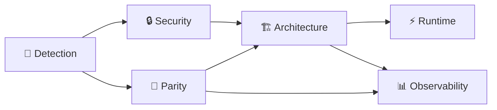

# Chaos Orchestration — Master Plan

**Repo:** `/Users/alanman/Developer/claude-local-bridge-playground`  
**Branch:** `playground/local-runner-chaos`  
**Status:** Planning only — no tests, no bridge gateway calls, no bridge edits.  
**Companion docs:** [HARNESS_VISION.md](./HARNESS_VISION.md) · [docs/threat-model.md](../docs/threat-model.md) · [deep-research-report.md](../deep-research-report.md)

> **North star (one line):** Six parallel lab workstreams, each with clear experiments and artifacts, so Alan can ideate wildly in the playground without losing the plot — then promote winners to `claude-local-bridge` on `codex/runner-clean-pr`.

---

## 1. Command center (one page)

Use **six Cursor chats** (or Multitask lanes). Rename each chat with the label below so you always know which brain you are talking to.

| # | Workstream | Cursor chat label | Owner role | This week’s focus | Canonical artifact |
|---|------------|-------------------|------------|-------------------|-------------------|
| 1 | **Security** | `🔒 Security` | Gatekeeper — deny matrix, shell risk, fail-closed | Bash-pathway decision + chaos fuzzer design | [bash-pathway-threat-model.md](./bash-pathway-threat-model.md) |
| 2 | **Architecture** | `🏗 Architecture` | Systems — sessions, ledger, fork, boundaries | Session DNA ledger spike spec | [session-ledger-spec.md](./session-ledger-spec.md) *(create)* |
| 3 | **Runtime perf** | `⚡ Runtime` | Speed — context budget, compaction, subagent cost | Compaction ladder + tool envelope design | [compaction-ladder.md](./compaction-ladder.md) *(create)* |
| 4 | **Observability** | `📊 Observability` | Flight recorder — traces, autopsy, merged timeline | Stop autopsy + stream-json event map | [observability-contract.md](./observability-contract.md) *(create)* |
| 5 | **Parity (claude -p / SDK)** | `🔄 Parity` | Contracts — headless CLI + Agent SDK alignment | Permission modes + stream-json parity matrix | [claude-parity-matrix.md](./claude-parity-matrix.md) *(create)* |
| 6 | **Detection / policy risk** | `🎯 Detection` | Policy — what *not* to copy (auto classifier, fingerprint) | Anthropic auto-mode + bridge detection notes | [anthropic-detection-policy.md](./anthropic-detection-policy.md) *(create)* |

### Workstream dependency sketch



**Rule of thumb:** Security and Detection inform *whether* to build something. Architecture and Parity define *what shape* it takes. Runtime and Observability make it *fast and debuggable*.

### Playground charter (paste into every chat once)

```
Work only in claude-local-bridge-playground on branch playground/local-runner-chaos.
Do not edit bridge files: credentials.js, proxy.js, server.js, interceptors/**.
Runner changes stay in bin/local-bridge-runner.js and src/runner/**.
Do not run npm test or localhost:11437 unless I explicitly ask.
Output lab-notes artifacts; prefer read-only runner commands for smoke checks.
```

---

## 2. Per-workstream experiments

Each workstream has **three experiments**, a **success metric**, an **artifact path**, and **priority**.

### 🔒 Security — `lab-notes/security/`

| Priority | Experiment | Success metric | Artifact |
|----------|------------|----------------|----------|
| **P0** | **Chaos permission fuzzer spec** — random tool args (symlink escapes, `.env` paths, bash pipes) expecting deny | Written test matrix ≥20 cases; each maps to deny reason in [docs/threat-model.md](../docs/threat-model.md) | [security/chaos-fuzzer-spec.md](./security/chaos-fuzzer-spec.md) *(create)* |
| **P0** | **Bash-primary go/no-go** — finish scoring TM-001–005 from bash pathway doc | Decision memo: *file-first*, *bash-secondary*, or *bash-primary with sandbox*; Alan signs one box | [bash-pathway-threat-model.md](./bash-pathway-threat-model.md) *(extend § recommendations)* |
| **P1** | **Trust thermostat** — named modes (`explore \| plan \| pair \| ship \| chaos`) → tool + permission matrix | One table: mode → allowed tools → ask/deny rules; maps to existing CLI flags | [security/trust-thermostat.md](./security/trust-thermostat.md) *(create)* |

**Top 3 this month:** fuzzer spec → bash decision → trust thermostat.

---

### 🏗 Architecture — `lab-notes/architecture/`

| Priority | Experiment | Success metric | Artifact |
|----------|------------|----------------|----------|
| **P0** | **Session DNA ledger** — dual-write transcript + canonical message state | JSON schema for one ledger line; resume reads ledger not lossy transcript parser | [session-ledger-spec.md](./session-ledger-spec.md) *(create)* |
| **P1** | **Fork genetics** — fork at turn N with family tree ID | Sequence diagram: parent/child ledger + metadata; no code required in playground | [architecture/fork-genetics.md](./architecture/fork-genetics.md) *(create)* |
| **P2** | **Explorer child process** — read-only sub-run, summary-only return | Coordinator API sketch: spawn flags, max steps, summary max tokens | [architecture/delegate-explore.md](./architecture/delegate-explore.md) *(create)* |

**Top 3 this month:** ledger spec → fork genetics → delegate explore.

---

### ⚡ Runtime perf — `lab-notes/runtime/`

| Priority | Experiment | Success metric | Artifact |
|----------|------------|----------------|----------|
| **P0** | **Compaction ladder** — clip → snip → ghost blocks → full summarize | Ordered stages with *when* each fires (token % or turn count) | [compaction-ladder.md](./compaction-ladder.md) *(create)* |
| **P1** | **Tool result envelope** — `{ ok, tool, summary, data, truncated, error }` | Before/after example for `read_file` 500-line dump | [runtime/tool-envelope.md](./runtime/tool-envelope.md) *(create)* |
| **P1** | **Context budget engine** — select / write / compress / isolate checklist | One-page policy: what enters model context each turn | [runtime/context-budget.md](./runtime/context-budget.md) *(create)* |

**Top 3 this month:** compaction ladder → tool envelope → context budget.

---

### 📊 Observability — `lab-notes/observability/`

| Priority | Experiment | Success metric | Artifact |
|----------|------------|----------------|----------|
| **P0** | **Loop autopsy scoreboard** — stop_reason, ping-pong, duplicate tool hash, token slope | Event list matching `stream-json` terminal shape | [observability-contract.md](./observability-contract.md) *(create)* |
| **P1** | **Merged trace replay** — runner JSONL + bridge JSONL → one HTML timeline | Field mapping table (runId, step, tool, latency) | [observability/merged-trace-replay.md](./observability/merged-trace-replay.md) *(create)* |
| **P2** | **Codex handoff packet** — what a supervisor agent needs per run | Checklist: session id, usage, denials, final structured output | [observability/codex-handoff-packet.md](./observability/codex-handoff-packet.md) *(create)* |

**Top 3 this month:** observability contract → merged trace → codex packet.

---

### 🔄 Parity (claude -p / SDK) — `lab-notes/parity/`

| Priority | Experiment | Success metric | Artifact |
|----------|------------|----------------|----------|
| **P0** | **Parity matrix** — runner vs `claude -p` vs Agent SDK (sessions, modes, events, stream-json, subagents) | Gap table with ✅ / ⚠️ / ❌ and *adopt / skip / later* | [claude-parity-matrix.md](./claude-parity-matrix.md) *(create)* |
| **P1** | **Permission mode mapping** — `plan`, `default`, `acceptEdits`, `dontAsk` | Flag-for-flag map to `bin/local-bridge-runner.js` today | [parity/permission-modes.md](./parity/permission-modes.md) *(create)* |
| **P2** | **Structured output + schema validation** — final JSON obeys schema or re-prompt | Example schema + sample valid/invalid outputs | [parity/structured-output.md](./parity/structured-output.md) *(create)* |

**Top 3 this month:** parity matrix → permission modes → structured output.

---

### 🎯 Detection / policy risk — `lab-notes/detection/`

| Priority | Experiment | Success metric | Artifact |
|----------|------------|----------------|----------|
| **P0** | **Auto-mode anti-adoption brief** — why not copy Anthropic classifier early | One-page: FP/FN tradeoffs, file-edit blind spot, local-runner fit | [anthropic-detection-policy.md](./anthropic-detection-policy.md) *(create)* |
| **P1** | **Bridge fingerprint / detection surface** — transport-only concerns | List: what bridge owns vs runner; no evasion research | [detection/bridge-fingerprint-notes.md](./detection/bridge-fingerprint-notes.md) *(create)* |
| **P2** | **Promotion gate** — playground → canonical branch checklist | Required artifacts + tests before merge to `codex/runner-clean-pr` | [detection/promotion-gate.md](./detection/promotion-gate.md) *(create)* |

**Top 3 this month:** anthropic detection policy → bridge fingerprint notes → promotion gate.

---

## 3. Weekly rhythm — 2-hour beginner session

**When:** Pick one fixed slot (e.g., Saturday morning). **Goal:** Move *one* workstream forward; touch others only if blocked.

### Template (120 minutes)

| Block | Time | What Alan does | Where |
|-------|------|----------------|-------|
| **0. Land the plane** | 0:00–0:10 | Open Terminal → `cd` playground → `git status` → read this file’s command center table | Terminal + this doc |
| **1. Pick one lane** | 0:10–0:15 | Choose **one** workstream row; open or create its Cursor chat label | Cursor |
| **2. Agent sprint** | 0:15–0:50 | Paste charter + one experiment from §2; ask agent to *write lab-notes only* (no bridge edits) | Cursor foreground |
| **3. Human read** | 0:50–1:05 | Read new artifact; highlight 3 bullets: *keep*, *cut*, *unsure* | Markdown preview |
| **4. Optional background** | 1:05–1:35 | Start **one** Multitask or background agent on a *read-only* second experiment (research doc, parity table) | Cursor background |
| **5. Integration pass** | 1:35–1:55 | Fill [weekly-integration.md](./weekly-integration.md) *(create)* — 5 lines max | lab-notes |
| **6. Close** | 1:55–2:00 | Update command center “this week’s focus” column mentally; no commit unless you want one | — |

### Monthly cadence (every 4th session)

- Skim all six artifact folders; mark **P0 done / stuck / promote**.
- One 30-min “promotion review”: anything ready for `claude-local-bridge`?

---

## 4. Cursor Multitask vs runner subagents (plain English)

### Cursor Multitask (IDE side)

**What it is:** Several Cursor agent chats running at once in the same repo — like six coworkers in six Zoom rooms, all editing the same codebase (or just writing docs in playground mode).

**Good for:** Parallel *thinking* — Security chat writes threat notes while Parity chat builds a gap table. You steer each chat; Cursor does not automatically merge their work.

**Risk:** Two chats editing the same file → merge mess. **Mitigation in playground:** Prefer *lab-notes only* in Multitask; one chat owns code spikes.

### Runner subagents (harness side — future)

**What it is:** Your local runner spawns a *child* agent process (e.g., read-only Explorer) with its own short prompt and tool allowlist. Only a **summary** returns to the parent run — like hiring a temp researcher who reports back one paragraph.

**Good for:** Cheap exploration, big repo maps, plan drafts — without stuffing 50 file reads into the main conversation.

**Risk:** Child runs real tools; needs permission boundaries and cost caps. Not built yet — see [architecture/delegate-explore.md](./architecture/delegate-explore.md) *(create)*.

### How they fit together

| Layer | Who orchestrates | Isolation | Best use in chaos lab |
|-------|------------------|-----------|------------------------|
| **Cursor Multitask** | Alan + chat labels | Weak (same folder) | Six workstreams, doc-heavy |
| **Runner subagent (future)** | Runner coordinator | Strong (process + allowlist) | Read-only repo scan, plan-only pass |
| **Canonical runner (later)** | Codex / CI | Branch + tests | Promoted features only |

**Simple rule:** Use **Cursor** to design and document; use **runner subagents** only after Architecture + Security sign off on delegate-explore spec.

---

## 5. Foreground vs background agents

### Run in **foreground** (Alan watches, approves)

- **Security decisions** — bash-primary go/no-go, trust thermostat tables.
- **Architecture choices** — ledger schema, fork semantics (hard to undo).
- **Anything that edits** `src/runner/**` or `bin/local-bridge-runner.js`.
- **Integration pass** — merging subagent outputs into one weekly note.
- **First read of any new lab-notes artifact** — catch wrong assumptions early.

### Run in **background** (Multitask / async agent)

- **Literature synthesis** — extend parity matrix from [deep-research-report.md](../deep-research-report.md).
- **Threat enumeration** — more bash TM scenarios against [bash-pathway-threat-model.md](./bash-pathway-threat-model.md).
- **Event type inventories** — stream-json field lists vs Claude headless docs.
- **Stub file creation** — empty markdown templates with headings only.
- **Read-only repo scans** — “list all files in `src/runner` and summarize modules” (no edits).

### Never background without explicit ask

- Bridge or gateway calls (`localhost:11437`).
- `npm test` / full test suite.
- `--allow-shell` + `--dont-ask` combinations.
- Commits or pushes (Alan decides).

---

## 6. Lab-notes index — existing and to create

### Already in repo

| File | Workstream |
|------|------------|
| [HARNESS_VISION.md](./HARNESS_VISION.md) | All — north star, gap table, 12 ideas |
| [bash-pathway-threat-model.md](./bash-pathway-threat-model.md) | Security |
| [../docs/threat-model.md](../docs/threat-model.md) | Security (canonical runner TM) |
| [../deep-research-report.md](../deep-research-report.md) | Parity, Architecture, Detection |

### Create next (by workstream)

```
lab-notes/
├── CHAOS_ORCHESTRATION.md          ← you are here
├── weekly-integration.md             ← 5-line weekly rollup (create)
├── session-ledger-spec.md
├── compaction-ladder.md
├── observability-contract.md
├── claude-parity-matrix.md
├── anthropic-detection-policy.md
├── security/
│   ├── chaos-fuzzer-spec.md
│   └── trust-thermostat.md
├── architecture/
│   ├── fork-genetics.md
│   └── delegate-explore.md
├── runtime/
│   ├── tool-envelope.md
│   └── context-budget.md
├── observability/
│   ├── merged-trace-replay.md
│   └── codex-handoff-packet.md
├── parity/
│   ├── permission-modes.md
│   └── structured-output.md
└── detection/
    ├── bridge-fingerprint-notes.md
    └── promotion-gate.md
```

### Optional cross-links (outside lab-notes)

| Doc | Why link |
|-----|----------|
| [../openrouter_codex_handoff/codex_handoff_safe.md](../openrouter_codex_handoff/codex_handoff_safe.md) | Session ledger + envelope ideas |
| [../AGENTS.md](../AGENTS.md) | Playground vs canonical boundaries |
| [../HEADLESS_AGENT_RUNNER_BEGINNER_GUIDE.md](../HEADLESS_AGENT_RUNNER_BEGINNER_GUIDE.md) | Safe first runner commands |

---

## 7. Integration — review subagent output without drowning

Subagents (Cursor background or future runner children) produce volume. This **15-minute protocol** keeps Alan in control.

### Step A — One inbox file

After any parallel work, agents append to **[weekly-integration.md](./weekly-integration.md)** *(create)* using this template only:

```markdown
## YYYY-MM-DD

### Done
- [Workstream] one sentence outcome + link to artifact

### Blocked
- [Workstream] blocker in plain English

### Promote?
- yes/no — feature name — why
```

No other integration doc. If it is not in weekly-integration, it did not happen.

### Step B — Traffic-light skim (5 min)

For each finished artifact, Alan marks one emoji in weekly-integration:

| Mark | Meaning | Action |
|------|---------|--------|
| 🟢 | Clear, matches threat model + vision | Keep; optional code spike next week |
| 🟡 | Interesting but fuzzy | One foreground chat to rewrite top half |
| 🔴 | Conflicts with anti-goals (auto classifier, bridge edits, bash-primary without sandbox) | Archive or delete section |

### Step C — Single decision per session

End every 2-hour session with **exactly one** written decision:

> **Decision:** e.g. “P0 this month = session ledger spec, not fork genetics.”

Record it at the bottom of weekly-integration. Prevents six half-started tracks.

### Step D — Promotion filter (when something feels “done”)

Before moving ideas to `claude-local-bridge`:

1. 🎯 Detection — passes [promotion-gate.md](./detection/promotion-gate.md) *(create)*  
2. 🔒 Security — no regression vs [docs/threat-model.md](../docs/threat-model.md)  
3. 🔄 Parity — row updated in [claude-parity-matrix.md](./claude-parity-matrix.md)  
4. 📊 Observability — event or metric defined in [observability-contract.md](./observability-contract.md)  
5. Alan runs targeted tests **in canonical repo** when ready (not during chaos ideation)

### Anti-drown rules

- **Max three active P0 experiments** across all workstreams (see §2 — one P0 per stream is aspirational; *monthly* focus is 3 total).
- **Background agents write docs, not code**, unless foreground chat explicitly owns the spike.
- **Summaries ≤ 200 words** when a subagent returns to parent; link full artifact instead of pasting it.
- **No bridge edits** — ever in playground orchestration; detection/fingerprint notes stay transport documentation only.

---

## Quick reference — priority stack (first 30 days)

| Order | Workstream | P0 artifact | Why first |
|-------|------------|-------------|-----------|
| 1 | Security | chaos-fuzzer-spec + bash decision | Fail-closed before new power |
| 2 | Architecture | session-ledger-spec | Unblocks resume, fork, parity |
| 3 | Observability | observability-contract | Makes experiments measurable |
| 4 | Parity | claude-parity-matrix | Stops building wrong shape |
| 5 | Runtime | compaction-ladder | Cost/reliability after ledger |
| 6 | Detection | anthropic-detection-policy | Guards against YOLO copying |

---

*Generated for playground orchestration — planning only. No tests run. No bridge gateway calls.*
