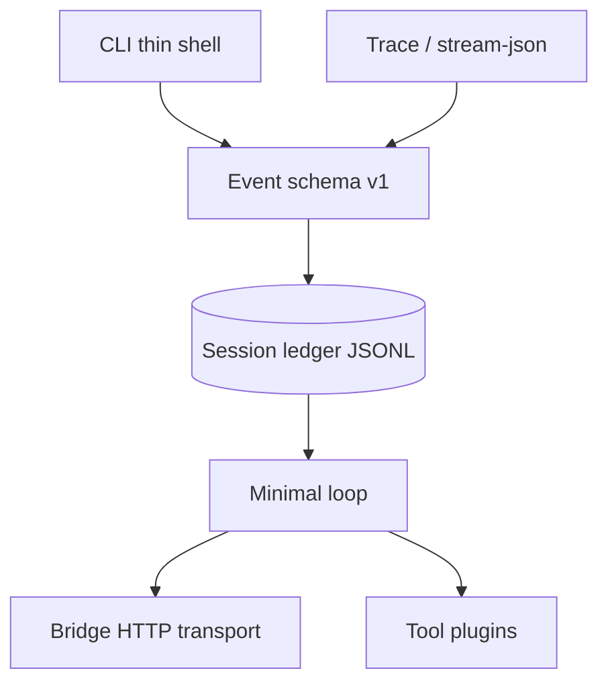
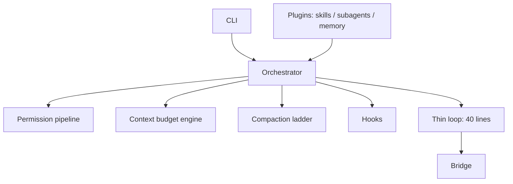
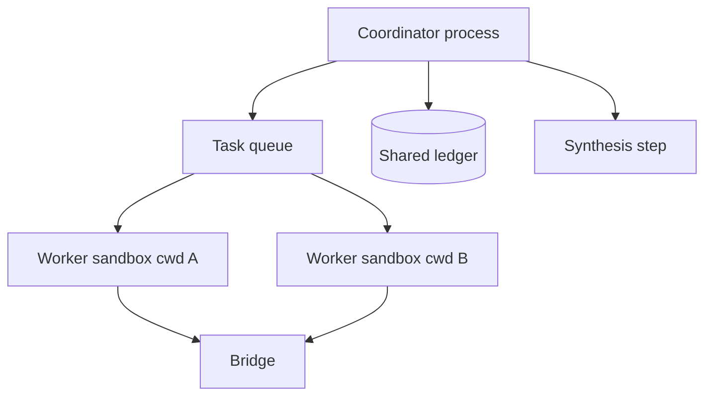

# Playground Harness Vision (Extreme Ideation)

**Repo:** `/Users/alanman/Developer/claude-local-bridge-playground`  
**Branch:** `playground/local-runner-chaos`  
**Status:** Planning only — no tests run, no bridge gateway calls.

> Alan: this is your **experiment lab**. The serious runner lives in `claude-local-bridge` on `codex/runner-clean-pr`. Here we are allowed to break things on purpose.

## Glossary (plain language)

| Term | Meaning |
|------|---------|
| **Bridge** | VS Code extension that forwards API calls to Anthropic using your Claude Code login. Transport only — not the agent brain. |
| **Runner / harness** | Local program that runs the agent loop: ask model → run tools → repeat. |
| **Transcript** | JSONL log file of what happened (good for humans, weak for perfect resume). |
| **Flight recorder / trace** | Extra debug log with sizes, tool names, optional redacted payloads. |
| **Fail-closed** | If unsure, block or ask — never silently allow danger. |
| **Compaction** | Shrinking old conversation so the model still fits in context window. |
| **Fork** | Copy a session at a point in time and try a different path without destroying the original. |

## A. One-sentence north star

**Turn the playground runner into a local “agent operating system shell” — where the bridge is just the phone line, and every session is a durable, forkable, observable experiment you can steer safely from Cursor or Terminal.**

## B. Gap table (current vs targets)

| Capability | Playground runner today | `claude -p` (headless CLI) | Claude Agent SDK | Harness patterns skill |
|------------|-------------------------|----------------------------|------------------|------------------------|
| Core loop | ✅ prompt → tools → repeat | ✅ same engine | ✅ library loop | ✅ baseline |
| Session ID / fork | ❌ no stable session object | ✅ continue/resume/fork | ✅ adapters + rewind | ✅ isolate + ledger |
| Canonical resume state | ⚠️ rebuild from JSONL transcript | ✅ full agent context | ✅ persisted messages | ✅ ledger ≠ log |
| Structured `stream-json` | ⚠️ partial event set | ✅ rich event types | ✅ native messages | ✅ machine contracts |
| Permission modes | ⚠️ flags (`--plan`, `--accept-edits`) | ✅ named modes | ✅ dynamic modes | ✅ fail-closed pipeline |
| Auto classifier “YOLO” | ❌ (good) | ✅ `auto` mode | ✅ optional | ❌ don’t copy early |
| Compaction ladder | ❌ append-only messages | ✅ multi-stage | ✅ same | ✅ select/write/compress |
| Subagents / delegation | ❌ | ✅ Explore/Plan/background | ✅ subagents | ✅ coordinator/fork/swarm |
| Worktree isolation | ❌ | ✅ parallel sessions | ✅ checkpoints | ✅ filesystem isolate |
| Skills (lazy) | ❌ | ✅ skills + `/bare` | ✅ MCP tools | ✅ metadata-first |
| Hooks lifecycle | ❌ | ✅ hooks | ✅ hooks | ✅ injection points |
| Memory layers | ❌ (only `AGENTS.md` if read manually) | ✅ CLAUDE.md + auto memory | ✅ memory tools | ✅ instruction/auto/extract |
| Tool schema validation | ⚠️ implicit in tools | ✅ strict | ✅ strict | ✅ envelope |
| Loop health stops | ⚠️ max steps, 2 failures, token warn | ✅ broader guards | ✅ configurable | ✅ hard stops |
| Observability | ✅ traces + human log | ✅ cost + OTel path | ✅ telemetry | ✅ flight recorder |
| Bridge coupling | ✅ `model-client` only | N/A (first-party) | N/A | ✅ transport boundary |

## C. Top 12 radical ideas

### 1. Session DNA Ledger
**Concept:** One append-only ledger stores *provider messages* and *runner state* (cwd, undo, budgets, allowlist grants) per turn. Resume reads the ledger, not a lossy transcript parser. **Innovation:** Treats continuity as data engineering, not log archaeology. **Risk:** med. **Leverage:** safety, observability. **Spike:** `src/runner/session-ledger.js`, wire in `run.js`.

### 2. Fork Genetics UI
**Concept:** `fork --at-turn 7` clones ledger + workspace snapshot metadata; parent and child share a family tree ID. **Innovation:** Claude Code fork semantics without Claude Code. **Risk:** high. **Leverage:** speed (parallel tries). **Spike:** `bin/local-bridge-runner.js`, `session-ledger.js`.

### 3. Compaction Ghost Blocks
**Concept:** After compaction, leave “ghost” placeholders: “Turns 3–9 summarized; tool_use ids preserved.” Model knows what was lost. **Innovation:** Prevents tool_result/orphan ID resume bugs. **Risk:** med. **Leverage:** cost, safety. **Spike:** `src/runner/context-compactor.js`, `run.js`.

### 4. Trust Thermostat (named modes)
**Concept:** Replace flag soup with `explore | plan | pair | ship | chaos` presets mapping to tool sets + permission matrix + confirmation rules. **Innovation:** Beginner-readable trust trajectory. **Risk:** low. **Leverage:** safety. **Spike:** `permissions.js`, CLI help in `bin/local-bridge-runner.js`.

### 5. Explorer Process (read-only child)
**Concept:** Coordinator spawns `node runner --bare --allowed-tools read_*` with a tight prompt; only summary returns to parent. **Innovation:** Subagent isolation without SDK. **Risk:** med. **Leverage:** cost, speed. **Spike:** `src/runner/delegate-explore.js`, `run.js`.

### 6. Hook Tapestry
**Concept:** User Dropped `hooks/pre-tool.json` runs shell/JS snippets; untrusted workspace = hooks disabled (fail-closed). **Innovation:** Extensibility without forking core loop. **Risk:** high. **Leverage:** observability. **Spike:** `src/runner/hooks.js`, `tool-registry.js`.

### 7. Lazy Skills Manifest from AGENTS.md
**Concept:** Parse `AGENTS.md` + `lab-notes/skills/*.md` into capped metadata block; load body only when triggered. **Innovation:** Skills without Anthropic plugin infra. **Risk:** low. **Leverage:** cost. **Spike:** `context-builder.js`, new `src/runner/skills-index.js`.

### 8. Tool Result Envelope + JSON Schema
**Concept:** Every tool returns `{ ok, tool, summary, data, truncated, error:{code} }`; model never sees raw 500-line dumps without metadata. **Innovation:** Codex-grade machine recovery. **Risk:** low. **Leverage:** safety, observability. **Spike:** `tool-registry.js`, one tool file as template.

### 9. Loop Autopsy Scoreboard
**Concept:** On stop, emit `stop_reason`, ping-pong detector, identical-call hash, wall-clock, token slope — as `stream-json` terminal event. **Innovation:** Makes “why did it spin?” answerable in one glance. **Risk:** low. **Leverage:** observability. **Spike:** `run.js` only.

### 10. Merged Timeline (runner + bridge traces)
**Concept:** Correlate `runId` across `~/.bridge-runner/traces/*.runner.jsonl` and `~/.claude-local-bridge/traces/*.bridge.jsonl` into one HTML “flight replay.” **Innovation:** Transport vs brain visibility without merging codebases. **Risk:** med. **Leverage:** observability. **Spike:** `scripts/merge-traces.js` (new), read-only.

### 11. Plan Mode → Executable Diff Cards
**Concept:** Plan mode outputs structured `{path, action, preview_diff}` JSON; user approves card → single `apply_patch`. **Innovation:** Plan becomes UX, not theater. **Risk:** med. **Leverage:** safety. **Spike:** `permissions.js`, `run.js` plan branch.

### 12. Chaos Monkey Permission Fuzzer
**Concept:** Nightly script generates random tool args (symlink escapes, `.env` reads, bash pipes) expecting deny. **Innovation:** Safety as CI game, not hope. **Risk:** low. **Leverage:** safety. **Spike:** `test/runner/chaos-permissions.test.js`.

## D. Architecture blueprints

### Blueprint 1 — Thin shell, fat contracts



### Blueprint 2 — Fat harness, thin model loop



### Blueprint 3 — Dual-runtime



## E. 90-day chaos roadmap

### Phase 1 — Weeks 1–4: “Make continuity real”
1. **Ledger spike** — dual-write transcript + ledger; compare resume fidelity.  
2. **Trust thermostat** — named modes + table in `docs/command-builder.html`.  
3. **Stop autopsy** — structured terminal reasons in `stream-json`.

### Phase 2 — Weeks 5–8: “Context is a budget”
1. **Compaction ghosts** — summarize old turns; keep tool IDs stable.  
2. **Tool envelopes** — schema results; truncation metadata.  
3. **Explorer child process** — read-only sub-run; summary-only parent injection.

### Phase 3 — Weeks 9–12: “Agent OS vibes”
1. **Fork genetics** — branch sessions at turn N.  
2. **Merged trace replay** — HTML timeline runner+bridge.  
3. **Hook tapestry (trusted workspace only)** — pre/post tool hooks.

## F. Beginner playbook snippet

### Five Cursor charter lines (paste into Agent / Rules)

```
Work only in claude-local-bridge-playground on branch playground/local-runner-chaos.
Do not edit bridge files: credentials.js, proxy.js, server.js, interceptors/**.
Runner changes stay in bin/local-bridge-runner.js and src/runner/**.
Never run npm test or anything that calls localhost:11437 unless I explicitly ask.
Prefer read-only runner commands first; explain every flag you add in plain English.
```

### Three read-only Terminal commands (playground folder)

```bash
cd "/Users/alanman/Developer/claude-local-bridge-playground"
git branch --show-current
node bin/local-bridge-runner.js --cwd "$(pwd)" --plan --allowed-tools list_files,read_file,search_text,git_status --max-steps 4 "Map src/runner and explain the agent loop. Do not edit files."
node bin/local-bridge-runner.js --cwd "$(pwd)" --output-format stream-json --trace-level summary --allowed-tools list_files,read_file --max-steps 3 "List runner files only. Do not edit."
```

*(Commands 2–3 need the VS Code bridge extension running if you want a live model reply; otherwise use them only after bridge is up.)*

## G. Explicit anti-goals (playground)

- **No** fingerprint mimicry, OAuth interception tricks, or “look like Claude Code” header spoofing research in runner code.  
- **No** edits to bridge auth/proxy/server/interceptors (transport stays upstream).  
- **No** auto-approve classifier copying Anthropic `auto` mode.  
- **No** claiming parity with Claude Code product surface (mobile, plugins marketplace, etc.).  
- **No** merging playground into canonical branch without a deliberate promotion ritual.  
- **No** storing secrets in transcripts/traces beyond redaction — treat logs as sensitive.  
- **No** default-enabled shell or network exfil “features.”

## H. Best bits from research docs

- **deep-research-report.md** — Loop is commodity; harness (compaction, sessions, permissions, observability) is the moat; adopt ledger + stream-json + modes first; skip auto-classifier early.  
- **codex_handoff_safe.md** — Canonical session ledger schema; hard stop conditions; tool envelopes; path realpath; shell risk tiers; provider compatibility isolation.  
- **openrouter_codex_handoff/extracted_visible_content.md** — Bridge/runner split validated in external reviews; caller-auth and parity themes recur.  
- **docs/threat-model.md** — Deny matrix + scrub pipeline is already strong; document egress/shell limits honestly.  
- **HEADLESS_AGENT_RUNNER_BEGINNER_GUIDE.md** — Mental model diagram; safe first-run flags; trace locations.  
- **letter-to-anthropic-v1/v2.md** — Bridge = margin/positioning issue not safety; fingerprint drift is bridge concern; clarity beats stealth.  
- **agentic-harness-patterns skill** — Memory layers; lazy skills; fail-closed permissions; context budget (select/write/compress/isolate); coordinator synthesis anti-pattern.  
- **Skipped:** `coding-agent-architecture-comparison-report.docx` (binary; not extracted in this pass).

## Candid risks

| Risk | What it means for you |
|------|------------------------|
| **Gateway conflict** | Only one thing should own `localhost:11437`; Claude CLI + bridge + runner competing = confusing errors. |
| **Resume bugs** | Today `--resume` rebuilds messages from transcript — easy to drop ordering or tool IDs after compaction. |
| **Fingerprint drift** | Bridge-side header capture can desync when Claude Code updates; runner should not depend on it. |
| **Transcript leakage** | Logs contain source code; treat `~/.bridge-runner/` as private. |
| **Playground entropy** | Fast experiments can rot; promote wins to `claude-local-bridge` deliberately. |

---

*Generated for parent handoff — ideation only.*
